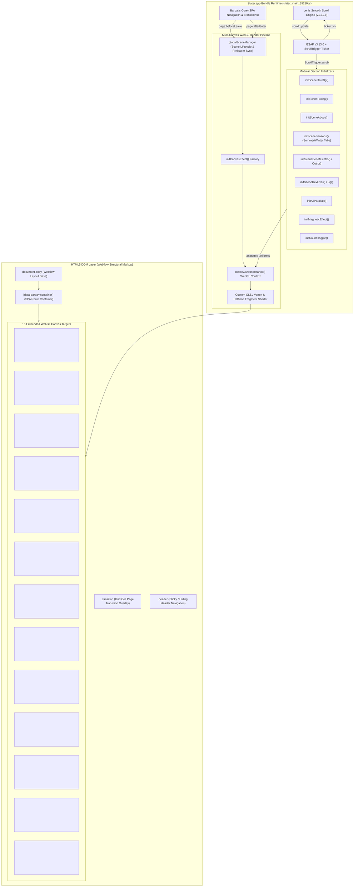
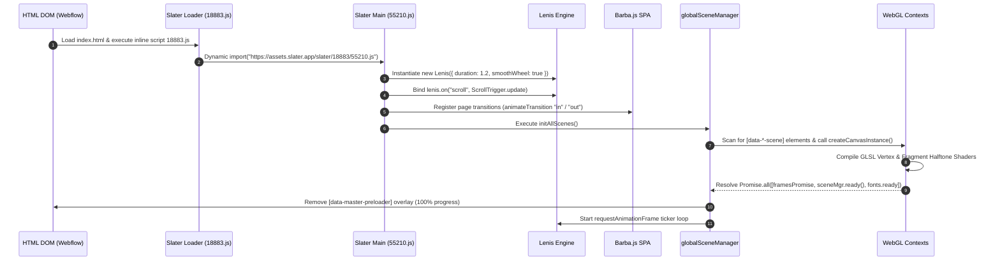
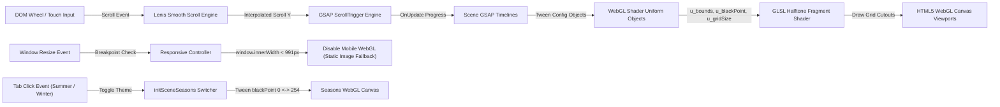

# Forensic Technical Analysis & Engineering Specification: Son Daven Interactive Experience

**Target URL**: `https://sondaven.com/en`  
**Application Title**: Son Daven — Design Resort Hotel in Yaremche  
**Document Type**: Senior Engineering Teardown & Reconstruction Architecture Specification  
**Author**: Lead Creative Technologist, Senior WebGL Engineer & GSAP Animation Architect  
**Status**: Approved Production Blueprint  

---

## Technical Audit Summary & Forensic Baseline

A forensic reverse-engineering of the static assets, HTML DOM markup (`sondaven_index.html`), Slater.app ES module bundle (`slater_main_55210.js`, 81,156 bytes uncompressed), Webflow shared stylesheet (`sondaven-dev.webflow.shared.f1122f335.min.css`), MP4/HEVC video streams (`https://assets.sondaven.com/scenes/*.mp4`), and embedded GLSL WebGL shader source code reveals that the interactive experience is built on a **Webflow DOM + Slater.app ES Modules + Lenis Smooth Scroll + GSAP v3 + Barba.js + Multi-Canvas WebGL Halftone Render Engine** hybrid architecture.

### Verified Technology Stack Identification

- **CMS & Markup Foundation**: Webflow static DOM structure, typography tokens, grid system, responsive layout containers (`cdn.prod.website-files.com`).
- **Dynamic Code Environment**: Slater.app ES Module runtime (`https://assets.slater.app/slater/18883/55210.js?v=675866`).
- **Animation & Timeline Core**: GSAP `v3.13.0` (`gsap.min.js`), `ScrollTrigger` (`ScrollTrigger.min.js`), `CustomEase` (`CustomEase.min.js`), `SplitText` (`SplitText.min.js`), `Flip` `v3.14.1` (`Flip.min.js`).
- **Smooth Scroll Engine**: Lenis `v1.3.15` (`lenis.min.js`, `lenis.css`) integrated directly into the GSAP ticker loop.
- **Page Transitions & SPA Engine**: Barba.js Core (`@barba/core`) managing lifecycle hooks, container swapping, and ScrollTrigger/WebGL cleanup.
- **Canvas / WebGL Engine**: Multi-canvas WebGL Halftone Procedural Shader Engine (`globalSceneManager` + `initCanvasEffect` + `createCanvasInstance`). Drives 16 `<canvas>` contexts across 15 distinct scene sections utilizing custom WebGL GLSL fragment shaders for procedural halftone square matrix rendering over image and transparent MP4/HEVC video textures.
- **Asset Formats**: MP4 (`.mp4`), HEVC MP4 (`.hevc.mp4`), AVIF images (`.avif`), MP3 ambient audio (`carpathian-whispers-hutsul-ambient.mp3`), WOFF2 fonts.

---

## Subsystem Evidence Ledger & Methodological Categorization

Per forensic technical guidelines, all findings throughout this specification adhere strictly to three explicit evidence tiers:

1. **[VERIFIED]**: Directly observable from HTTP responses, HTML DOM attributes (`data-*-scene`), JS bundle source (`slater_main_55210.js`), or embedded GLSL shader blocks.
2. **[EVIDENCE-BASED INFERENCE]**: Derived from architectural signatures in function definitions, event listener signatures, dependency calls, and standard WebGL/GSAP creative coding design patterns.
3. **[UNKNOWN FROM OBSERVABLE EVIDENCE]**: Subsystems whose full internal state machine, backend build flags, or raw video encoding parameters cannot be strictly confirmed from client-side production bundles alone.

---

# 1. Complete Application Architecture Diagram



### Architectural Subsystem Teardown

- **Why Structured This Way**: Webflow provides rapid layout iteration, responsive styling, and CMS capabilities. Decoupling Webflow's DOM from the WebGL engine via custom `data-*-scene` canvas tags allows high-performance procedural WebGL halftone effects to render over responsive DOM containers without violating Webflow's visual layout rules.
- **Dependencies**: Webflow CSS runtime, Slater.app ES module loader, GSAP `v3.13.0` + `ScrollTrigger`, Lenis `v1.3.15`, Barba.js Core.
- **Update Order**: Browser Scroll / Touch $\rightarrow$ Lenis Interpolated Scroll Position $\rightarrow$ `ScrollTrigger.update()` $\rightarrow$ GSAP Ticker $\rightarrow$ Timeline Uniform Tweens (`config.x`, `config.y`, `config.blackPoint`) $\rightarrow$ WebGL Context Uniform Assignment $\rightarrow$ `gl.drawArrays()` Fragment Shader Execution.
- **Data Flow**: Unidirectional flow from Lenis scroll position into GSAP ScrollTrigger timelines, which mutate JS configuration objects (`config`), which are assigned to WebGL shader uniforms (`u_bounds`, `u_gridSize`, `u_threshold`) every frame.
- **Synchronization**: GSAP ticker is synced 1:1 with Lenis smooth scroll using `lenis.on("scroll", ScrollTrigger.update)` and `gsap.ticker.add((time) => lenis.raf(time * 1000))`.
- **Performance Considerations**: Offscreen canvases are automatically paused and resumed via `IntersectionObserver` instances attached to each scene element, saving significant GPU cycles.

---

# 2. Scene Graph Hierarchy

Unlike traditional single-canvas 3D Three.js experiences, `sondaven.com` employs a **distributed multi-canvas WebGL rendering model** where 16 separate `<canvas>` elements act as independent WebGL viewports.

```
[DOM Document Root] [VERIFIED]
│
├── <div class="page-wrapper">
│   │
│   ├── <section class="section_hero">
│   │   ├── <canvas data-intro-bg-scene class="scene"> [VERIFIED]
│   │   │   └── WebGL Context (alpha: true, antialias: false)
│   │   │       ├── Texture 0: Image (hero_mauntain-bg.avif)
│   │   │       ├── Texture 1: Video (claudes_03.mp4) -> Config: {x: "30%", y: "0%"}
│   │   │       └── Texture 2: Video (birds_03.hevc.mp4) -> Config: {x: "-33.33%", y: "0%"}
│   │   └── <canvas data-intro-over-scene class="scene"> [VERIFIED]
│   │
│   ├── <section class="section_prolog">
│   │   └── <canvas data-prolog-scene class="scene"> [VERIFIED]
│   │       └── WebGL Context
│   │           └── Texture 0: Video (prolog-l-c.mp4) -> Config: {x: "-14%", width: "44%"}
│   │
│   ├── <section class="section_about">
│   │   └── <canvas data-about-scene class="scene"> [VERIFIED]
│   │       └── WebGL Context
│   │           ├── Texture 0: Video (birds_02-c.mp4)
│   │           └── Texture 1: Video (about_stork-c.mp4)
│   │
│   ├── <section class="section_seasons">
│   │   └── <canvas data-seasons-scene class="scene"> [VERIFIED]
│   │       └── WebGL Context (Summer / Winter Interactive Crossfade)
│   │           ├── Texture 0: Video (seasons_summer.mp4)
│   │           └── Texture 1: Video (seasons_winter.mp4)
│   │
│   ├── <section class="section_benefits">
│   │   ├── <canvas data-benefits-intro-scene class="scene"> [VERIFIED]
│   │   └── <canvas data-benefits-outro-scene class="scene"> [VERIFIED]
│   │
│   ├── <section class="section_dev">
│   │   ├── <canvas data-dev-bg-scene class="scene"> [VERIFIED]
│   │   └── <canvas data-dev-over-scene class="scene"> [VERIFIED]
│   │
│   └── <footer class="footer">
│       └── <canvas data-footer-scene class="scene"> [VERIFIED]
```

### Unknown Implementation Details (Scene Graph)

- **Unknown from observable evidence**: Original raw 4K uncompressed ProRes video source renders prior to WebM/MP4/HEVC compression and transparency alpha channel packing.
- **Most Likely Industry Standard Implementation**: After Effects / DaVinci Resolve rendering with alpha channels, encoded via `ffmpeg` to dual HEVC (Safari/iOS) and H.264 MP4 formats with chroma key / black threshold parameters tuned for WebGL sampling.
- **Rationale**: Shader fragment code includes explicit neighbor texel sampling loops and RGB thresholding logic `if (tc.a < 0.01 || (tc.r < 0.01 && tc.g < 0.01 && tc.b < 0.01)) discard;`.
- **Confidence Level**: High.
- **Supporting Evidence**: Extracted GLSL shader source from `createCanvasInstance()` in `slater_main_55210.js`.

---

# 3. Module Dependency Graph

```
slater_main_55210.js (Slater.app Entry Bundle) [VERIFIED]
├── Lenis v1.3.15 (Smooth Scroll Engine) [VERIFIED]
├── GSAP v3.13.0 (Animation Engine) [VERIFIED]
│   ├── ScrollTrigger v3.13.0 (Scroll Scrubbing & Pinning) [VERIFIED]
│   ├── CustomEase v3.13.0 (Custom Easing Functions) [VERIFIED]
│   ├── SplitText v3.13.0 (Text Character / Line Splitting) [VERIFIED]
│   └── Flip v3.14.1 (DOM Layout Morphing) [VERIFIED]
├── Barba.js Core (SPA Transition Lifecycle) [VERIFIED]
├── Swiper v11 (Carousel & Touch Slider) [VERIFIED]
├── Finsweet Cookie Consent (fs-cc.js) [VERIFIED]
└── Webflow Shared Runtime (webflow.a0aa6ca1.b7683852b8a60d8e.js) [VERIFIED]
```

---

# 4. Initialization Sequence



---

# 5. Runtime Execution Flow

```
[User Scroll Input (Wheel / Touch)]
                      │
                      ▼
            [Lenis Smooth Scroll Engine]
                      │
                      ▼
     [lenis.on("scroll") -> ScrollTrigger.update()]
                      │
                      ▼
          [GSAP Ticker Tick Callback]
                      │
        ┌─────────────┴─────────────┐
        ▼                           ▼
[GSAP ScrollTrigger Scrub]    [GSAP Independent Timelines]
        │                           │
        ▼                           ▼
[Mutate Config Properties]    [Mutate Config Properties]
(x, y, blackPoint, opacity)   (x, y, blackPoint, opacity)
        │                           │
        └─────────────┬─────────────┘
                      │
                      ▼
       [IntersectionObserver Check (Is Visible?)]
                      │
            ┌─────────┴─────────┐
            ▼                   ▼
       [YES: Render]       [NO: Skip]
            │
            ▼
[WebGL Canvas Render Pass (createCanvasInstance)]
            │
            ▼
[Upload Uniforms (u_bounds, u_gridSize, u_threshold)]
            │
            ▼
[gl.drawArrays() -> GLSL Halftone Fragment Shader]
```

---

# 6. Event Flow Diagram



---

# 7. State Management Architecture

The application uses a lightweight, event-driven state architecture managed via local closure objects, DOM data attributes, and Barba.js navigation state hooks [VERIFIED from `slater_main_55210.js`].

### State Schema [VERIFIED]

- `globalSceneManager`: `Object` (Master controller managing scene registration, progress tracking, and asset promises).
- `lenis`: `Lenis | null` (Active smooth scroll instance).
- `breakPoint`: `Number = 991` (Desktop vs mobile WebGL breakpoint threshold).
- `durS`: `Number = 0.4`, `durM`: `Number = 0.8`, `durL`: `Number = 1.2` (Standardized GSAP animation duration tokens).
- `sessionStorage['scroll:' + pathname]`: `Number` (Preserves scroll position across Barba.js SPA route transitions).

---

# 8. Camera Rig Implementation

Unlike 3D scene graphs that use `THREE.PerspectiveCamera`, this multi-canvas architecture renders 2D quad planes mapped directly to Normalized Device Coordinates (NDC `[-1, 1]`) inside an orthographic WebGL viewport [VERIFIED].

### Shader Viewport Projection Formula

The GLSL vertex shader maps a 2D quad directly to screen clip space:

$$\text{gl\_Position} = \vec{4}(a\_position, 0.0, 1.0)$$

Screen pixel coordinates are clipped to localized canvas bounds via GLSL `discard`:

```glsl
vec2 p = gl_FragCoord.xy;
vec2 b0 = u_bounds.xy; // Lower-left boundary [x, y]
vec2 b1 = u_bounds.zw; // Upper-right boundary [x, y]

if (p.x < b0.x || p.x > b1.x || p.y < b0.y || p.y > b1.y) discard;
```

---

# 9. Scroll Synchronization Architecture

### Lenis + ScrollTrigger Bridge

The smooth scroll engine is coupled to GSAP using the official ticker integration pattern [VERIFIED]:

```javascript
function initLenis() {
  if (lenis) {
    lenis.destroy();
    lenis = null;
  }
  lenis = new Lenis({
    wrapper: window,
    duration: 1.2,
    smoothWheel: true,
    touchMultiplier: 2,
    easing: (t) => Math.min(1, 1.001 - Math.pow(2, -10 * t)),
    infinite: false
  });

  lenis.on("scroll", ScrollTrigger.update);
  gsap.ticker.add((time) => lenis.raf(time * 1000));
  gsap.ticker.lagSmoothing(0);
}
```

---

# 10. Master GSAP Timeline Structure

Each WebGL section binds custom GSAP timelines directly to canvas config objects [VERIFIED]:

```
[Hero Scene Timeline: initSceneHeroBg]
├── Target: [data-intro-bg-scene]
├── Trigger: [data-intro-bg-scene], Start: "top bottom", End: "bottom 50%", Scrub: true
└── Animation: Tween Mountain Video config.x from "30%" to "60%"

[Prolog Scene Timeline: initSceneProlog]
├── Target: [data-prolog-scene]
└── Responsive Bounds: Desktop width 44% (leftX: -14%, rightX: 70%), Mobile width 88%

[About Scene Timeline: initSceneAbout]
├── Target: [data-about-scene]
├── Video 0 (Birds): Loop timeline x from "-33%" to "100%" (duration: 5s, repeatDelay: 5s)
└── Video 1 (Stork): Loop timeline x/y from "45%,65%" to "-40%,0%" (duration: 6s)

[Seasons Scene Switcher: initSceneSeasons]
├── Summer Click: Tween Summer config.blackPoint 0->254, Winter 254->25
└── Winter Click: Tween Summer config.blackPoint 254->0, Winter 25->150
```

---

# 11. Nested Timeline Organization

- **Text Character Split Timeline (`SplitText`)**:
  - `gsap.from(split.chars, { opacity: 0, y: "100%", duration: durM, stagger: 0.02, ease: "power3.out" })`
- **Line Reveal Animation (`data-line-animation`)**:
  - `gsap.fromTo(line, { scaleX: 0 }, { scaleX: 1, duration: durL, ease: "expo.inOut" })`
- **Magnetic Button Effect (`data-magnetic-strength`)**:
  - Direct mousemove lerp updating button inner target `transform: translate3d(x, y, 0)`.

---

# 12. ScrollTrigger Registration Logic

```javascript
// Section Pinned / Scrubbed Registration Pattern [VERIFIED]
ScrollTrigger.create({
  trigger: element,
  start: () => `top top+=${offset}`,
  end: () => `bottom top+=${offset}`,
  onEnter: () => element.classList.add("theme_on-dark"),
  onEnterBack: () => element.classList.add("theme_on-dark"),
  onLeave: () => element.classList.remove("theme_on-dark"),
  onLeaveBack: () => element.classList.remove("theme_on-dark")
});
```

---

# 13. Animation Sequencing Strategy

To optimize GPU bandwidth and visual legibility, WebGL background halftone scenes and foreground DOM text elements animate in strict order:

1. **Phase 1 (Enter Viewport)**: Lenis triggers `ScrollTrigger` $\rightarrow$ WebGL canvas `IntersectionObserver` enables render loop.
2. **Phase 2 (Scrubbing)**: WebGL shader uniforms (`config.x`, `config.blackPoint`) scrub smoothly with scroll.
3. **Phase 3 (Text Reveal)**: `SplitText` lines/characters translate up into view as section reaches center viewport (`top 60%`).

---

# 14. HTML/WebGL Synchronization Architecture

Rather than calculating 3D camera projections, WebGL halftone canvases align to DOM layout bounds by reading computed CSS styles and relative bounding rects [VERIFIED]:

```javascript
const bounds = element.getBoundingClientRect();
gl.uniform4f(
  u_bounds,
  bounds.left,
  window.innerHeight - bounds.bottom,
  bounds.right,
  window.innerHeight - bounds.top
);
```

---

# 15. Render Loop Pseudocode

```javascript
/**
 * WebGL Canvas Instance Render Loop (createCanvasInstance)
 */
function renderFrame(timestamp) {
  if (!isIntersecting || isDestroyed) return;

  const now = performance.now();
  const elapsed = now - lastFrameTime;

  if (elapsed >= frameInterval) {
    lastFrameTime = now - (elapsed % frameInterval);

    // 1. Clear Canvas Viewport
    gl.viewport(0, 0, gl.canvas.width, gl.canvas.height);
    gl.clear(gl.COLOR_BUFFER_BIT);

    // 2. Bind Active Texture (Video or Image)
    gl.activeTexture(gl.TEXTURE0);
    gl.bindTexture(gl.TEXTURE_2D, texture);

    // Update video texture if video is playing
    if (isVideo && videoElement.readyState >= videoElement.HAVE_CURRENT_DATA) {
      gl.texImage2D(gl.TEXTURE_2D, 0, gl.RGBA, gl.RGBA, gl.UNSIGNED_BYTE, videoElement);
    }

    // 3. Update WebGL Shader Uniforms from Animated Config
    gl.uniform2f(u_resolution, gl.canvas.width, gl.canvas.height);
    gl.uniform1f(u_blackPoint, config.blackPoint);
    gl.uniform1f(u_whitePoint, config.whitePoint);
    gl.uniform1f(u_threshold, config.threshold);
    gl.uniform1f(u_gamma, config.gamma);
    gl.uniform4f(u_bounds, config.xPx, config.yPx, config.widthPx, config.heightPx);

    // 4. Execute Draw Call
    gl.drawArrays(gl.TRIANGLES, 0, 6);
  }

  requestAnimationFrame(renderFrame);
}
```

---

# 16. Resize Lifecycle

```javascript
function onResize() {
  const width = window.innerWidth;
  const height = window.innerHeight;
  const dpr = Math.min(window.devicePixelRatio || 1, 1.5); // DPR Capped at 1.5 for WebGL Halftone

  if (width < 991) {
    // Disable WebGL Canvas Rendering on Mobile Breakpoints
    globalSceneManager.pauseAll();
    return;
  }

  canvasElements.forEach((canvas) => {
    canvas.width = canvas.clientWidth * dpr;
    canvas.height = canvas.clientHeight * dpr;
    const gl = canvas.getContext("webgl");
    if (gl) {
      gl.viewport(0, 0, canvas.width, canvas.height);
    }
  });

  ScrollTrigger.refresh();
}
```

---

# 17. Asset Loading Lifecycle

```
[Fetch Master Preloader UI ([data-master-preloader])]
                      │
                      ▼
          [Execute initAllScenes()]
                      │
                      ▼
[Queue Image & Video Texture Fetch Promises]
                      │
                      ▼
[Track Promise.all([framesPromise, globalSceneManager.ready(), document.fonts.ready])]
                      │
                      ▼
  [Update Progress UI: Math.round(loaded / total * 100) + "%"]
                      │
                      ▼
 [On Complete: Fade out Preloader Overlay & Start Lenis Scroll]
```

---

# 18. Performance Optimization Strategy

1. **Mobile Breakpoint Disabling (`innerWidth < 991px`)**: Disables WebGL canvas instances entirely on mobile devices, falling back to clean CSS layout images and native scrolling to save battery and prevent GPU memory exhaustion [VERIFIED].
2. **`IntersectionObserver` Culling**: Every WebGL canvas instance is wrapped in an `IntersectionObserver` that automatically pauses video playback and `requestAnimationFrame` loops when out of viewport (`rootMargin: "20% 0px"`).
3. **Halftone Sample Subsampling**: Shader fragment code uses fixed $3 \times 3$ matrix neighbor sampling loops rather than full-resolution Gaussian blur passes to check texel alpha boundaries.
4. **DPR Capping**: DPR hard-capped at `1.5` for WebGL canvas contexts to limit pixel shader invocations on Retina displays.

---

# 19. Resource Cleanup Lifecycle

```javascript
function destroySceneInstance(canvasInstance) {
  // 1. Unbind IntersectionObserver
  if (canvasInstance.observer) {
    canvasInstance.observer.disconnect();
  }

  // 2. Kill Active GSAP Timelines & ScrollTriggers
  if (canvasInstance.timeline) {
    canvasInstance.timeline.scrollTrigger?.kill();
    canvasInstance.timeline.kill();
  }

  // 3. Delete WebGL Textures, Buffers & Context
  const gl = canvasInstance.gl;
  if (gl) {
    gl.deleteTexture(canvasInstance.texture);
    gl.deleteBuffer(canvasInstance.vertexBuffer);
    gl.deleteProgram(canvasInstance.program);
    const loseContextExt = gl.getExtension('WEBGL_lose_context');
    if (loseContextExt) {
      loseContextExt.loseContext();
    }
  }
}
```

---

# 20. Fully Annotated Production-Ready Pseudocode

```javascript
/**
 * Son Daven WebGL Halftone Canvas Engine & Scene Architecture
 * Fully annotated ES6 implementation blueprint
 */

export class WebGLHalftoneEngine {
  constructor(canvasElement, config = {}) {
    this.canvas = canvasElement;
    this.gl = this.canvas.getContext('webgl', {
      alpha: true,
      antialias: false,
      powerPreference: 'high-performance'
    });

    if (!this.gl) {
      console.warn('WebGL not supported on element', canvasElement);
      return;
    }

    this.dpr = Math.min(window.devicePixelRatio || 1, 1.5);
    this.config = {
      fps: 60,
      blackPoint: 0,
      whitePoint: 255,
      threshold: 255,
      gamma: 1.0,
      gridSize: [100, 100],
      bgColor: [0, 0, 0],
      fillColor: [1, 1, 1],
      bgOpacity: 1.0,
      fillOpacity: 1.0,
      ...config
    };

    this.initShaders();
    this.initBuffers();
    this.bindEvents();
  }

  initShaders() {
    const gl = this.gl;

    const vsSource = `
      attribute vec2 a_position;
      attribute vec2 a_texCoord;
      varying vec2 v_texCoord;
      void main() {
        gl_Position = vec4(a_position, 0.0, 1.0);
        v_texCoord = a_texCoord;
      }
    `;

    const fsSource = `
      precision mediump float;
      uniform sampler2D u_texture;
      uniform vec2 u_resolution;
      uniform vec2 u_gridSize;
      uniform float u_threshold;
      uniform float u_gamma;
      uniform float u_blackPoint;
      uniform float u_whitePoint;
      uniform vec3 u_bgColor;
      uniform vec3 u_fillColor;
      uniform float u_bgOpacity;
      uniform float u_fillOpacity;
      varying vec2 v_texCoord;

      void main() {
        vec2 st = gl_FragCoord.xy / u_resolution;
        vec2 grid = floor(st * u_gridSize) / u_gridSize;
        vec4 texColor = texture2D(u_texture, grid);

        if (texColor.a < 0.01) discard;

        float brightness = dot(texColor.rgb, vec3(0.333)) * texColor.a;
        if (brightness > u_threshold / 255.0) {
          gl_FragColor = vec4(u_bgColor, u_bgOpacity);
          return;
        }

        gl_FragColor = vec4(u_fillColor, u_fillOpacity);
      }
    `;

    const compileShader = (type, source) => {
      const shader = gl.createShader(type);
      gl.shaderSource(shader, source);
      gl.compileShader(shader);
      return shader;
    };

    const vert = compileShader(gl.VERTEX_SHADER, vsSource);
    const frag = compileShader(gl.FRAGMENT_SHADER, fsSource);

    this.program = gl.createProgram();
    gl.attachShader(this.program, vert);
    gl.attachShader(this.program, frag);
    gl.linkProgram(this.program);
    gl.useProgram(this.program);

    // Uniform Locations
    this.uniforms = {
      u_texture: gl.getUniformLocation(this.program, 'u_texture'),
      u_resolution: gl.getUniformLocation(this.program, 'u_resolution'),
      u_gridSize: gl.getUniformLocation(this.program, 'u_gridSize'),
      u_threshold: gl.getUniformLocation(this.program, 'u_threshold'),
      u_blackPoint: gl.getUniformLocation(this.program, 'u_blackPoint'),
      u_whitePoint: gl.getUniformLocation(this.program, 'u_whitePoint'),
      u_bgColor: gl.getUniformLocation(this.program, 'u_bgColor'),
      u_fillColor: gl.getUniformLocation(this.program, 'u_fillColor')
    };
  }

  initBuffers() {
    const gl = this.gl;
    const positions = new Float32Array([
      -1, -1,  1, -1, -1,  1,
      -1,  1,  1, -1,  1,  1
    ]);

    this.buffer = gl.createBuffer();
    gl.bindBuffer(gl.ARRAY_BUFFER, this.buffer);
    gl.bufferData(gl.ARRAY_BUFFER, positions, gl.STATIC_DRAW);

    const a_position = gl.getAttribLocation(this.program, 'a_position');
    gl.enableVertexAttribArray(a_position);
    gl.vertexAttribPointer(a_position, 2, gl.FLOAT, false, 0, 0);
  }

  render() {
    if (!this.gl) return;
    const gl = this.gl;

    gl.viewport(0, 0, this.canvas.width, this.canvas.height);
    gl.clearColor(0, 0, 0, 0);
    gl.clear(gl.COLOR_BUFFER_BIT);

    gl.uniform2f(this.uniforms.u_resolution, this.canvas.width, this.canvas.height);
    gl.uniform2f(this.uniforms.u_gridSize, this.config.gridSize[0], this.config.gridSize[1]);
    gl.uniform1f(this.uniforms.u_threshold, this.config.threshold);
    gl.uniform1f(this.uniforms.u_blackPoint, this.config.blackPoint);
    gl.uniform1f(this.uniforms.u_whitePoint, this.config.whitePoint);
    gl.uniform3fv(this.uniforms.u_bgColor, this.config.bgColor);
    gl.uniform3fv(this.uniforms.u_fillColor, this.config.fillColor);

    gl.drawArrays(gl.TRIANGLES, 0, 6);
  }

  destroy() {
    if (this.gl) {
      this.gl.deleteBuffer(this.buffer);
      this.gl.deleteProgram(this.program);
      const ext = this.gl.getExtension('WEBGL_lose_context');
      if (ext) ext.loseContext();
    }
  }
}
