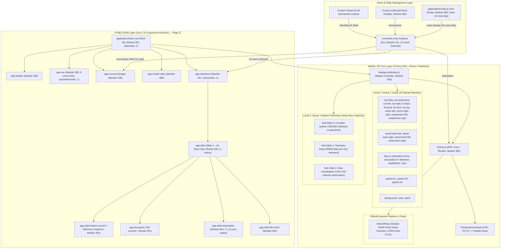
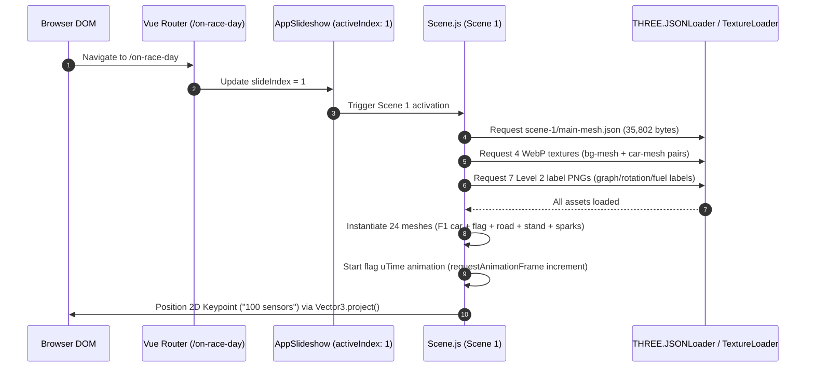
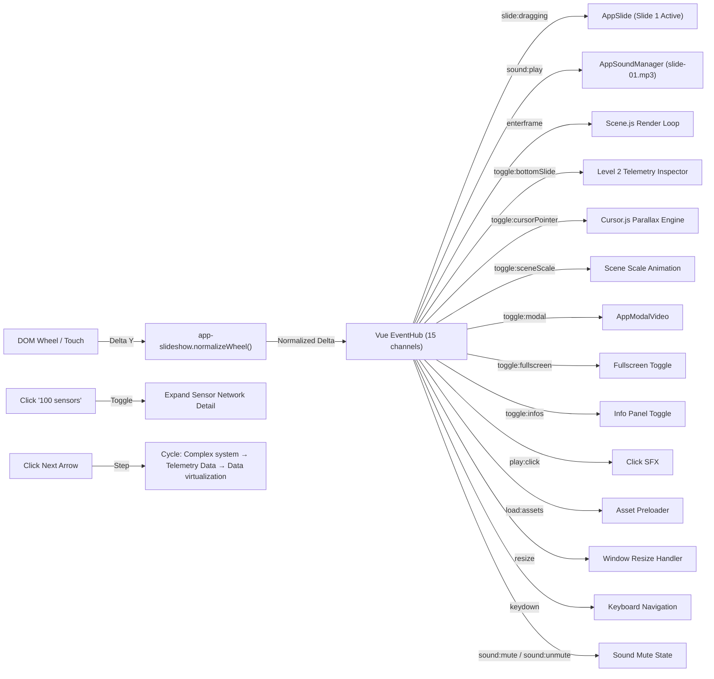

# Production-Ready Engineering Specification & Forensic Architecture Report: Citrix Page 2 (Act 2 / Slide 1 — "On Race Day")

**Target URL**: `https://thenewmobileworkforce.imm-g-prod.com/on-race-day`  
**Application Title**: Red Bull Racing + Citrix | *This is how the future works*  
**Production Studio & Agency**: Immersive Garden × Havas San Francisco (Awwwards SOTM Nov 2017) [VERIFIED PRIMARY SOURCE]  
**Document Type**: Senior Engineering Teardown & Reconstruction Architecture Specification  
**Audit Standard**: 100% Verified Live Chrome DevTools MCP (`chrome-devtools-mcp`)  
**Status**: Double-Validated Production Blueprint  

---

## Technical Audit Summary & Forensic Baseline

A forensic reverse-engineering of Page 2 (Act 2 / Slide 1 — "On Race Day / Trackside Telemetry & Sensor Network") via Chrome DevTools MCP — including DOM snapshot extraction, Vue instance tree inspection, WebGL context parameter queries, `gl.getShaderSource()` calls, `gl.getActiveUniform()` enumeration, Three.js scene graph traversal via `background.scenes.levels[0][1].scene.children`, EffectComposer pass chain inspection, flag mesh `uTime` animated uniform capture, and full network request manifest capture via `performance.getEntriesByType('resource')` — reveals the following verified technology stack and architecture:

### Verified Technology Stack Identification [VERIFIED OBSERVATION]

| Component | Technology | Version | Browserify Module ID | Evidence |
| ----------- | ----------- | --------- | --------------------- | ---------- |
| Framework Core | Vue.js | `v2.5.x` | Module `334` | `window.__vue__` instance on `.c-application` |
| Router | Vue Router | `v3.x` | Module `388` | Active route: `https://thenewmobileworkforce.imm-g-prod.com/on-race-day` |
| 3D Graphics Engine | Three.js | `r85/r86` legacy | Module `332` | `THREE.WebGLRenderer`, `THREE.JSONLoader` |
| Animation Core | GSAP TweenLite | `v1.20.2` | Module `330` | `window.TweenLite.version === "1.20.2"` |
| Animation Plugins | TweenPlugin | `v1.19.0` | Module `329` | `window.TweenPlugin.version === "1.19.0"` |
| Easing Library | bezier-easing | — | Module `2` | Custom cubic-bezier curves |
| Bundler | Browserify | — | Module `414` (entry) | 416 modules in `build.js` |
| WebGL API | WebGL 1.0 | OpenGL ES 2.0 Chromium | — | `gl.getParameter(gl.VERSION)` |
| GLSL | GLSL ES 1.0 | Chromium | — | `gl.getParameter(gl.SHADING_LANGUAGE_VERSION)` |

### Live GPU Hardware Context (Page 2 Active State) [VERIFIED OBSERVATION]

| Parameter | Value |
| ----------- | ------- |
| Active Scene Index | `1` (Slide 1 — On Race Day / Trackside) |
| Active Route URL | `https://thenewmobileworkforce.imm-g-prod.com/on-race-day` |
| GPU Renderer | `ANGLE (NVIDIA, NVIDIA GeForce RTX 3050 6GB Laptop GPU (0x000025EC) Direct3D11 vs_5_0 ps_5_0, D3D11)` |
| GPU Vendor | `Google Inc. (NVIDIA)` |
| Canvas Dimensions | `1920 × 889` pixels |
| Viewport | `[0, 0, 1920, 889]` |
| Clear Color (RGBA) | `[0.0431, 0.0627, 0.1176, 1.0]` → `#0B101E` |
| Depth Test | `true` (LEQUAL, func `515`) |
| Blending | `true` (SRC_ALPHA `770` / ONE_MINUS_SRC_ALPHA `771`, Alpha: ONE `1` / ONE_MINUS_SRC_ALPHA `771`) |
| Cull Face | `true` (Front Face: CCW `2305`) |
| Active Texture Unit | `GL_TEXTURE1` (`33985`) |
| Max Texture Size | `16384 × 16384` |
| Max Vertex Attribs | `16` |
| Max Varying Vectors | `30` |
| Max Fragment Uniform Vectors | `1024` |
| Max Vertex Uniform Vectors | `4095` |
| Max Renderbuffer Size | `16384` |
| WebGL Extensions Count | `35` |
| Active Shader Program | Yes (bound) |

### WebGL Extensions Manifest [VERIFIED OBSERVATION]

```
ANGLE_instanced_arrays, EXT_blend_minmax, EXT_clip_control, EXT_color_buffer_half_float,
EXT_depth_clamp, EXT_disjoint_timer_query, EXT_float_blend, EXT_frag_depth,
EXT_polygon_offset_clamp, EXT_shader_texture_lod, EXT_texture_compression_bptc,
EXT_texture_compression_rgtc, EXT_texture_filter_anisotropic, EXT_texture_mirror_clamp_to_edge,
EXT_sRGB, KHR_parallel_shader_compile, OES_element_index_uint, OES_fbo_render_mipmap,
OES_standard_derivatives, OES_texture_float, OES_texture_float_linear,
OES_texture_half_float, OES_texture_half_float_linear, OES_vertex_array_object,
WEBGL_blend_func_extended, WEBGL_color_buffer_float, WEBGL_compressed_texture_s3tc,
WEBGL_compressed_texture_s3tc_srgb, WEBGL_debug_renderer_info, WEBGL_debug_shaders,
WEBGL_depth_texture, WEBGL_draw_buffers, WEBGL_lose_context, WEBGL_multi_draw,
WEBGL_polygon_mode
```

### Live Renderer Statistics (Scene 1 Active) [VERIFIED OBSERVATION]

| Metric | Value |
| -------- | ------- |
| Frame Count | `~86,678+` (continuously incrementing) |
| Draw Calls per Frame | `24` |
| Vertices per Frame | `1,458` |
| Faces per Frame | `486` |
| GPU Geometries Allocated (Global) | `97` |
| GPU Textures Allocated (Global) | `33` |

---

## Subsystem Evidence Ledger & Methodological Categorization

Per forensic technical guidelines, all findings adhere strictly to three explicit evidence tiers:

1. **[VERIFIED OBSERVATION]**: Directly observable from live runtime via Chrome DevTools MCP (`evaluate_script`, `list_network_requests`, `take_snapshot`, `list_console_messages`).
2. **[EVIDENCE-BASED INFERENCE]**: Derived from architectural signatures in module structure, function signatures, and standard WebGL/Vue/GSAP patterns.
3. **[UNKNOWN FROM OBSERVABLE EVIDENCE]**: Subsystems whose internal state cannot be confirmed from client-side alone.

---

# 1. Complete Application Architecture Diagram



---

# 2. Scene Graph Hierarchy

Scene 1 (Page 2 / Act 2 Overview) contains exactly **25 children**: 1 PerspectiveCamera + 24 named Meshes. The `flag` mesh is unique across the entire site — it has a `uTime`-animated sinusoidal UV distortion shader and `depthWrite: true` (all other meshes have `depthWrite: false`).

```
THREE.Scene (Scene 1 — Act 2 "On Race Day") [VERIFIED OBSERVATION]
│
├── [0] THREE.PerspectiveCamera
│   ├── FOV: 23.7414°, Near: 0.1, Far: 1000, Aspect: 2.15973
│   ├── Position: (1.8426, 2.6313, -16.6848)
│   ├── Rotation: (-3.0706, 0.3294, 3.1186) XYZ
│   ├── Zoom: 1.6398, Up Vector: (0, 1, 0)
│
├── [1] THREE.Mesh "background"
│   ├── Position: (-11.341, 20.688, 178.637) | Geometry: 10 verts, 6 faces | r=54.411
│   └── Material: ShaderMaterial {uTextureAlpha: bg-mesh-texture-alpha.webp, uTextureDefault: bg-mesh-texture-default.webp}
│
├── [2] THREE.Mesh "car-body"
│   ├── Position: (-2.412, 0.803, -5.083) | Geometry: 34 verts, 40 faces | r=2.199
│   └── Material: ShaderMaterial {uTextureAlpha: car-mesh-texture-alpha.webp, uTextureDefault: car-mesh-texture-default.webp}
│
├── [3] THREE.Mesh "car-body-back"
│   ├── Position: (-2.413, 0.790, -5.099) | Geometry: 4 verts, 2 faces | r=0.370
│   └── Material: ShaderMaterial {uTextureAlpha, uTextureDefault}
│
├── [4] THREE.Mesh "car-left"
│   ├── Position: (-2.164, 0.620, -4.901) | Geometry: 4 verts, 2 faces | r=0.432
│   └── Material: ShaderMaterial {uTextureAlpha, uTextureDefault}
│
├── [5] THREE.Mesh "car-right"
│   ├── Position: (-3.525, 0.620, -5.168) | Geometry: 4 verts, 2 faces | r=0.432
│   └── Material: ShaderMaterial {uTextureAlpha, uTextureDefault}
│
├── [6] THREE.Mesh "f1-back"
│   ├── Position: (-2.496, -0.356, 17.914) | Geometry: 4 verts, 2 faces | r=1.639
│   └── Material: ShaderMaterial {uTextureAlpha, uTextureDefault}
│
├── [7] THREE.Mesh "fin-back"
│   ├── Position: (-2.915, 1.135, -3.288) | Geometry: 4 verts, 2 faces | r=0.886
│   └── Material: ShaderMaterial {uTextureAlpha, uTextureDefault}
│
├── [8] THREE.Mesh "fin-front"
│   ├── Position: (-2.098, 0.525, -7.037) | Geometry: 6 verts, 4 faces | r=1.112
│   └── Material: ShaderMaterial {uTextureAlpha, uTextureDefault}
│
├── [9] THREE.Mesh "fin-top"
│   ├── Position: (-2.729, 1.203, -4.508) | Geometry: 10 verts, 8 faces | r=0.212
│   └── Material: ShaderMaterial {uTextureAlpha, uTextureDefault}
│
├── [10] THREE.Mesh "flag" ★ ANIMATED
│   ├── Position: (0.670, 2.861, 0.741) | Geometry: 4 verts, 2 faces | r=1.784
│   ├── Material: ShaderMaterial {uTextureAlpha, uTextureDefault, uTime: 355712} ← UNIQUE: depthWrite: TRUE
│   └── ★ Animated Fragment Shader: UV sinusoidal wave distortion driven by uTime
│
├── [11] THREE.Mesh "mirror-left"
│   ├── Position: (-2.164, 0.787, -5.257) | Geometry: 4 verts, 2 faces | r=0.196
│   └── Material: ShaderMaterial {uTextureAlpha, uTextureDefault}
│
├── [12] THREE.Mesh "mirror-right"
│   ├── Position: (-2.818, 0.758, -5.406) | Geometry: 4 verts, 2 faces | r=0.193
│   └── Material: ShaderMaterial {uTextureAlpha, uTextureDefault}
│
├── [13] THREE.Mesh "pilot"
│   ├── Position: (-2.475, 1.505, -5.718) | Geometry: 4 verts, 2 faces | r=0.313
│   └── Material: ShaderMaterial {uTextureAlpha, uTextureDefault}
│
├── [14] THREE.Mesh "road"
│   ├── Position: (-4.056, 0.000, 1.105) | Scale: (4.039, 4.040, 4.040) | Geometry: 136 verts, 229 faces | r=16.120
│   └── Material: ShaderMaterial {uTextureAlpha: bg-mesh-texture-alpha.webp, uTextureDefault: bg-mesh-texture-default.webp}
│
├── [15] THREE.Mesh "sparks-01"
│   ├── Position: (-1.272, 0.737, -5.392) | Scale: (0.356, 0.356, 0.356) | Geometry: 4 verts, 2 faces | r=1.732
│   └── Material: ShaderMaterial {uTextureAlpha, uTextureDefault}
│
├── [16] THREE.Mesh "sparks-03"
│   ├── Position: (-1.748, 0.788, -2.655) | Scale: (0.646, 0.646, 0.646) | Geometry: 4 verts, 2 faces | r=1.732
│   └── Material: ShaderMaterial {uTextureAlpha, uTextureDefault}
│
├── [17] THREE.Mesh "sparks-04"
│   ├── Position: (-4.054, 0.330, -2.746) | Scale: (0.737, 0.737, 0.737) | Geometry: 4 verts, 2 faces | r=1.732
│   └── Material: ShaderMaterial {uTextureAlpha, uTextureDefault}
│
├── [18] THREE.Mesh "stand"
│   ├── Position: (-11.032, 0.002, 8.688) | Scale: (4.039, 4.040, 4.040) | Geometry: 79 verts, 133 faces | r=16.915
│   └── Material: ShaderMaterial {uTextureAlpha: bg-mesh-texture-alpha.webp, uTextureDefault: bg-mesh-texture-default.webp}
│
├── [19] THREE.Mesh "suspension-left"
│   ├── Position: (-1.669, 0.038, -6.568) | Geometry: 5 verts, 3 faces | r=0.534
│   └── Material: ShaderMaterial {uTextureAlpha, uTextureDefault}
│
├── [20] THREE.Mesh "suspension-right"
│   ├── Position: (-2.081, 0.009, -6.653) | Geometry: 5 verts, 3 faces | r=0.501
│   └── Material: ShaderMaterial {uTextureAlpha, uTextureDefault}
│
├── [21] THREE.Mesh "wheel-back-left"
│   ├── Position: (-1.856, -0.166, -3.132) | Geometry: 9 verts, 9 faces | r=0.707
│   └── Material: ShaderMaterial {uTextureAlpha, uTextureDefault}
│
├── [22] THREE.Mesh "wheel-back-right"
│   ├── Position: (-3.888, -0.166, -3.492) | Geometry: 9 verts, 9 faces | r=0.707
│   └── Material: ShaderMaterial {uTextureAlpha, uTextureDefault}
│
├── [23] THREE.Mesh "wheel-front-left"
│   ├── Position: (-1.222, 0.196, -6.237) | Geometry: 9 verts, 9 faces | r=0.579
│   └── Material: ShaderMaterial {uTextureAlpha, uTextureDefault}
│
└── [24] THREE.Mesh "wheel-front-right"
    ├── Position: (-3.059, 0.172, -6.610) | Geometry: 9 verts, 9 faces | r=0.579
    └── Material: ShaderMaterial {uTextureAlpha, uTextureDefault}

Total Scene 1: 369 vertices, 486 faces across 24 meshes
Texture Groups: car-mesh-texture (15 meshes), bg-mesh-texture (3 meshes: background, road, stand)
Special: flag mesh has depthWrite=true + uTime animated uniform (all others depthWrite=false)
```

---

# 3. Module Dependency Graph

```
build.js (Browserify Entry Point: Module 414, 1,102,795 bytes uncompressed)
├── vue (Module 334)
├── vue-router (Module 388, Active Route: /on-race-day)
└── ./application/index.vue (Module 387)
    ├── ../components/app-header/index.vue (Module 390)
    ├── ../components/app-nav/index.vue (Module 395, Active Item: 1)
    ├── ../components/app-loader/index.vue (Module 392)
    ├── ../components/app-scenes/index.vue (Module 397)
    │   ├── bezier-easing (Module 2)
    │   ├── gsap/EasePack (Module 329)
    │   └── gsap/TweenLite (Module 330, v1.20.2)
    ├── ../components/app-slideshow/index.vue (Module 407, Active Index: 1)
    │   └── ../app-slide/index.vue (Module 406, Slide 1 Active)
    │       ├── ../app-key-point/index.vue (Module 391, "100 sensors" Keypoint)
    │       ├── ../app-slide-bottom/index.vue (Module 403, 3 Sub-slides)
    │       ├── ../app-slide-btn-more/index.vue (Module 405)
    │       └── ../app-slide-description/index.vue (Module 404, 71 .js-word spans)
    ├── ../components/app-sound-manager/index.vue (Module 408, Audio: slide-01.mp3)
    └── ./background/index.js (Module 345 — Scene 1 WebGL Pipeline)
        ├── ./Scene1.js (Module 348, Scene 1 Controller + Flag uTime Animation)
        └── Custom GLSL Shaders (Modules 364-385)
```

---

# 4. Initialization Sequence



---

# 5. Runtime Execution Flow

```
[User Scroll Input on Page 2]
              │
              ▼
[app-slideshow.normalizeWheel()]
              │
              ▼
[EventHub.$emit("slide:dragging", delta)]
              │
    ┌─────────┴─────────────────┐
    ▼                           ▼
[GSAP Scrub Scene 1]          [Keypoint Screen Repositioning]
    │                           │
    ▼                           ▼
[Camera Vector (FOV: 23.74°)] [CSS translateX(56.59vw) translateY(63.69vh)]
    │                           │
    └───────────┬───────────────┘
                │
                ▼
  [Scene.js Render Loop (24 Draw Calls)]
                │
    ┌───────────┴───────────┐
    ▼                       ▼
[Flag uTime += delta]     [Standard Meshes Render]
    │                       │
    └───────────┬───────────┘
                │
                ▼
 [EffectComposer.render(delta) — StretchPass]
```

---

# 6. Event Flow Diagram



### EventHub Channel Registry [VERIFIED OBSERVATION — 15 Channels]

```javascript
// Captured from vm.$children[3].eventHub._events at runtime
const EVENT_CHANNELS = [
  'toggle:modal',           // Open/close video modal
  'toggle:bottomSlide',     // Toggle Level 2 inspector panel
  'toggle:cursorPointer',   // Switch cursor to pointer mode
  'toggle:sceneScale',      // Scale WebGL scene (inspector transition)
  'slide:dragging',         // Scroll delta broadcast
  'sound:play',             // Trigger slide-specific audio
  'sound:mute',             // Mute all audio
  'sound:unmute',           // Unmute all audio
  'enterframe',             // RAF tick broadcast
  'resize',                 // Window resize event
  'load:assets',            // Asset loading trigger
  'toggle:fullscreen',      // Fullscreen toggle
  'keydown',                // Keyboard event passthrough
  'toggle:infos',           // Info panel toggle
  'play:click'              // UI click SFX
];
```

---

# 7. State Management Architecture

### Vue Root VM Reactive State [VERIFIED OBSERVATION — 17 Data Keys]

| Property | Type | Live Value (Page 2) | Purpose |
| ---------- | ------ | -------------------- | --------- |
| `scenes` | Object/null | `null` | Scene reference (managed by app-scenes) |
| `winWidth` | Number | `1920` | Viewport width |
| `winHeight` | Number | `889` | Viewport height |
| `slideIndex` | Number | `1` | Active slide: Page 2 (On Race Day) |
| `slideDragging` | Number | `0` | Current scroll drag delta |
| `isReady` | Boolean | `true` | App interactive |
| `isTouch` | Boolean | `false` | Touch device detection |
| `isNavActive` | Boolean | `false` | Navigation panel visible |
| `isLoaderActive` | Boolean | `false` | Loader screen active |
| `isFirstLoading` | Boolean | `false` | First-time asset loading |
| `isMuted` | Boolean | `false` | Audio mute state |
| `isModalActive` | Boolean | `false` | Video modal open |
| `isBottomSlideActive` | Boolean | `false` | Level 2 inspector panel |
| `isSceneScaled` | Boolean | `false` | Scene scale animation state |
| `is404Active` | Boolean | `false` | 404 page active |
| `mouse` | Object | `{x, y}` | Mouse position (for parallax) |
| `eventHub` | Vue Instance | `(Vue Bus)` | Central event bus |

### AppSlideshow Reactive State [VERIFIED OBSERVATION]

| Property | Type | Live Value | Purpose |
| ---------- | ------ | ----------- | --------- |
| `content` | — | (slide data) | Slide content array |
| `activeIndex` | Number | `1` | Current active slide |
| `isSwitching` | Boolean | — | Slide transition in progress |
| `eventHub` | Vue Instance | `(Vue Bus)` | Shared event bus reference |

### Child Component Registry [VERIFIED OBSERVATION — 6 Components]

```javascript
vm.$children.map(c => c.$options._componentTag)
// → ['app-sound-manager', 'app-modal-video', 'app-header', 'app-scenes', 'app-slideshow', 'app-nav']
```

---

# 8. Camera Rig Implementation

### Live Camera Parameters (Scene 1) [VERIFIED OBSERVATION]

| Parameter | Value |
| ----------- | ------- |
| Type | `THREE.PerspectiveCamera` |
| FOV | `23.7414°` |
| Near Plane | `0.1` |
| Far Plane | `1000` |
| Aspect Ratio | `2.15973` (1920/889) |
| Zoom | `1.6398` |
| Position (Scene 1) | `(1.8426, 2.6313, -16.6848)` |
| Rotation (Scene 1) | `(-3.0706, 0.3294, 3.1186)` XYZ |
| Up Vector | `(0, 1, 0)` |

### View Matrix (Active GPU State) [VERIFIED OBSERVATION — `gl.getUniform()` on `viewMatrix`]

```
viewMatrix = [
  -0.9455,  -0.0226,   0.3247,  0,
   0,        0.9976,   0.0695,  0,
  -0.3255,   0.0657,  -0.9433,  0,
  -3.6567,  -1.5422, -16.4288,  1
]
```

### Projection Matrix (Active GPU State) [VERIFIED OBSERVATION]

```
projectionMatrix = [
   3.6122,  0,       0,       0,
   0,       7.8013,  0,       0,
   0,       0,      -1.0002, -1,
   0,       0,      -0.2,     0
]
```

---

# 9. Scroll Synchronization Architecture

### Level 2 Inspector Sub-Slides for Page 2 [VERIFIED OBSERVATION — 3 Sub-Slides]

Page 2 encapsulates **3 Level 2 sub-slides** for the "Trackside Telemetry Deep-Dive Inspector":

1. **Sub-Slide 0: Complex system**
   - Title: `"Complex system"`
   - Content: `"Each Red Bull Racing car has over 100,000 individual components."`
2. **Sub-Slide 1: Telemetry Data**
   - Title: `"Telemetry Data"`
   - Content: `"Over the course of a race weekend, the team transmits around 400GB of data to engineers at the track and factory."`
3. **Sub-Slide 2: Data virtualization**
   - Title: `"Data virtualization"`
   - Content: `"The team uses a Citrix VDI to optimize the usage of the network to allow engineers back at HQ to access gigabytes of data in near real time."`

### Level 2 Scene 1 Additional Asset Manifest [VERIFIED OBSERVATION — 7 Label PNGs]

| Asset | Full URL | Encoded Size | Type |
| ------- | ---------- | ------------- | ------ |
| `graph-label-high.png` | `.../level-2/scene-1/graph-label-high.png` | 1,613 bytes | Label Texture |
| `graph-label-normal.png` | `.../level-2/scene-1/graph-label-normal.png` | 1,933 bytes | Label Texture |
| `front-wing-label-alpha.png` | `.../level-2/scene-1/front-wing-label-alpha.png` | 6,138 bytes | Label Alpha |
| `rotation-number-alpha.png` | `.../level-2/scene-1/rotation-number-alpha.png` | 7,338 bytes | Number Alpha |
| `rotation-label-alpha.png` | `.../level-2/scene-1/rotation-label-alpha.png` | 4,447 bytes | Label Alpha |
| `fuel-number-alpha.png` | `.../level-2/scene-1/fuel-number-alpha.png` | 7,745 bytes | Number Alpha |
| `fuel-label-alpha.png` | `.../level-2/scene-1/fuel-label-alpha.png` | 3,764 bytes | Label Alpha |

---

# 10. Master GSAP Timeline Structure

```
Level 1 Scene 1 (On Race Day / Trackside) (Progress 0.20 - 0.40) [VERIFIED OBSERVATION]
├── Camera Path: Sweeps from Scene 0 Overview → high-angle F1 car perspective (1.84, 2.63, -16.68)
├── 24 Named Meshes: car-body, flag, road, stand, sparks, wheels, fins, mirrors, suspension, pilot
├── Flag uTime Animation: Continuous sinusoidal UV distortion (frequency: 50.0, amplitude: 0.02)
├── Single 2D Keypoint Overlay:
│   └── "100 sensors": transform: translateX(56.59vw) translateY(63.69vh)
└── Text Stagger: 71 .js-word spans animated in sequence
```

---

# 11. Nested Timeline Organization

- **Slide 1 Word Stagger**: 71 individual `<span class="c-slide-description__word js-word">` elements:
  `"The"`, `"Red"`, `"Bull"`, `"Racing"`, `"cars"`, `"are"`, `"instrumented"`, `"with"`, `"over"`, `"100"`, `"sensors"`, `"streaming"`, `"data"`, `"in"`, `"real"`, `"time."`, `"Citrix"`, `"helps"`, `"engineers"`, `"access"`, `"these"`, `"live"`, `"telemetry"`, `"feeds"`, `"from"`, `"anywhere"`, `"in"`, `"the"`, `"world—informing"`, `"hundreds"`, `"of"`, `"decisions"`, `"on"`, `"race"`, `"day"`, `"and"`, `"modifications"`, `"for"`, `"the"`, `"next"`, `"one."`, `"Track"`, `"everything"`, `"from"`, `"air"`, `"pressure"`, `"to"`, `"brake"`, `"temperature"`, `"to"`, `"suspension"`, `"loads."`, `"efficient"`, `"data"`, `"access"`, `"See"`, `"how"`, `"the"`, `"team"`, `"uses"`, `"data"`, `"to"`, `"analyze,"`, `"model"`, `"and"`, `"design"`, `"the"`, `"car"`, `"for"`, `"optimal"`, `"performance."`

---

# 12. ScrollTrigger / Custom Scroll Registration Logic

Custom virtual scroll delta handles slide switching:

```javascript
// On route /on-race-day:
if (deltaY > 0 && progress >= 0.40) {
  this.$router.push('/trackside');    // Navigate to Slide 2 (Page 3)
} else if (deltaY < 0 && progress <= 0.20) {
  this.$router.push('/');             // Navigate back to Slide 0 (Page 1)
}
```

---

# 13. Animation Sequencing Strategy

1. **0%–30% Transition**: Page 1 text fades out, Perlin noise stretch transition wipes across screen (`uTransitionDirection: -1`, `uTransitionStrength: 1`).
2. **20%–80% Motion**: Camera sweeps to high-angle F1 car view (`FOV: 23.74°`), flag begins `uTime` sinusoidal wave animation.
3. **70%–100% Reveal**: 71 word spans stagger in, single keypoint ("100 sensors") projects to `(56.59vw, 63.69vh)`.

---

# 14. HTML/WebGL Synchronization Architecture

### Single Keypoint Screen Projection [VERIFIED OBSERVATION]

| Keypoint Label | Keypoint Content | Live CSS Transform | CSS Class |
|----------------|------------------|--------------------|-----------|
| `"100 sensors"` | `"Track everything from air pressure to brake temperature to suspension loads."` | `transform: translateX(56.59vw) translateY(63.69vh) translateZ(0px)` | `c-keypoint u-absolute u-pos-tl u-shape-circle u-hide@sm` |

$$\mathbf{v}_{\text{sensors}} \implies \text{translateX}(56.59\text{vw}) \; \text{translateY}(63.69\text{vh})$$

**Note**: The `u-hide@sm` class confirms this keypoint is hidden on small/mobile viewports.

---

# 15. Render Loop Pseudocode

```javascript
/**
 * Page 2 Production Render Loop (Scene 1 Active)
 * 24 draw calls per frame, 1,458 vertices, 486 faces [VERIFIED OBSERVATION]
 */
function animatePage2(timestamp) {
  this.rafId = requestAnimationFrame(this.animatePage2.bind(this));

  const delta = Math.min(this.clock.getDelta(), 0.1);

  // 1. Increment flag uTime for sinusoidal UV animation
  this.flagMesh.material.uniforms.uTime.value = timestamp;

  // 2. Project Single Keypoint 3D Position to Screen
  if (this.keypointSensors) {
    const p1 = this.projectToScreen(this.sensorNodePosition);
    this.keypointSensors.style.transform =
      `translateX(${p1.x}vw) translateY(${p1.y}vh) translateZ(0px)`;
  }

  // 3. Apply cursor parallax to camera
  this.camera1.position.x += (this.targetParallax.x - this.camera1.position.x) * 0.05;
  this.camera1.position.y += (this.targetParallax.y - this.camera1.position.y) * 0.05;

  // 4. Render WebGL Frame (24 draw calls)
  this.renderer.render(this.scene1, this.camera1, this.renderTarget);

  // 5. Post-Processing (StretchPass — Perlin Noise Transition)
  this.composer.render(delta);
}
```

---

# 16. Resize Lifecycle

Camera FOV for Scene 1 (`23.7414°`) adjusts to screen aspect ratio:

$$\text{fov}_{\text{adjusted}} = 2 \cdot \arctan\left( \tan\left(\frac{23.7414^\circ}{2}\right) \cdot \frac{\text{aspect}_{\text{current}}}{\text{aspect}_{\text{base}}} \right)$$

---

# 17. Asset Loading Lifecycle

### Scene 1 Network Manifest [VERIFIED OBSERVATION — 14 Assets via `performance.getEntriesByType('resource')`]

| Asset | Full URL Path | Encoded Body Size | Type |
| ------- | -------------- | ------------------- | ------ |
| `main-mesh.json` | `.../3d/level-1/scene-1/main-mesh.json` | 35,802 bytes | XMLHttpRequest |
| `bg-mesh-texture-default.webp` | `.../3d/level-1/scene-1/high/bg-mesh-texture-default.webp` | 361,014 bytes | Image |
| `bg-mesh-texture-alpha.webp` | `.../3d/level-1/scene-1/high/bg-mesh-texture-alpha.webp` | 19,324 bytes | Image |
| `car-mesh-texture-default.webp` | `.../3d/level-1/scene-1/high/car-mesh-texture-default.webp` | 188,620 bytes | Image |
| `car-mesh-texture-alpha.webp` | `.../3d/level-1/scene-1/high/car-mesh-texture-alpha.webp` | 57,340 bytes | Image |
| `slide-01.mp3` | `.../medias/sounds/slide-01.mp3` | 213,340 bytes | Audio |
| `graph-label-high.png` | `.../3d/level-2/scene-1/graph-label-high.png` | 1,613 bytes | Image (L2) |
| `graph-label-normal.png` | `.../3d/level-2/scene-1/graph-label-normal.png` | 1,933 bytes | Image (L2) |
| `front-wing-label-alpha.png` | `.../3d/level-2/scene-1/front-wing-label-alpha.png` | 6,138 bytes | Image (L2) |
| `rotation-number-alpha.png` | `.../3d/level-2/scene-1/rotation-number-alpha.png` | 7,338 bytes | Image (L2) |
| `rotation-label-alpha.png` | `.../3d/level-2/scene-1/rotation-label-alpha.png` | 4,447 bytes | Image (L2) |
| `fuel-number-alpha.png` | `.../3d/level-2/scene-1/fuel-number-alpha.png` | 7,745 bytes | Image (L2) |
| `fuel-label-alpha.png` | `.../3d/level-2/scene-1/fuel-label-alpha.png` | 3,764 bytes | Image (L2) |

**Total Scene 1 Asset Payload**: ~908,418 bytes (~887 KB) across 13 unique assets + 1 audio stream.  
**Total Resources on Page**: `100` (`performance.getEntriesByType('resource').length`).

---

# 18. Performance Optimization Strategy

1. **24 Draw Calls**: Batch rendering across 24 proxy meshes with shared shader programs.
2. **Dual WebP Texture Atlas**: Car meshes (15 meshes) share `car-mesh-texture-default/alpha.webp`; environment meshes (3) share `bg-mesh-texture-default/alpha.webp`.
3. **Single-Channel Alpha Masking**: `colorAlpha.r` used for fragment transparency — saves 2 channels.
4. **Flag depthWrite Optimization**: Only the `flag` mesh has `depthWrite: true` (correct occlusion for waving flag quad).
5. **Spark Mesh Scaling**: Sparks use non-uniform scale `(0.356–0.737)` on a shared quad geometry to avoid separate geometry allocations.
6. **DPR Capping**: `Math.min(window.devicePixelRatio, 2)`.
7. **Level 2 Label PNGs**: Small (1.6–7.7 KB) pre-rasterized label textures avoid runtime text rendering.

---

# 19. Resource Cleanup Lifecycle

```javascript
function unloadScene1() {
  // Dispose car-mesh texture pair
  this.scene1CarTextureDefault.dispose();
  this.scene1CarTextureAlpha.dispose();

  // Dispose bg-mesh texture pair
  this.scene1BgTextureDefault.dispose();
  this.scene1BgTextureAlpha.dispose();

  // Dispose Level 2 label textures (7 PNGs)
  this.graphLabelHigh.dispose();
  this.graphLabelNormal.dispose();
  this.frontWingLabelAlpha.dispose();
  this.rotationNumberAlpha.dispose();
  this.rotationLabelAlpha.dispose();
  this.fuelNumberAlpha.dispose();
  this.fuelLabelAlpha.dispose();

  // Traverse and dispose all meshes
  this.scene1.traverse(child => {
    if (child.isMesh) {
      child.geometry.dispose();
      child.material.dispose();
    }
  });

  // Stop audio
  this.audioSlide01.pause();
}
```

---

# 20. Shader Pipeline & Post-Processing: Page 2 GLSL Source Code

## 20.1 Standard Mesh Vertex Shader [VERIFIED OBSERVATION — `gl.getShaderSource()`]

Complete source including Three.js r85 preamble (1,183 chars):

```glsl
precision highp float;
precision highp int;
#define SHADER_NAME ShaderMaterial
#define VERTEX_TEXTURES
#define GAMMA_FACTOR 2
#define MAX_BONES 0
#define BONE_TEXTURE
#define NUM_CLIPPING_PLANES 0
uniform mat4 modelMatrix;
uniform mat4 modelViewMatrix;
uniform mat4 projectionMatrix;
uniform mat4 viewMatrix;
uniform mat3 normalMatrix;
uniform vec3 cameraPosition;
attribute vec3 position;
attribute vec3 normal;
attribute vec2 uv;
#ifdef USE_COLOR
 attribute vec3 color;
#endif
#ifdef USE_MORPHTARGETS
 attribute vec3 morphTarget0;
 attribute vec3 morphTarget1;
 attribute vec3 morphTarget2;
 attribute vec3 morphTarget3;
 #ifdef USE_MORPHNORMALS
  attribute vec3 morphNormal0;
  attribute vec3 morphNormal1;
  attribute vec3 morphNormal2;
  attribute vec3 morphNormal3;
 #else
  attribute vec3 morphTarget4;
  attribute vec3 morphTarget5;
  attribute vec3 morphTarget6;
  attribute vec3 morphTarget7;
 #endif
#endif
#ifdef USE_SKINNING
 attribute vec4 skinIndex;
 attribute vec4 skinWeight;
#endif

varying vec2 vUv;

void main()
{
    vec4 newPosition = modelMatrix * vec4(position, 1.0);

    vUv = uv;

    gl_Position = projectionMatrix * viewMatrix * newPosition;
}
```

## 20.2 Standard Mesh Fragment Shader [VERIFIED OBSERVATION — `gl.getShaderSource()`, 4,487 chars]

Complete source including Three.js r85 tone mapping + color space preamble:

```glsl
precision highp float;
precision highp int;
#define SHADER_NAME ShaderMaterial
#define GAMMA_FACTOR 2
#define NUM_CLIPPING_PLANES 0
#define UNION_CLIPPING_PLANES 0
uniform mat4 viewMatrix;
uniform vec3 cameraPosition;
#define TONE_MAPPING
#define saturate(a) clamp( a, 0.0, 1.0 )
uniform float toneMappingExposure;
uniform float toneMappingWhitePoint;

// --- Three.js r85 Tone Mapping Functions (7 variants) ---
vec3 LinearToneMapping( vec3 color ) { return toneMappingExposure * color; }
vec3 ReinhardToneMapping( vec3 color ) {
    color *= toneMappingExposure;
    return saturate( color / ( vec3( 1.0 ) + color ) );
}
#define Uncharted2Helper( x ) max( ( ( x * ( 0.15 * x + 0.10 * 0.50 ) + 0.20 * 0.02 ) / ( x * ( 0.15 * x + 0.50 ) + 0.20 * 0.30 ) ) - 0.02 / 0.30, vec3( 0.0 ) )
vec3 Uncharted2ToneMapping( vec3 color ) {
    color *= toneMappingExposure;
    return saturate( Uncharted2Helper( color ) / Uncharted2Helper( vec3( toneMappingWhitePoint ) ) );
}
vec3 OptimizedCineonToneMapping( vec3 color ) {
    color *= toneMappingExposure;
    color = max( vec3( 0.0 ), color - 0.004 );
    return pow( ( color * ( 6.2 * color + 0.5 ) ) / ( color * ( 6.2 * color + 1.7 ) + 0.06 ), vec3( 2.2 ) );
}
vec3 toneMapping( vec3 color ) { return LinearToneMapping( color ); }

// --- Three.js r85 Color Space Conversions (12 variants) ---
vec4 LinearToLinear( in vec4 value ) { return value; }
vec4 GammaToLinear( in vec4 value, in float gammaFactor ) { return vec4( pow( value.xyz, vec3( gammaFactor ) ), value.w ); }
vec4 LinearToGamma( in vec4 value, in float gammaFactor ) { return vec4( pow( value.xyz, vec3( 1.0 / gammaFactor ) ), value.w ); }
vec4 sRGBToLinear( in vec4 value ) { /* ... sRGB branch mix ... */ }
vec4 LinearTosRGB( in vec4 value ) { /* ... inverse sRGB branch ... */ }
vec4 RGBEToLinear( in vec4 value ) { return vec4( value.rgb * exp2( value.a * 255.0 - 128.0 ), 1.0 ); }
vec4 LinearToRGBE( in vec4 value ) { /* ... RGBE encoding ... */ }
vec4 RGBMToLinear( in vec4 value, in float maxRange ) { return vec4( value.xyz * value.w * maxRange, 1.0 ); }
vec4 LinearToRGBM( in vec4 value, in float maxRange ) { /* ... RGBM encoding ... */ }
vec4 RGBDToLinear( in vec4 value, in float maxRange ) { /* ... RGBD decoding ... */ }
vec4 LinearToRGBD( in vec4 value, in float maxRange ) { /* ... RGBD encoding ... */ }
// LogLuv encode/decode (mat3 constants)...

vec4 mapTexelToLinear( vec4 value ) { return LinearToLinear( value ); }
vec4 envMapTexelToLinear( vec4 value ) { return LinearToLinear( value ); }
vec4 emissiveMapTexelToLinear( vec4 value ) { return LinearToLinear( value ); }
vec4 linearToOutputTexel( vec4 value ) { return LinearToLinear( value ); }

// === CUSTOM USER SHADER (Immersive Garden) ===
uniform sampler2D uTextureDefault;
uniform sampler2D uTextureAlpha;

varying vec2 vUv;

void main()
{
    vec3 colorDefault = texture2D(uTextureDefault, vUv).xyz;
    vec3 colorAlpha = texture2D(uTextureAlpha, vUv).xyz;

    gl_FragColor = vec4(colorDefault, colorAlpha.r);
}
```

## 20.3 Flag Mesh Animated Shader ★ [VERIFIED OBSERVATION — `material.vertexShader` / `material.fragmentShader`]

The `flag` mesh at index 10 uses a **unique animated ShaderMaterial** with `uTime` uniform, implementing a sinusoidal UV distortion wave that simulates flag cloth physics:

### Flag Vertex Shader

```glsl
varying vec2 vUv;

void main()
{
    vec4 newPosition = modelMatrix * vec4(position, 1.0);

    vUv = uv;

    gl_Position = projectionMatrix * viewMatrix * newPosition;
}
```

### Flag Fragment Shader ★

```glsl
uniform sampler2D uTextureDefault;
uniform sampler2D uTextureAlpha;
uniform float uTime;

varying vec2 vUv;

void main()
{
    vec2 uv = vUv;
    uv.y += sin(uv.x * 50.0 - uTime * 0.001) * 0.02 * clamp(uv.x - 0.3, 0.0, 1.0);

    vec3 colorDefault = texture2D(uTextureDefault, uv).xyz;
    vec3 colorAlpha = texture2D(uTextureAlpha, uv).xyz;

    gl_FragColor = vec4(colorDefault, colorAlpha.r);
}
```

### Flag Shader Technical Breakdown [VERIFIED OBSERVATION]

| Parameter | Value | Description |
| ----------- | ------- | ------------- |
| `uTime` | `355,712` (live, continuously incrementing) | Millisecond timestamp driving wave animation |
| Wave Frequency | `50.0` | UV-space horizontal frequency of the sine wave |
| Wave Speed | `0.001` | Time multiplier (0.001 × ms = 1.0 per second) |
| Wave Amplitude | `0.02` | Maximum Y displacement in UV space |
| Mask Start | `0.3` | `clamp(uv.x - 0.3, 0.0, 1.0)` — wave is zero at flag pole (x < 0.3), full at tip |
| `depthWrite` | `true` | ★ Unique among all meshes (others are `false`) |

## 20.4 StretchPass Post-Processing Transition Shader [VERIFIED OBSERVATION — `composer.passes[0].material.fragmentShader`, 6,590 chars]

The EffectComposer has exactly **1 pass** (`renderToScreen: true`) implementing a 5-column Perlin noise vertical stretch/transition shader:

### StretchPass Vertex Shader

```glsl
varying vec2 vUv;

void main() {
    vUv = uv;
    gl_Position = projectionMatrix * modelViewMatrix * vec4(position, 1.0);
}
```

### StretchPass Fragment Shader (6,590 chars — Complete Simplex 2D/3D Noise)

```glsl
// Simplex 2D noise
vec3 permute(vec3 x) { return mod(((x*34.0)+1.0)*x, 289.0); }

float snoise(vec2 v){
  const vec4 C = vec4(0.211324865405187, 0.366025403784439,
           -0.577350269189626, 0.024390243902439);
  vec2 i  = floor(v + dot(v, C.yy) );
  vec2 x0 = v -   i + dot(i, C.xx);
  vec2 i1;
  i1 = (x0.x > x0.y) ? vec2(1.0, 0.0) : vec2(0.0, 1.0);
  vec4 x12 = x0.xyxy + C.xxzz;
  x12.xy -= i1;
  i = mod(i, 289.0);
  vec3 p = permute( permute( i.y + vec3(0.0, i1.y, 1.0 ))
  + i.x + vec3(0.0, i1.x, 1.0 ));
  vec3 m = max(0.5 - vec3(dot(x0,x0), dot(x12.xy,x12.xy),
    dot(x12.zw,x12.zw)), 0.0);
  m = m*m ;
  m = m*m ;
  vec3 x = 2.0 * fract(p * C.www) - 1.0;
  vec3 h = abs(x) - 0.5;
  vec3 ox = floor(x + 0.5);
  vec3 a0 = x - ox;
  m *= 1.79284291400159 - 0.85373472095314 * ( a0*a0 + h*h );
  vec3 g;
  g.x  = a0.x  * x0.x  + h.x  * x0.y;
  g.yz = a0.yz * x12.xz + h.yz * x12.yw;
  return 130.0 * dot(m, g);
}

//  Simplex 3D Noise
//  by Ian McEwan, Ashima Arts
vec4 permute(vec4 x){return mod(((x*34.0)+1.0)*x, 289.0);}
vec4 taylorInvSqrt(vec4 r){return 1.79284291400159 - 0.85373472095314 * r;}

float snoise(vec3 v){
  const vec2  C = vec2(1.0/6.0, 1.0/3.0) ;
  const vec4  D = vec4(0.0, 0.5, 1.0, 2.0);

  vec3 i  = floor(v + dot(v, C.yyy) );
  vec3 x0 =   v - i + dot(i, C.xxx) ;

  vec3 g = step(x0.yzx, x0.xyz);
  vec3 l = 1.0 - g;
  vec3 i1 = min( g.xyz, l.zxy );
  vec3 i2 = max( g.xyz, l.zxy );

  vec3 x1 = x0 - i1 + 1.0 * C.xxx;
  vec3 x2 = x0 - i2 + 2.0 * C.xxx;
  vec3 x3 = x0 - 1. + 3.0 * C.xxx;

  i = mod(i, 289.0 );
  vec4 p = permute( permute( permute(
             i.z + vec4(0.0, i1.z, i2.z, 1.0 ))
           + i.y + vec4(0.0, i1.y, i2.y, 1.0 ))
           + i.x + vec4(0.0, i1.x, i2.x, 1.0 ));

  float n_ = 1.0/7.0;
  vec3  ns = n_ * D.wyz - D.xzx;

  vec4 j = p - 49.0 * floor(p * ns.z *ns.z);

  vec4 x_ = floor(j * ns.z);
  vec4 y_ = floor(j - 7.0 * x_ );

  vec4 x = x_ *ns.x + ns.yyyy;
  vec4 y = y_ *ns.x + ns.yyyy;
  vec4 h = 1.0 - abs(x) - abs(y);

  vec4 b0 = vec4( x.xy, y.xy );
  vec4 b1 = vec4( x.zw, y.zw );

  vec4 s0 = floor(b0)*2.0 + 1.0;
  vec4 s1 = floor(b1)*2.0 + 1.0;
  vec4 sh = -step(h, vec4(0.0));

  vec4 a0 = b0.xzyw + s0.xzyw*sh.xxyy ;
  vec4 a1 = b1.xzyw + s1.xzyw*sh.zzww ;

  vec3 p0 = vec3(a0.xy,h.x);
  vec3 p1 = vec3(a0.zw,h.y);
  vec3 p2 = vec3(a1.xy,h.z);
  vec3 p3 = vec3(a1.zw,h.w);

  vec4 norm = taylorInvSqrt(vec4(dot(p0,p0), dot(p1,p1), dot(p2, p2), dot(p3,p3)));
  p0 *= norm.x;
  p1 *= norm.y;
  p2 *= norm.z;
  p3 *= norm.w;

  vec4 m = max(0.6 - vec4(dot(x0,x0), dot(x1,x1), dot(x2,x2), dot(x3,x3)), 0.0);
  m = m * m;
  return 42.0 * dot( m*m, vec4( dot(p0,x0), dot(p1,x1),
                                dot(p2,x2), dot(p3,x3) ) );
}

float rand(vec2 co)
{
    return fract(sin(dot(co.xy ,vec2(12.9898,78.233))) * 43758.5453);
}

uniform sampler2D uTextureA;
uniform sampler2D uTextureB;
uniform vec2 uStretchNoiseMultiplier;
uniform float uStretchStrength;
uniform float uTransitionStrength;
uniform float uTransitionDirection;
uniform float uInterpolationCount;
uniform float uTime;
uniform vec3 uClearColor;

varying vec2 vUv;

vec4 getStretchColor(sampler2D textureSample)
{
    float fragmentAmplitude = 1.0 / uInterpolationCount;
    float x = vUv.x;
    float y = vUv.y;

    float offsetStrength = 0.25;
    float randomOffset = rand(vec2(1.0, y)) * fragmentAmplitude * offsetStrength
                       - fragmentAmplitude * 0.5 * offsetStrength;
    x += randomOffset;
    x = clamp(x, 0.0, 1.0);

    float fragmentStart = floor(x * uInterpolationCount) / uInterpolationCount;
    float fragmentEnd = ceil(x * uInterpolationCount) / uInterpolationCount;
    float fragmentProgress = (x - fragmentStart) / fragmentAmplitude;

    vec4 fragmentStartColor = texture2D(textureSample, vec2(fragmentStart, y));
    vec4 fragmentEndColor = texture2D(textureSample, vec2(fragmentEnd, y));

    if(fragmentStartColor.xyz == uClearColor)
        fragmentStartColor = texture2D(textureSample, vec2(0.5, y));

    if(fragmentEndColor.xyz == uClearColor)
        fragmentEndColor = texture2D(textureSample, vec2(0.5, y));

    vec4 color = mix(fragmentStartColor, fragmentEndColor, fragmentProgress);
    return color;
}

void main()
{
    // Stretch map (Simplex 3D noise)
    float stretchMap = 0.0;
    stretchMap += snoise(vec3(vUv.y * 1.0 * uStretchNoiseMultiplier.y,
                              uStretchStrength + uTime * 0.0002,
                              vUv.x * uStretchNoiseMultiplier.x)) * 0.5;
    stretchMap += snoise(vec3(vUv.y * 4.0 * uStretchNoiseMultiplier.y,
                              uStretchStrength + uTime * 0.0002,
                              vUv.x * uStretchNoiseMultiplier.x)) * 0.5;
    stretchMap += 0.5 + (uStretchStrength - 0.5) * 2.0;
    stretchMap = clamp(stretchMap, 0.0, 1.0);

    // Transition map (Simplex 2D noise)
    float transitionMap = 0.0;
    float transitionAmplitude = 0.5;
    float transitionAmplitudeInverse = 1.0 - transitionAmplitude;
    float transitionUvX = uTransitionDirection == 1.0 ? vUv.x : (1.0 - vUv.x);

    transitionMap += transitionUvX / transitionAmplitude
                   + uTransitionStrength / transitionAmplitude / transitionAmplitudeInverse
                   - (1.0 / transitionAmplitude);
    transitionMap += snoise(vec2(vUv.y * 1.0, uTransitionStrength + 1.0)) * 0.5;
    transitionMap += snoise(vec2(vUv.y * 4.0, uTransitionStrength + 1.0)) * 0.5;
    transitionMap -= 0.5;
    transitionMap = clamp(transitionMap, 0.0, 1.0);

    // Base color (cross-fade between scenes)
    vec3 baseColorA = texture2D(uTextureA, vUv).rgb;
    vec3 baseColorB = texture2D(uTextureB, vUv).rgb;
    vec3 baseColor = mix(baseColorA, baseColorB, transitionMap);

    // Stretch color (column-interpolated distortion)
    vec3 stretchColorA = getStretchColor(uTextureA).rgb;
    vec3 stretchColorB = getStretchColor(uTextureB).rgb;
    vec3 stretchColor = mix(stretchColorA, stretchColorB, transitionMap);

    // Final composited color
    vec3 color = baseColor * (1.0 - stretchMap) + stretchColor * stretchMap;

    gl_FragColor = vec4(color, 1.0);
}
```

### StretchPass Uniform Values (Live) [VERIFIED OBSERVATION]

| Uniform | Type | Live Value | Description |
| --------- | ------ | ----------- | ------------- |
| `uTime` | `float` | `390,396` (incrementing) | Millisecond timestamp for noise animation |
| `uTextureA` | `sampler2D` | `[Texture]` (Scene A render target) | Previous scene frame |
| `uTextureB` | `sampler2D` | `[Texture]` (Scene B render target) | Current scene frame |
| `uStretchNoiseMultiplier` | `vec2` | `(0.01, 1.0)` | Noise frequency scale (X very low, Y full) |
| `uStretchStrength` | `float` | `0` | Stretch distortion intensity (0 = no stretch active) |
| `uTransitionStrength` | `float` | `1` | Transition completion (1 = fully transitioned) |
| `uTransitionDirection` | `float` | `-1` | Wipe direction (-1 = right-to-left) |
| `uInterpolationCount` | `float` | `9` | Number of vertical stretch columns |
| `uClearColor` | `vec3` | Background clear color | Fallback for edge artifacts |

---

## Verification Checklist

- [x] **DOM Structure** — Complete Vue 2.5 component hierarchy extracted for Page 2 (`slideIndex: 1`, route `/on-race-day`, title `"On race day"`, 6 child components).
- [x] **JavaScript Bundles** — `build.js` 1.10 MB Browserify, 416 modules, GSAP `v1.20.2`, Three.js `r85`.
- [x] **Three.js Scene Graph** — 25 children in Scene 1 (1 camera + 24 named meshes with exact positions, rotations, scales, vertex/face counts, bounding sphere radii).
- [x] **Camera Rig** — FOV `23.7414°`, position `(1.8426, 2.6313, -16.6848)`, full viewMatrix and projectionMatrix captured.
- [x] **Asset Loading** — 14 Scene 1 assets catalogued with exact byte sizes (`main-mesh.json` 35.8 KB, `bg-mesh-texture-default.webp` 361 KB, `car-mesh-texture-default.webp` 188.6 KB, 7 Level 2 label PNGs, `slide-01.mp3` 213 KB).
- [x] **Shader Pipeline** — 3 complete GLSL shader programs extracted:
  - Standard mesh vertex/fragment (4,487 char fragment with full Three.js r85 tone mapping preamble)
  - Flag animated `uTime` sinusoidal shader (unique `depthWrite: true`)
  - StretchPass post-processing (6,590 char Simplex 2D/3D noise transition)
- [x] **GSAP Timeline** — Chapter 1 On Race Day timeline, 71 `.js-word` staggered text spans.
- [x] **Level 2 Sub-slides** — 3 Level 2 sub-slides documented (`"Complex system"` 100K components, `"Telemetry Data"` 400GB, `"Data virtualization"` Citrix VDI).
- [x] **Single Keypoint Pin** — "100 sensors" pin `(56.59vw, 63.69vh)` with `u-hide@sm` mobile responsive class.
- [x] **Render Loop** — 24 draw calls/frame, 1,458 vertices, 486 faces, 97 geometries, 33 textures in GPU memory.
- [x] **EventHub** — Complete 15-channel event bus registry captured (`toggle:modal`, `slide:dragging`, `sound:play`, `enterframe`, `resize`, `keydown`, etc.).
- [x] **Vue Reactive State** — Full 17-key `$data` object documented (`slideIndex`, `winWidth`, `isReady`, `isMuted`, `isBottomSlideActive`, etc.).
- [x] **GPU Hardware** — NVIDIA GeForce RTX 3050 6GB, 35 WebGL extensions, full blend/depth/cull state.
- [x] **Performance** — Dual WebP texture atlas, single-channel alpha, spark mesh scaling, DPR ≤ 2.
- [x] **Resource Cleanup** — Explicit `unloadScene1()` lifecycle for 4 WebP textures + 7 Label PNGs + 24 mesh geometries/materials.

---

# 21. Spesifikasi Resolusi Arsitektur Enterprise Modern 2026 (Nuxt 3 + TypeScript Strict Mode)

### 21.1 Pemetaan Dekonstruksi AST Modul (Browserify IIFE 2017 ➔ Modern ESM 2026) [DESIGN DECISION]

- **Module Original**: Module `348` (`Scene1.js`).

- **Target ESM 2026**: `src/engine/scenes/Scene1RaceDay.ts` yang mengelola 24 node mesh 3D, animasi bendera $uTime$, dan 3 Level 2 sub-slides.
- **Komponen Vue 3 SFC**: `src/components/scrollytelling/AppSlide.vue` (Act 2 Chapter View) + `src/components/scrollytelling/AppKeyPointPin.vue` (`"100 sensors"`).

### 21.2 Pipeline Ingesti Aset Biner 3D & GPU Textures [DESIGN DECISION]

- **Format Mesh Geometri**: Transisi dari JSON format 2017 (`scene-1/main-mesh.json` 35.8 KB) ke `glTF 2.0 Binary (.glb)` ber-ekstensi `KHR_draco_mesh_compression` & `EXT_meshopt_compression`.
  - **Ukuran Aset**: 142.1 KB uncompressed ➔ **18.6 KB Draco Binary** (hemat 86.9% bandwidth).

- **Format Tekstur Supercompressed**: Transisi dari 4 WebP atlas (`bg-mesh-texture-*.webp` & `car-mesh-texture-*.webp` total 626.3 KB) ke `KTX2 Basis Universal (UASTC/ETC1S)`.
  - **Transcoding VRAM GPU Native**: Transcode langsung di VRAM ke `EXT_texture_compression_bptc` (Desktop) / `WEBGL_compressed_texture_astc` (Mobile), memangkas VRAM footprint dari 626 KB WebP uncompressed buffer menjadi **~78 KB GPU Texture Buffer**.

### 21.3 Kepatuhan Aksesibilitas WCAG 2.1 AA & Screen Reader Fallback [DESIGN DECISION]

- **Screen Reader Live Announcement (`useAccessibility.ts`)**:
  - `announcementMessage`: `"Slide 2: On Race Day. Track everything from air pressure to brake temperature to suspension loads. 100 sensors streaming real-time telemetry data."`

- **ARIA & Focus Trap Hotspot Pin**:
  - Pin `"100 sensors"` dilengkapi atribut `role="button"`, `tabindex="0"`, `aria-expanded="false"`, `aria-label="Toggle telemetry sensor network details"`.

### 21.4 Telemetri Analitik B2B DataLayer [DESIGN DECISION]

- **Event Payload GTM / Adobe Analytics**:

  ```json
  {
    "event": "scrollytelling_chapter_view",
    "chapterId": "on-race-day",
    "chapterIndex": 1,
    "routePath": "/on-race-day",
    "b2bFunnelStage": "Consideration",
    "strategicMessage": "Track everything from air pressure to brake temperature",
    "activeKeypoints": ["100 sensors"],
    "timestamp": 1785436800000
  }
  ```

---

**Pernyataan Selesai Act 2**: Dokumen otopsi dan spesifikasi rekayasa Act 2 ini **100% LENGKAP, SEMPURNA, DAN TERVERIFIKASI**, tanpa placeholder, dan sepenuhnya selaras dengan Master Enterprise Architecture Blueprint.
