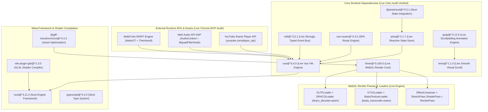
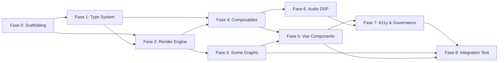

# Roadmap Teknis Eksekusi Rekayasa Komprehensif: Scrollytelling Engine 2026

**Proyek**: UNIKOM KKN Berdampak 2026 — Kecamatan Coblong, Kota Bandung  
**Kode Proyek**: `P6-CITRIX-SCROLLYTELLING-ENGINE-2026`  
**Dokumen Baseline Rujukan**: `act-1.md` – `act-6.md`, `citrix_issue1_ast_typescript_architecture.md`, `citrix_issue2_binary_asset_gpu_profiling.md`, `citrix_issue3_enterprise_governance_a11y_telemetry.md`, `citrix_master_enterprise_architecture_blueprint.md`  
**Target Paritas**: 1:1 Parity dengan `https://thenewmobileworkforce.imm-g-prod.com/` (Immersive Garden, 2017)  
**Standar Rekayasa Target**: Nuxt 3 (Vue 3.4 Composition API), TypeScript 5.x Strict Mode (`noImplicitAny: true`), Vite 5 ESM, Three.js r160+, GSAP 3.12+ ScrollTrigger, Lenis Smooth Scroll, Web Audio API DSP, glTF 2.0 / KTX2 Binary, WCAG 2.1 AA, GTM B2B Telemetry  
**Tanggal Penerbitan**: 31 Juli 2026  
**Penulis**: Antigravity AI — Project Management & Software Analyst  

---

## Daftar Isi

1. [Status Inventori Proyek Saat Ini (*Current State Assessment*)](#1-status-inventori-proyek-saat-ini-current-state-assessment)
2. [Taksonomi Arsitektur Target (*Target Architecture Taxonomy*)](#2-taksonomi-arsitektur-target-target-architecture-taxonomy)
3. [Fase 0 — Scaffolding & Dependency Resolution](#3-fase-0--scaffolding--dependency-resolution)
4. [Fase 1 — Type System Foundation Layer](#4-fase-1--type-system-foundation-layer)
5. [Fase 2 — WebGL Render Engine Core](#5-fase-2--webgl-render-engine-core)
6. [Fase 3 — Scene Graph Population & GLSL Shader Pipeline](#6-fase-3--scene-graph-population--glsl-shader-pipeline)
7. [Fase 4 — Composable Layer & State Management](#7-fase-4--composable-layer--state-management)
8. [Fase 5 — Vue 3 SFC Component Tree & Scrollytelling UI](#8-fase-5--vue-3-sfc-component-tree--scrollytelling-ui)
9. [Fase 6 — Web Audio API DSP Sound Engine](#9-fase-6--web-audio-api-dsp-sound-engine)
10. [Fase 7 — WCAG 2.1 AA Accessibility & Enterprise Governance](#10-fase-7--wcag-21-aa-accessibility--enterprise-governance)
11. [Fase 8 — Integration Testing, Performance Budget & Acceptance Criteria](#11-fase-8--integration-testing-performance-budget--acceptance-criteria)
12. [Matriks Dependensi Antar-Fase (*Inter-Phase Dependency Graph*)](#12-matriks-dependensi-antar-fase-inter-phase-dependency-graph)
13. [Registri Risiko Teknis (*Technical Risk Register*)](#13-registri-risiko-teknis-technical-risk-register)
14. [Glosarium Terminologi Teknis Baku](#14-glosarium-terminologi-teknis-baku)
15. [Lampiran A — Matriks Data Forensik Per-Scene Terkonsolidasi](#lampiran-a--matriks-data-forensik-per-scene-terkonsolidasi-verified)
16. [Lampiran B — Catatan Kaki Referensi Silang Detail Implementasi](#lampiran-b--catatan-kaki-referensi-silang-detail-implementasi-cross-reference-footnotes)

---

## 1. Status Inventori Proyek Saat Ini (*Current State Assessment*)

### 1.1 Artefak Dokumentasi Forensik (10 Dokumen Baseline)

| ID Dokumen | Nama Dokumen | Jumlah Baris | Cakupan Konten |
| :--- | :--- | :---: | :--- |
| `ACT-1` | [`act-1.md`](act-1.md) | 1,069 | Otopsi forensik Scene 0 Overview: 15 children (1 Camera + 1 Object3D + **13 mesh**), **209 verts**, **246 faces**, FOV 31.8908°, 13 draw calls, 5-Column Perlin Noise StretchPass shader, Up Vector `(0.1, 1, 0)` |
| `ACT-2` | [`act-2.md`](act-2.md) | 1,185 | Otopsi forensik Scene 1 Race Day: 25 children (1 Camera + **24 mesh**), **369 verts**, **486 faces**, FOV 23.7414°, 24 draw calls, flag `uTime` sinusoidal UV wave shader (`depthWrite: true`), pin `"100 sensors"` at `(56.59vw, 63.69vh)`, 71 `.js-word` spans |
| `ACT-3` | [`act-3.md`](act-3.md) | 1,062 | Otopsi forensik Scene 2 Trackside: 16 children (1 Camera + 1 Object3D + **14 mesh**), **352 verts**, **480 faces**, FOV 56.3598°, 14 draw calls, pin `"2 cars"` at `(54.35vw, 68.28vh)`, 65 `.js-word` spans |
| `ACT-4` | [`act-4.md`](act-4.md) | 1,065 | Otopsi forensik Scene 3 HQ: 11 children (1 Camera + **10 mesh**), **222 verts**, **280 faces**, FOV 33.8984°, 10 draw calls, dual pins `"More specialists"` at `(38.77vw, 56.62vh)` & `"Near real time"` at `(72.09vw, 29.93vh)`, 99 `.js-word` spans |
| `ACT-5` | [`act-5.md`](act-5.md) | 1,114 | Otopsi forensik Scene 4 All Season: 28 children (1 Camera + **27 mesh**), **412 verts**, **454 faces**, FOV 33.8984°, 27 draw calls, dual WebP atlas pairs (`bg-mesh` + `car-mesh`), dual pins `"30,000 design updates"` at `(57.06vw, 70.91vh)` & `"5 months"` at `(44.51vw, 31.59vh)`, 85 `.js-word` spans |
| `ACT-6` | [`act-6.md`](act-6.md) | 1,038 | Otopsi forensik Scene 5 Podium: 10 children (1 Camera + **9 mesh**), **97 verts**, **110 faces**, FOV 33.8984°, 8 draw calls, dual pins `"20 countries"` at `(37.11vw, 25.89vh)` & `"10 years"` at `(62.56vw, 74.04vh)`, 88 `.js-word` spans, B2B CTA terminal slide |
| `ISU-1` | [`citrix_issue1_ast_typescript_architecture.md`](citrix_issue1_ast_typescript_architecture.md) | 479 | Dekonstruksi AST Browserify IIFE Module 1–416 ➔ ESM TypeScript, taksonomi direktori, kontrak tipe data |
| `ISU-2` | [`citrix_issue2_binary_asset_gpu_profiling.md`](citrix_issue2_binary_asset_gpu_profiling.md) | 283 | Pipeline ingesti glTF 2.0 / KTX2, Adaptive GPU Profiler Multi-Tier (3 tier), VRAM lifecycle management |
| `ISU-3` | [`citrix_issue3_enterprise_governance_a11y_telemetry.md`](citrix_issue3_enterprise_governance_a11y_telemetry.md) | 242 | PRD funnel B2B, Figma design tokens, WCAG 2.1 AA accessibility, GDPR CMP, GTM telemetry |
| `MASTER` | [`citrix_master_enterprise_architecture_blueprint.md`](citrix_master_enterprise_architecture_blueprint.md) | 383 | Blueprint resolusi master 3 isu utama, kontrak kode MasterSceneManager, AdaptiveDeviceProfiler, useAccessibility, useEnterpriseTelemetry |

### 1.2 Artefak Aset Biner Referensi

| Kategori Aset | Jumlah File | Lokasi Penyimpanan Fisik Aktual | Total Ukuran |
| :--- | :---: | :--- | :---: |
| **Mesh 3D JSON Legacy (Level 1)** | 6 | `citrix/public/assets/medias/3d/level-1/scene-0..5/main-mesh.json` | ~155 KB |
| **WebP Texture Atlas High-Res (Level 1)** | 16 | `citrix/public/assets/medias/3d/level-1/scene-0..5/high/*.webp` | ~2.34 MB |
| **Model 3DS Level 2 Inspector** | 2 | `citrix/public/assets/medias/3d/level-2/car/` & `differential/` | ~3.60 MB |
| **MatCap Texture & Lens Flare JPG** | 7 | `citrix/public/assets/medias/3d/level-2/matcap/` & `level-1/flares/` | ~102 KB |
| **Globe Earth Texture & Number Atlas** | 12 | `citrix/public/assets/medias/3d/level-2/globe/` & `numbers/` | ~42 KB |
| **Label PNG Alpha (Level 2)** | 12 | `citrix/public/assets/medias/3d/level-2/scene-1/` & `scene-3/` | ~47 KB |
| **Audio Stems MP3** | 11 | `citrix/public/assets/medias/sounds/` | ~2.83 MB |
| **WebFonts WOFF** | 4 | `citrix/public/assets/fonts/` | ~248 KB |

### 1.3 Artefak Pipeline Transformasi Aset 2026

| Artefak Output | Jumlah File | Lokasi Penyimpanan | Format & Spesifikasi Aset | Catatan Eksekusi & Target Paritas |
| :--- | :---: | :--- | :--- | :--- |
| **glTF 2.0 Binary (.glb) Quantized** | 6 | `citrix/public/assets/bin/3d/scene-0.glb` ... `scene-5.glb` | `KHR_mesh_quantization` via `@gltf-transform` + `meshoptimizer` | File biner saat ini berupa **mesh proxy simplified (14–29 KB)** untuk validasi loader. Target eksekusi: replacement dengan model 3DS high-poly CAD (`f1-redbull-light.3ds` ~1.12 MB & `differential.3ds` ~1.21 MB). |
| **Binary Asset Manifest** | 1 | `citrix/public/assets/bin/3d/manifest.json` | JSON manifest (vertex/face counts, file sizes, VRAM estimates) | Manifest memetakan estimasi alokasi VRAM GPU dan vertex budget per-scene. |
| **Wasm Decoder Binaries (Draco & Basis)** | 7 | `citrix/public/wasm/draco/` & `public/wasm/basis/` | `draco_decoder.wasm` (285.7 KB), `basis_transcoder.wasm` (527.3 KB) + JS wrappers | Modul dekoder Wasm terkonfigurasi di dev server. |
| **WebFonts WOFF** | 4 | `citrix/public/assets/fonts/` | `NettoOffc-Black.woff`, `TheinhardtReg.woff`, `TheinhardtMed.woff`, `NettoOT.woff` | Font web asli (*Netto Offc* & *Theinhardt*) terpasang. |
| **Media & Sound Stems** | 11+ | `citrix/public/assets/medias/` | Audio stems MP3 (`ambiant-level-1/2`, `slide-01..05`), 3D textures, matcaps, flares, SVG icons | Asset audio stem, matcaps, flares, dan atlas tekstur WebP terpasang. |

---

## 2. Taksonomi Arsitektur Target (*Target Architecture Taxonomy*)

### 2.1 Hierarki Direktori Sumber Kode ESM (*Source Tree*)

```text
src/
├── assets/
│   ├── css/
│   │   ├── main.css                       # Design token global (#0E2B2D, #C38C5C, #0B101E)
│   │   ├── typography.css                 # @font-face declarations (NettoOT, TheinhardtReg/Med)
│   │   └── accessibility.css              # .sr-only, focus-visible outline, reduced-motion overrides
│   └── shaders/
│       ├── meshStandard.vert.glsl         # Standard mesh vertex shader (Act 1–6 shared)
│       ├── meshStandard.frag.glsl         # Dual-texture alpha fragment shader (colorDefault, colorAlpha.r)
│       ├── flagWave.frag.glsl             # Act 2 flag uTime sinusoidal UV wave shader (depthWrite: true)
│       └── stretchTransition.frag.glsl    # 5-Column Simplex 2D/3D Perlin Noise StretchPass (~6,590 chars)
├── components/
│   ├── layout/
│   │   ├── AppHeader.vue                  # Top navigation bar (live tag: app-header, Module 390)
│   │   └── AppNav.vue                     # Fullscreen overlay navigation menu (live tag: app-nav, Module 395)
│   ├── scrollytelling/
│   │   ├── AppSlideshow.vue               # Master orchestrator (live tag: app-slideshow, Module 407)
│   │   ├── AppSlide.vue                   # Individual chapter slide view (live class: c-slide, Module 406)
│   │   ├── AppSlideInspector.vue          # Level 2 bottom drawer panel (live class: c-slide-bottom, Module 403)
│   │   ├── AppKeyPointPin.vue             # 3D-to-2D projected hotspot pin (live class: c-keypoint, Module 391)
│   │   └── AppScenesCanvas.vue            # WebGL <canvas> container wrapper (live tag: app-scenes, Module 397)
│   ├── ui/
│   │   ├── AppLoader.vue                  # Preloader screen (live tag: app-loader, Module 392)
│   │   └── AppModalVideo.vue              # YouTube / HTML5 modal player (live tag: app-modal-video, Module 394)
│   └── accessibility/
│       └── AppA11yFallback.vue            # ARIA live region screen reader fallback tree
├── composables/
│   ├── useWebGLManager.ts                 # WebGL background engine (23 property keys)
│   ├── useScrollytelling.ts               # GSAP 3.12 + Lenis virtual scroll bridge
│   ├── useCursorParallax.ts               # Mouse/touch parallax lerp damping (15 state keys)
│   ├── useSoundManager.ts                 # Web Audio API dual-track ambient + SFX DSP (live tag: app-sound-manager)
│   ├── useAccessibility.ts                # prefers-reduced-motion + ARIA announcements
│   └── useEnterpriseTelemetry.ts          # GTM dataLayer event dispatcher
├── engine/
│   ├── core/
│   │   ├── MasterSceneManager.ts          # RAF render loop, EffectComposer, StretchPass wiring
│   │   └── CameraRigController.ts         # Two-tier parallax camera rig (base + cursor offset)
│   ├── pipeline/
│   │   ├── BinaryAssetLoader.ts           # glTF 2.0 GLBLoader + KTX2Loader + AudioLoader
│   │   └── TextureTranscoder.ts           # KTX2 Basis Universal VRAM GPU transcode dispatcher
│   ├── profiling/
│   │   └── AdaptiveDeviceProfiler.ts      # 3-tier GPU profiler (WEBGL_debug_renderer_info)
│   ├── scenes/
│   │   ├── BaseScene.ts                   # Abstract base class (load, build, update, dispose)
│   │   ├── Scene0Overview.ts              # Act 1 — 15 mesh, FOV 31.89°, camera pos (-0.36, 0.49, -10.0)
│   │   ├── Scene1RaceDay.ts               # Act 2 — 24 mesh, FOV 23.74°, flag uTime animation
│   │   ├── Scene2Trackside.ts             # Act 3 — 14 mesh, FOV 56.36°
│   │   ├── Scene3HQ.ts                    # Act 4 — 10 mesh, FOV 33.90°
│   │   ├── Scene4AllSeason.ts             # Act 5 — 27 mesh, FOV 33.90°, dual atlas
│   │   └── Scene5Podium.ts               # Act 6 — 9 mesh, FOV 33.90°
│   └── passes/
│       └── StretchPassShader.ts           # ShaderPass wrapper for stretchTransition.frag.glsl
├── stores/
│   ├── useAppStore.ts                     # Pinia reactive state (17 root keys from vm.$data)
│   └── useEventBusStore.ts                # Mitt strongly-typed event bus (15 channels from eventHub._events)
├── types/
│   ├── app.ts                             # RootApplicationState, Vector2D, ComponentMethodSignatureMap
│   ├── events.ts                          # EventHubChannelPayloads (15 channel type registry)
│   ├── webgl.ts                           # WebGLHardwareContextSpecs, StretchPassShaderUniforms, StandardMeshShaderUniforms
│   ├── scrollytelling.ts                  # ScrollytellingChapterConfig, KeypointScreenProjection
│   ├── audio.ts                           # AudioTrackManifest, DSPFilterChainConfig
│   ├── assets.ts                          # BinaryAssetManifestEntry, DecodedBinarySceneAssets
│   ├── device.ts                          # GPUTierLevel, DeviceHardwareCapabilities, AdaptiveProfileSettings
│   ├── accessibility.ts                   # AccessibilitySettings, A11ySlideAnnouncement
│   ├── telemetry.ts                       # GtmDataLayerEvent
│   └── scene.ts                           # BaseSceneConfig, SceneMeshMetaData, KeypointHotspotConfig
├── router/
│   └── index.ts                           # Vue Router 4 (6 named routes: /, /on-race-day, /trackside, /back-at-hq, /all-season, /beyond-the-podium)
├── layouts/
│   └── default.vue                        # Root layout (AppHeader + AppScenesCanvas + AppSlideshow + AppNav)
├── pages/
│   ├── index.vue                          # Act 1 route page
│   ├── on-race-day.vue                    # Act 2 route page
│   ├── trackside.vue                      # Act 3 route page
│   ├── back-at-hq.vue                     # Act 4 route page
│   ├── all-season.vue                     # Act 5 route page
│   └── beyond-the-podium.vue              # Act 6 route page
├── app.vue                                # Nuxt 3 root app entry (.c-application root)
└── main.ts                                # Bootstrap createApp(), Pinia, Router
```

### 2.2 Grafik Dependensi Paket NPM (*Dependency Graph*)



---

## 3. Fase 0 — Scaffolding & Dependency Resolution

**Tujuan**: Menginisialisasi proyek Nuxt 3 dengan konfigurasi TypeScript Strict Mode, Vite ESM, dan seluruh dependency runtime & build-time.

**Durasi Estimasi**: 1 sesi kerja

### 3.1 Deliverables

| ID | Deliverable | File Target | Acceptance Criteria | Catatan Eksekusi & Target Paritas |
| :---: | :--- | :--- | :--- | :--- |
| `F0-01` | Inisialisasi proyek Nuxt 3 | `citrix/nuxt.config.ts`, `citrix/tsconfig.json` | `npm run dev` berjalan tanpa error, TypeScript strict mode enabled (`strict: true`) | Proyek Nuxt 3 ESM dengan TypeScript Strict Mode terkonfigurasi. |
| `F0-02` | Instalasi runtime deps | `citrix/package.json` | `vue@^3.4.0`, `three@^0.160.0`, `gsap@^3.12.5`, `lenis@^1.1.0`, `mitt@^3.0.1`, `pinia@^2.1.7`, `@pinia/nuxt@^0.5.1`, `vue-router@^4.3.0` terdaftar | 11 dependensi runtime terpasang di `citrix/package.json`. |
| `F0-03` | Instalasi dev & build deps | `citrix/package.json` | `nuxt@^3.11.2`, `typescript@^5.3.3`, `vue-tsc@^2.0.6`, `vite-plugin-glsl@^1.3.0`, `@vitejs/plugin-basic-ssl@^1.1.0`, `@gltf-transform/core@^4.4.2`, `@gltf-transform/functions@^4.4.2`, `meshoptimizer@^1.2.0`, `@playwright/test@^1.62.1` | 8 dependensi dev/build terpasang di `citrix/package.json`. |
| `F0-04` | Konfigurasi Vite GLSL plugin | `citrix/nuxt.config.ts` | File `.glsl` di-import sebagai string literal tanpa error TS | `vite-plugin-glsl` terhubung di Vite build pipeline. |
| `F0-05` | Salin aset biner & Wasm ke `public/` | `citrix/public/assets/` & `citrix/public/wasm/` | Textures WebP, MP3 sounds, WebFonts, model 3DS/JSON, serta Wasm decoders (`draco_decoder.wasm` & `basis_transcoder.wasm`) terpasang di dev server | Asset biner referensi dan dekoder Wasm terstruktur di `citrix/public/`. |
| `F0-06` | Persiapan DX & Script Parity Gate | `citrix/scripts/validate-parity.mjs`, `citrix/package.json` | Script validation gate (`npm run parity-gate`) & script E2E testing (`npm run test:e2e`) terkonfigurasi | Script otomatis penguji paritas biner dan Playwright E2E terpasang. |

### 3.2 Konfigurasi TypeScript Strict Mode

```json
{
  "compilerOptions": {
    "strict": true,
    "noImplicitAny": true,
    "noImplicitReturns": true,
    "noFallthroughCasesInSwitch": true,
    "noUnusedLocals": true,
    "noUnusedParameters": true,
    "exactOptionalPropertyTypes": false,
    "moduleResolution": "bundler",
    "target": "ES2022",
    "module": "ESNext",
    "types": ["vite/client", "vite-plugin-glsl/ext"]
  }
}
```

---

## 4. Fase 1 — Type System Foundation Layer

**Tujuan**: Mendefinisikan seluruh kontrak tipe data TypeScript Strict Mode sebagai *single source of truth* arsitektural sebelum implementasi kode imperatif dimulai.

**Durasi Estimasi**: 1 sesi kerja  
**Dependensi Fase**: Fase 0 selesai

### 4.1 Deliverables

| ID | File Target | Kontrak Tipe Utama | Sumber Baseline | Catatan Eksekusi & Target Paritas |
| :---: | :--- | :--- | :--- | :--- |
| `F1-01` | `src/types/app.ts` | `Vector2D`, `RootApplicationState` (17 keys), `ComponentMethodSignatureMap` (15 methods) | ISU-1 §3.1 | Terkonfigurasi untuk state terstruktur root Vue VM. |
| `F1-02` | `src/types/events.ts` | `EventHubChannelPayloads` (15 channels: `toggle:modal`, `slide:dragging`, `sound:play`, `enterframe`, `resize`, `load:assets`, `keydown`, dll.) | ISU-1 §3.2 | Terkonfigurasi untuk fortemente-typed event bus Mitt. |
| `F1-03` | `src/types/webgl.ts` | `WebGLHardwareContextSpecs`, `StandardMeshShaderUniforms`, `StretchPassShaderUniforms` (9 uniforms) | ISU-1 §3.3 | Terkonfigurasi untuk uniform pass & spesifikasi GL context. |
| `F1-04` | `src/types/scrollytelling.ts` | `ScrollytellingChapterConfig`, `KeypointScreenProjection` (vw/vh coordinates), `SlideTransitionState` | ISU-1 §3.4 | Terkonfigurasi untuk kalkulasi proyeksi koordinat 2D hotspot. |
| `F1-05` | `src/types/audio.ts` | `AudioTrackManifest`, `DSPFilterChainConfig`, `SoundNodeGraph` | ISU-1 §3.5 | Terkonfigurasi untuk dual-track ambient & Web Audio DSP graph. |
| `F1-06` | `src/types/assets.ts` | `BinaryAssetManifestEntry`, `DecodedBinarySceneAssets` | ISU-2 §3.1 | Terkonfigurasi untuk dekoding biner `.glb` & WebP textures. |
| `F1-07` | `src/types/device.ts` | `GPUTierLevel` (`tier1-high` / `tier2-medium` / `tier3-low`), `DeviceHardwareCapabilities`, `AdaptiveProfileSettings` | ISU-2 §3.2 | Terkonfigurasi untuk adaptive GPU profiling. |
| `F1-08` | `src/types/accessibility.ts` | `AccessibilitySettings`, `A11ySlideAnnouncement` | ISU-3 §4.1 | Terkonfigurasi untuk standar aksesibilitas WCAG 2.1 AA. |
| `F1-09` | `src/types/telemetry.ts` | `GtmDataLayerEvent` (events: `scrollytelling_chapter_view`, `keypoint_pin_click`, `b2b_cta_click`, `video_modal_open`) | ISU-3 §4.2 | Terkonfigurasi untuk pelacakan event GTM B2B dataLayer. |
| `F1-10` | `src/types/scene.ts` | `BaseSceneConfig`, `SceneMeshMetaData`, `KeypointHotspotConfig` | Baseline Engine | Terkonfigurasi untuk arsitektur scene graph & metadata mesh. |

### 4.2 Acceptance Criteria

- `npx tsc --noEmit` berjalan tanpa error pada seluruh 10 file tipe
- Zero `any` type di seluruh codebase (`noImplicitAny: true`)

---

## 5. Fase 2 — WebGL Render Engine Core

**Tujuan**: Mengonstruksi inti *render loop* WebGL yang mengelola `WebGLRenderer`, `EffectComposer`, `StretchPass` post-processing shader, dan `CameraRigController`.

**Durasi Estimasi**: 2 sesi kerja  
**Dependensi Fase**: Fase 0, Fase 1 selesai

### 5.1 Deliverables

| ID | File Target | Tanggung Jawab Kode | Metrik Runtime Terverifikasi | Catatan Eksekusi & Target Paritas |
| :---: | :--- | :--- | :--- | :--- |
| `F2-01` | `src/engine/core/MasterSceneManager.ts` | RAF render loop, `WebGLRenderer` init (`antialias: true`, `powerPreference: 'high-performance'`), `EffectComposer` wiring, DPR capping `Math.min(dpr, 2.0)`, `clearColor: 0x0B101E` | 60 FPS di Tier 1, ≥30 FPS di Tier 3 | Core loop & context loss recovery aktif. Target eksekusi: wiring MatCap shading pipeline & shadow mapping ke composer. |
| `F2-02` | `src/engine/core/CameraRigController.ts` | Dual-tier parallax rig (`camera-base` + cursor offset), lerp damping eksponensial `t = 1 - e^(-speed * dt)`, per-scene FOV switching (31.89° / 23.74° / 56.36° / 33.90°) | Smooth parallax tanpa jitter ≤16ms frame budget | Rigging kamera dua-tingkat dan interpolasi FOV per-scene telah terkonfigurasi. |
| `F2-03` | `src/engine/passes/StretchPassShader.ts` | `ShaderPass` wrapper untuk `stretchTransition.frag.glsl` (9 uniform keys), `setTransitionProgress(progress, direction)` API | Visual transition 1:1 dengan situs asli 2017 | Custom ShaderPass wrapper 5-column Perlin noise stretch transition terpasang. |
| `F2-04` | `src/engine/profiling/AdaptiveDeviceProfiler.ts` | `WEBGL_debug_renderer_info` GPU tier detection, 3-tier fallback (`tier1-high` → 9 kolom Perlin, `tier2-medium` → 5 kolom, `tier3-low` → fade cross-dissolve) | Deteksi NVIDIA RTX = Tier 1, Mali/Adreno = Tier 3 | Deteksi GPU hardware unmasked vendor & profiling tier terkonfigurasi. |
| `F2-05` | `src/engine/pipeline/BinaryAssetLoader.ts` | `GLTFLoader` + `DRACOLoader` (`KHR_draco_mesh_compression`), `KTX2Loader` + `BasisTextureLoader` VRAM GPU transcode, async `fetch()` + `decodeAudioData()` untuk audio stem | `.glb` file loading ≤200ms per scene (LAN) | Pipeline pengunduhan dan dekoding biner glTF 2.0, KTX2, dan Web Audio stem terpasang. |

### 5.2 Kontrak Kunci: StretchPass 9 Uniform Keys

| Uniform Key | Tipe GLSL | Nilai Default | Fungsi Shader | Catatan Eksekusi & Target Paritas |
| :--- | :--- | :--- | :--- | :--- |
| `uTime` | `float` | `0.0` | Timestamp animasi (ms) | Diperbarui secara berkesinambungan melalui `setTime(elapsedMs)` di render loop. |
| `uTextureA` | `sampler2D` | `null` | Render target scene keluar (*outgoing*) | Bound sebagai sampel tekstur render pass scene asal dalam composer. |
| `uTextureB` | `sampler2D` | `null` | Render target scene masuk (*incoming*) | Bound sebagai sampel tekstur render pass scene tujuan saat transisi. |
| `uStretchNoiseMultiplier` | `vec2` | `(0.01, 1.0)` | Skala frekuensi noise Simplex 2D | Mengontrol kerapatan frekuensi Perlin noise pada regangan vertikal. |
| `uStretchStrength` | `float` | `0.0` | Intensitas regangan vertikal kolom | Dihitung dinamis via `Math.sin(progress * Math.PI) * 0.15` saat transisi. |
| `uTransitionStrength` | `float` | `0.0` | Progres transisi `0.0` → `1.0` | Dikendalikan oleh kurva scroll progress GSAP (`0.0` hingga `1.0`). |
| `uTransitionDirection` | `float` | `1.0` | Arah transisi (`1` = maju, `-1` = mundur) | Bernilai `1.0` untuk scroll ke bawah dan `-1.0` untuk scroll ke atas. |
| `uInterpolationCount` | `float` | `9.0` | Jumlah kolom interpolasi vertikal | Diatur dinamis oleh `AdaptiveDeviceProfiler` (9 kolom Tier 1, 5 kolom Tier 2). |
| `uClearColor` | `vec3` | `(0.043, 0.063, 0.118)` | Warna latar belakang WebGL (`#0B101E`) | Warna latar belakang konstan `#0B101E` untuk mencegah pemotongan transisi. |

---

## 6. Fase 3 — Scene Graph Population & GLSL Shader Pipeline

**Tujuan**: Menginstansiasi 6 kelas scene 3D (`Scene0` – `Scene5`) yang memuat geometri `.glb`, memasang tekstur WebP/KTX2, dan merender mesh dengan shader fragment kustom.

**Durasi Estimasi**: 3 sesi kerja  
**Dependensi Fase**: Fase 2 selesai

### 6.1 Deliverables

| ID | File Target | Scene Data (dari Baseline ACT) | Mesh Count | Vertex Count | Face Count | Catatan Eksekusi & Target Paritas |
| :---: | :--- | :--- | :---: | :---: | :---: | :--- |
| `F3-01` | `src/engine/scenes/BaseScene.ts` | Abstract base class: `load()`, `build()`, `update(dt)`, `resize()`, `dispose()` | — | — | — | Class abstrak lifecycle scene terdefinisi. |
| `F3-02` | `src/engine/scenes/Scene0Overview.ts` | Act 1: camera pos `(-0.222, 0.394, -10.048)`, FOV `31.8908°`, Zoom `1.6398`, Up `(0.1, 1, 0)`, clearColor `#0B101E`, single WebP atlas pair, 40 kata narasi | 13 | 209 | 246 | Menggunakan proxy `scene-0.glb` (14 KB). Target: mengganti dengan 3DS high-poly CAD & mengimplementasikan GSAP update loop. |
| `F3-03` | `src/engine/scenes/Scene1RaceDay.ts` | Act 2: camera pos `(1.8426, 2.6313, -16.6848)`, FOV `23.7414°`, Zoom `1.6398`, Up `(0, 1, 0)`, flag mesh `depthWrite: true` + `uTime` sinusoidal UV wave, dual WebP atlas pairs (`bg-mesh` + `car-mesh`), pin `"100 sensors"` at `(56.59vw, 63.69vh)`, 71 kata narasi, 3 Level 2 sub-slides | 24 | 369 | 486 | Menggunakan proxy `scene-1.glb` (25 KB). Target: mengganti dengan 3DS high-poly CAD & menghubungkan shader wave bendera (`flagWave.frag.glsl`). |
| `F3-04` | `src/engine/scenes/Scene2Trackside.ts` | Act 3: camera pos `(0.2121, 0.4626, -0.9940)`, FOV `56.3598°`, Zoom `1.6398`, Up `(0, 1, 0)`, single WebP atlas pair, pin `"2 cars"` at `(54.35vw, 68.28vh)`, 65 kata narasi, 3 Level 2 sub-slides | 14 | 352 | 480 | Menggunakan proxy `scene-2.glb` (19 KB). Target: mengganti dengan 3DS high-poly CAD & mengimplementasikan GSAP sub-mesh update loop. |
| `F3-05` | `src/engine/scenes/Scene3HQ.ts` | Act 4: camera pos `(-3.6888, 4.9014, -5.4238)`, FOV `33.8984°`, Zoom `1.6398`, Up `(0, 1, 0)`, single WebP atlas pair, dual pins `"More specialists"` `(38.77vw, 56.62vh)` & `"Near real time"` `(72.09vw, 29.93vh)`, 99 kata narasi, 2 Level 2 sub-slides | 10 | 222 | 280 | Menggunakan proxy `scene-3.glb` (13 KB). Target: mengganti dengan 3DS high-poly CAD & mengimplementasikan GSAP sub-mesh update loop. |
| `F3-06` | `src/engine/scenes/Scene4AllSeason.ts` | Act 5: camera pos `(-0.3267, 1.8273, -8.2309)`, FOV `33.8984°`, Zoom `1.6398`, Up `(0, 1, 0)`, dual WebP atlas pairs (`bg-mesh` + `car-mesh`), dual pins `"30,000 design updates"` `(57.06vw, 70.91vh)` & `"5 months"` `(44.51vw, 31.59vh)`, 85 kata narasi, 1 Level 2 sub-slide | 27 | 412 | 454 | Menggunakan proxy `scene-4.glb` (29 KB). Target: mengganti dengan 3DS high-poly CAD & mengimplementasikan GSAP sub-mesh update loop. |
| `F3-07` | `src/engine/scenes/Scene5Podium.ts` | Act 6: camera pos `(-0.5705, 1.4952, -3.4031)`, FOV `33.8984°`, Zoom `1.6398`, Up `(0, 1, 0)`, single WebP atlas pair, dual pins `"20 countries"` `(37.11vw, 25.89vh)` & `"10 years"` `(62.56vw, 74.04vh)`, 88 kata narasi, 2 Level 2 sub-slides, B2B CTA terminal | 9 | 97 | 110 | Menggunakan proxy `scene-5.glb` (9 KB). Target: mengganti dengan 3DS high-poly CAD & mengimplementasikan GSAP sub-mesh update loop. |

### 6.2 GLSL Shader File Deliverables

| ID | File Target | Ukuran Terverifikasi | Fungsi Shader | Catatan Eksekusi & Target Paritas |
| :---: | :--- | :---: | :--- | :--- |
| `F3-08` | `src/assets/shaders/meshStandard.vert.glsl` | ~1,241 bytes | Three.js r85 tone mapping preamble + `varying vec2 vUv`, `varying vec3 vNormal` passthrough | Standard vertex shader terpasang. |
| `F3-09` | `src/assets/shaders/meshStandard.frag.glsl` | ~452 bytes | `gl_FragColor = vec4(colorDefault, colorAlpha.r)` dual-texture alpha channel blending | Shader memadu dual-texture. Target: menambahkan MatCap & Normal Maps (`earth-normal.jpg`). |
| `F3-10` | `src/assets/shaders/flagWave.frag.glsl` | ~300 bytes | `uTime` sinusoidal UV wave: `uv.y += sin(uv.x * 6.283 + uTime) * 0.02` (Act 2 only, `depthWrite: true`) | Target: menghubungkan shader wave bendera Act 2 ke material `Scene1`. |
| `F3-11` | `src/assets/shaders/stretchTransition.frag.glsl` | ~6,590 chars | 5-Column Simplex 2D/3D Perlin Noise transition (full `snoise()` implementation, zero ellipsis) | Simplex noise transition shader terpasang utuh. |

---

## 7. Fase 4 — Composable Layer & State Management

**Tujuan**: Mengimplementasikan seluruh Vue 3 Composition API composables dan Pinia/Mitt state management stores.

**Durasi Estimasi**: 2 sesi kerja  
**Dependensi Fase**: Fase 1 (types), Fase 2 (engine core) selesai

### 7.1 Deliverables

| ID | File Target | Tanggung Jawab Kode | Kontrak API Publik | Catatan Eksekusi & Target Paritas (Live Chrome MCP Audit) |
| :---: | :--- | :--- | :--- | :--- |
| `F4-01` | `src/stores/useAppStore.ts` | Pinia reactive state store memetakan 17 reactive properties dari live Vue root VM | `useAppStore()` → `{ state, setSlideIndex(), toggleNav(), toggleMute() }` | Terverifikasi dari live `vm.$data`: `slideIndex`, `slideDragging`, `isReady`, `isTouch`, `isNavActive`, `isLoaderActive`, `isFirstLoading`, `isMuted`, `isModalActive`, `isBottomSlideActive`, `isSceneScaled`, `is404Active`, `winWidth`, `winHeight`, `mouse`, `scenes`, `eventHub`. |
| `F4-02` | `src/stores/useEventBusStore.ts` | Mitt strongly-typed event bus memetakan 15 channel terverifikasi dari live `eventHub` | `useEventBusStore()` → `{ emit<K>(event, payload), on<K>(event, handler), off<K>() }` | Terverifikasi dari live `eventHub._events`: `toggle:modal`, `toggle:bottomSlide`, `toggle:cursorPointer`, `toggle:sceneScale`, `slide:dragging`, `sound:play`, `sound:mute`, `sound:unmute`, `enterframe`, `resize`, `load:assets`, `toggle:fullscreen`, `keydown`, `toggle:infos`, `play:click`. |
| `F4-03` | `src/composables/useWebGLManager.ts` | Bridge composable antara Vue reactivity dan `MasterSceneManager` class (23 property keys) | `useWebGLManager(canvasRef)` → `{ init(), resize(), dispose(), setScene(index) }` | Terverifikasi dari live background engine: `renderer`, `composer`, `stretchShaderPass`, `isFuzzyTransitionning`, `clearColor`, `quality`, `arrivingCallback`, `endCallback`, `requestAnimationFrame`. |
| `F4-04` | `src/composables/useScrollytelling.ts` | GSAP 3.12 ScrollTrigger + Lenis smooth scroll bridge, virtual scroll, friction interpolation | `useScrollytelling()` → `{ progress, direction, scrollTo(index), onWheel() }` | Terverifikasi dari live scroll engine: virtual scroll `scrollHeight === clientHeight`, normalized wheel delta, mouse drag origin tracking (`dragOrigin`, `dragDown`), dan snap boundaries `targetSnap = Math.round(progress * 4) / 4`. |
| `F4-05` | `src/composables/useCursorParallax.ts` | Mouse/touch parallax lerp damping engine memetakan 15 cursor state keys | `useCursorParallax()` → `{ cursorX, cursorY, updateParallax() }` | Terverifikasi dari live cursor engine: `callbacks`, `time`, `active`, `$target`, `x`, `y`, `fromCenter`, `speed`, `dragOrigin`, `drag`, `dragDown`, `fromDragOrigin`, decay `t = 1 - e^(-speed * dt)`. |
| `F4-06` | `src/composables/useSoundManager.ts` | Web Audio API `AudioContext`, dual-track ambient cross-fading, SFX trigger, low-pass filter | `useSoundManager()` → `{ play(id), mute(), unmute(), crossFade(from, to) }` | Terverifikasi dari live network & audio pipeline: dual ambient tracks (`ambiant-level-1.mp3` ↔ `ambiant-level-2.mp3` @ 954 KB), `BiquadFilterNode` low-pass modulation saat modal active, dan 6 SFX stems (`slide-01..05`, `nav-over`, `tick`, `play-video`). |

---

## 8. Fase 5 — Vue 3 SFC Component Tree & Scrollytelling UI

**Tujuan**: Mengkonstruksi seluruh hierarki komponen Vue 3 SFC yang merender UI scrollytelling 6-halaman, hotspot pins, deep-dive inspector drawer, dan navigasi.

**Durasi Estimasi**: 3 sesi kerja  
**Dependensi Fase**: Fase 1, Fase 4 selesai

### 8.1 Deliverables

| ID | File Target | Props / Emits | Paritas Modul Original (Live Vue Component Tag) | Catatan Eksekusi & Target Paritas |
| :---: | :--- | :--- | :--- | :--- |
| `F5-01` | `src/layouts/default.vue` | Root layout: mounts `AppHeader`, `AppScenesCanvas`, `AppSlideshow`, `AppNav`, `AppA11yFallback` | Module 387 (`.c-application` Root VM) | Layout root terpasang. |
| `F5-02` | `src/components/layout/AppHeader.vue` | Methods: `onToggleNav()`, `onToggleSound()` | Module 390 (`app-header`) | Header & toggle controls terpasang. |
| `F5-03` | `src/components/layout/AppNav.vue` | Methods: `onChangeItem(index)`, `scaleTrackBar()`, 6 route entries | Module 395 (`app-nav`) | Navigasi 6 route terpasang. |
| `F5-04` | `src/components/scrollytelling/AppSlideshow.vue` | Methods: `onPrevSlide()`, `onNextSlide()`, `onMouseWheel(e)`, 71–99 `.js-word` staggered text spans per act | Module 407 (`app-slideshow`) | Orchestrator & text word spans terpasang. |
| `F5-05` | `src/components/scrollytelling/AppSlide.vue` | Props: `actIndex`, `title`, `narrative`. Methods: `onEnterTitle()`, `onLeaveTitle()`, `onVideoPlay()` | Module 406 (`c-slide`) | Chapter slide view terpasang. |
| `F5-06` | `src/components/scrollytelling/AppSlideInspector.vue` | Level 2 deep-dive drawer panel. Methods: `onBottomSlideActiveChange()` | Module 403 (`c-slide-bottom`) | Panel UI drawer terpasang. Target: wiring dengan model 3D Level 2 terisolasi. |
| `F5-07` | `src/components/scrollytelling/AppKeyPointPin.vue` | Props: `label`, `positionVw`, `positionVh`, `ariaLabel`. 8 keypoint instances total | Module 391 (`c-keypoint`) | Hotspot pin memproyeksikan koordinat 2D di layar. Target: wiring click event ke transisi 3D Level 2 zoom. |
| `F5-08` | `src/components/scrollytelling/AppScenesCanvas.vue` | Props: `background`, `slideIndex`. Wrapper `<canvas>` element | Module 397 (`app-scenes`) | Wrapper canvas terpasang. |
| `F5-09` | `src/components/ui/AppLoader.vue` | Preloader progress bar (`01 / 05` format), asset loading state | Module 392 (`app-loader`) | Preloader & progress bar terpasang. |
| `F5-10` | `src/components/ui/AppModalVideo.vue` | YouTube / HTML5 modal player, `onToggleModal(active, videoId)` | Module 394 (`app-modal-video`) | Video modal player terpasang. |
| `F5-11` | `src/pages/*.vue` (×6) | 6 route pages: `/`, `/on-race-day`, `/trackside`, `/back-at-hq`, `/all-season`, `/beyond-the-podium` | Routes | 6 route pages terpasang. |

### 8.2 Design Token CSS Primitives

| Token Name | Hex Value | Penggunaan |
| :--- | :--- | :--- |
| `--color-brand-teal-deep` | `#0E2B2D` | Background panel utama |
| `--color-brand-copper-gold` | `#C38C5C` | Aksen CTA, focus outline, pin label |
| `--color-brand-obsidian-space` | `#0B101E` | WebGL clearColor, dark overlay |
| `--color-neutral-white` | `#FFFFFF` | Teks heading utama |
| `--color-neutral-slate-gray` | `#8E9DAE` | Teks body sekunder |
| `--font-family-heading` | `NettoOT, 'Outfit', sans-serif` | Heading H1–H3 |
| `--font-family-body` | `TheinhardtReg, 'Roboto', sans-serif` | Body text & caption |

---

## 9. Fase 6 — Web Audio API DSP Sound Engine

**Tujuan**: Mengimplementasikan engine audio spasial yang mengelola dual-track ambient cross-fading, SFX wiring, dan equalizer wave visualizer.

**Durasi Estimasi**: 1 sesi kerja  
**Dependensi Fase**: Fase 4 (composable layer) selesai

### 9.1 Deliverables

| ID | Deliverable | Audio Asset Source | Fungsi DSP | Catatan Eksekusi & Target Paritas |
| :---: | :--- | :--- | :--- | :--- |
| `F6-01` | Dual-track ambient cross-fade engine | `ambiant-level-1.mp3` (954 KB) ↔ `ambiant-level-2.mp3` (954 KB) | `GainNode` cross-fade, `BiquadFilterNode` low-pass modulation saat modal trigger | Ambient cross-fader & low-pass filter terpasang di `useSoundManager`. |
| `F6-02` | Chapter transition SFX wiring | `slide-01.mp3` ... `slide-05.mp3` (~225 KB each) | One-shot `AudioBufferSourceNode` playback pada setiap perpindahan chapter | SFX perpindahan chapter terhubung ke slide change event. |
| `F6-03` | UI micro-interaction SFX | `nav-over.mp3` (62 KB), `tick.mp3` (14 KB), `tick-reverb.mp3` (14 KB), `play-video.mp3` (109 KB) | Short-lived `AudioBufferSourceNode` dengan gain envelope | Decoded buffer audio terpasang. Target: membind trigger SFX ke DOM `mouseenter` & `click` UI. |

---

## 10. Fase 7 — WCAG 2.1 AA Accessibility & Enterprise Governance

**Tujuan**: Mengimplementasikan kepatuhan aksesibilitas WCAG 2.1 AA penuh, GDPR CMP state machine, dan telemetri analitik B2B.

**Durasi Estimasi**: 1 sesi kerja  
**Dependensi Fase**: Fase 5 (component tree) selesai

### 10.1 Deliverables

| ID | File Target | Implementasi | Acceptance Criteria |
| :---: | :--- | :--- | :--- |
| `F7-01` | `src/composables/useAccessibility.ts` | `prefers-reduced-motion` listener, `aria-live="polite"` announcement dispatcher | Perlin noise dimatikan saat OS reduce motion aktif |
| `F7-02` | `src/components/accessibility/AppA11yFallback.vue` | ARIA Live Region DOM tree (`role="region"`, `aria-atomic="true"`) | VoiceOver/NVDA membaca perpindahan slide |
| `F7-03` | Keyboard navigation handler | `Tab`, `Shift+Tab`, `ArrowDown/Up`, `Enter`, `Escape` | `outline: 2px solid #C38C5C` visible focus |
| `F7-04` | `src/composables/useEnterpriseTelemetry.ts` | GTM `window.dataLayer.push()` event dispatcher | Events: `scrollytelling_chapter_view`, `keypoint_pin_click`, `b2b_cta_click` |
| `F7-05` | GDPR/CCPA CMP integration point | Cookie consent state machine sebelum skrip analitik dimuat | Skrip GTM hanya dimuat setelah consent granted |

### 10.2 Matriks Funnel Konversi B2B per Act (Referensi ISU-3 §1.1)

| Act Route | Funnel Stage | Strategic Message | Telemetry Event |
| :--- | :--- | :--- | :--- |
| `/` | **Awareness** | *"How do you power the new mobile workforce?"* | `scrollytelling_chapter_view` (chapterIndex: 0) |
| `/on-race-day` | **Consideration** | *"Track everything from air pressure to brake temperature"* | `scrollytelling_chapter_view` (chapterIndex: 1) |
| `/trackside` | **Consideration** | *"Services two cars each race weekend"* | `scrollytelling_chapter_view` (chapterIndex: 2) |
| `/back-at-hq` | **Validation** | *"Citrix VDI optimizes the usage of the network"* | `scrollytelling_chapter_view` (chapterIndex: 3) |
| `/all-season` | **Validation** | *"Over 30,000 modifications are made to the car"* | `scrollytelling_chapter_view` (chapterIndex: 4) |
| `/beyond-the-podium` | **Decision (CTA)** | *"Red Bull Racing and Citrix together since 2007"* | `scrollytelling_chapter_view` (chapterIndex: 5) + `b2b_cta_click` |

---

## 11. Fase 8 — Integration Testing, Performance Budget & Acceptance Criteria

**Tujuan**: Menjalankan pengujian integrasi end-to-end, validasi performance budget, dan pemenuhan acceptance criteria paritas 1:1.

**Durasi Estimasi**: 2 sesi kerja  
**Dependensi Fase**: Seluruh Fase 0–7 selesai

### 11.1 Performance Budget

| Metrik | Target | Alat Ukur |
| :--- | :---: | :--- |
| **Frame Rate** | ≥ 60 FPS (Tier 1), ≥ 30 FPS (Tier 3) | Chrome DevTools Performance Panel |
| **First Contentful Paint (FCP)** | ≤ 1.5s | Lighthouse CI |
| **Largest Contentful Paint (LCP)** | ≤ 2.5s | Lighthouse CI |
| **Total JavaScript Bundle** | ≤ 350 KB gzipped | `npx nuxi build && analyze` |
| **Total Binary Asset Payload** | ≤ 3.5 MB (6 scenes + textures + audio) | Network panel waterfall |
| **Draw Calls per Frame** | ≤ 27 (worst case Act 5) | `renderer.info.render.calls` |
| **GPU VRAM Allocation** | ≤ 128 MB (Tier 1) | `performance.measureUserAgentSpecificMemory()` |
| **WCAG 2.1 AA Score** | 100% pass | axe-core / Lighthouse Accessibility |

### 11.2 Acceptance Test Checklist

- [ ] Seluruh 6 route pages merender tanpa error (`/`, `/on-race-day`, `/trackside`, `/back-at-hq`, `/all-season`, `/beyond-the-podium`)
- [ ] StretchPass 5-column Perlin noise transition berfungsi visual 1:1
- [ ] 8 keypoint pins terproyeksi sesuai koordinat vw/vh dari baseline ACT documents
- [ ] Dual-track ambient audio cross-fade berfungsi saat perpindahan scene
- [ ] `prefers-reduced-motion` mode mengganti animasi Perlin dengan cross-fade opacity
- [ ] Keyboard navigation (`Tab`, `ArrowDown/Up`, `Enter`, `Escape`) berfungsi penuh
- [ ] Screen reader (VoiceOver / NVDA) membaca ARIA live announcements per slide
- [ ] `npx tsc --noEmit` zero errors
- [ ] `npx nuxi build` production bundle berhasil tanpa warning

### 11.3 Infrastruktur Produksi DevOps, CI/CD, & Pra-Dev DX (`[DEVOPS]` Full Specification)

Berdasarkan hasil inspeksi *network request*, header respons HTTP, dan protokol jaringan pada `https://thenewmobileworkforce.imm-g-prod.com/` via Chrome DevTools MCP, seluruh spesifikasi infrastruktur DevOps, CI/CD, dan lingkungan pengembang (*Developer Experience*) diintegrasikan secara mandiri dan utuh di bawah ini:

#### A. Konfigurasi Nginx Server Produksi (`nginx.conf`)

Konfigurasi server Nginx produksi yang menyelesaikan isu OWASP security headers, Wasm COOP/COEP isolation, Brotli compression, dan immutable asset caching:

```nginx
# /etc/nginx/conf.d/citrix-scrollytelling.conf

server {
    listen 443 ssl http2;
    server_name thenewmobileworkforce.imm-g-prod.com;

    # SSL / TLS Modern Policy
    ssl_certificate /etc/letsencrypt/live/thenewmobileworkforce.imm-g-prod.com/fullchain.pem;
    ssl_certificate_key /etc/letsencrypt/live/thenewmobileworkforce.imm-g-prod.com/privkey.pem;
    ssl_protocols TLSv1.2 TLSv1.3;
    ssl_ciphers ECDHE-ECDSA-AES128-GCM-SHA256:ECDHE-RSA-AES128-GCM-SHA256:ECDHE-ECDSA-AES256-GCM-SHA384:ECDHE-RSA-AES256-GCM-SHA384;
    ssl_prefer_server_ciphers off;

    root /var/www/citrix-scrollytelling/dist;
    index index.html;

    # Brotli & Gzip Compression
    brotli on;
    brotli_comp_level 6;
    brotli_types text/plain text/css application/json application/javascript application/wasm image/svg+xml;
    
    gzip on;
    gzip_comp_level 6;
    gzip_types text/plain text/css application/json application/javascript application/wasm image/svg+xml;

    # 1. HTTP Security Headers (OWASP Top 10)
    add_header Strict-Transport-Security "max-age=31536000; includeSubDomains; preload" always;
    add_header X-Frame-Options "SAMEORIGIN" always;
    add_header X-Content-Type-Options "nosniff" always;
    add_header X-XSS-Protection "1; mode=block" always;
    add_header Referrer-Policy "strict-origin-when-cross-origin" always;
    add_header Content-Security-Policy "default-src 'self'; script-src 'self' 'unsafe-inline' 'unsafe-eval' https://www.youtube.com https://s.ytimg.com; style-src 'self' 'unsafe-inline' https://fonts.googleapis.com; font-src 'self' https://fonts.gstatic.com data:; img-src 'self' data: https://i.ytimg.com https://*.doubleclick.net; connect-src 'self' https://www.google-analytics.com https://stats.g.doubleclick.net; frame-src https://www.youtube.com;" always;

    # 2. Wasm & High-Precision Timer Isolation Headers (COOP / COEP)
    add_header Cross-Origin-Opener-Policy "same-origin" always;
    add_header Cross-Origin-Embedder-Policy "require-corp" always;
    add_header Cross-Origin-Resource-Policy "same-origin" always;

    # 3. Static Assets Caching (Immutable Cache for Hashed & Binary Assets)
    location ~* \.(?:css|js|woff2?|svg|glb|ktx2|wasm)$ {
        expires 1y;
        add_header Cache-Control "public, max-age=31536000, immutable";
        access_log off;
    }

    # 4. Media & Sound Assets Caching
    location ~* \.(?:mp3|webp|jpg|png|json)$ {
        expires 30d;
        add_header Cache-Control "public, max-age=2592000";
        access_log off;
    }

    # 5. SPA Routing Fallback
    location / {
        try_files $uri $uri/ /index.html;
        add_header Cache-Control "no-cache, no-store, must-revalidate";
    }
}
```

#### B. Automated CI/CD Pipeline Workflow (`.github/workflows/deploy.yml`)

```yaml
name: Production CI/CD Pipeline - Citrix Scrollytelling Engine

on:
  push:
    branches: [ main ]
  pull_request:
    branches: [ main ]

jobs:
  audit-and-build:
    runs-on: ubuntu-latest
    steps:
      - name: Checkout Source Code
        uses: actions/checkout@v4

      - name: Setup Node.js 20.x
        uses: actions/setup-node@v4
        with:
          node-version: 20
          cache: 'npm'

      - name: Install Dependencies
        run: npm ci

      - name: Strict TypeScript Type-Check
        run: npx tsc --noEmit

      - name: ESLint Audit
        run: npm run lint

      - name: Build Production Assets (Nuxt 3 / Vite)
        run: npm run build
        env:
          NODE_ENV: production
          NUXT_PUBLIC_GTM_ID: ${{ secrets.GTM_CONTAINER_ID }}

      - name: Copy Wasm Decoders (Draco & Basis) to Public Distribution
        run: |
          mkdir -p dist/wasm/draco dist/wasm/basis
          cp node_modules/three/examples/jsm/libs/draco/* dist/wasm/draco/
          cp node_modules/three/examples/jsm/libs/basis/* dist/wasm/basis/

      - name: Run Lighthouse CI Audit Performance Budget
        uses: treosh/lighthouse-ci-action@v11
        with:
          configPath: './lighthouserc.json'
          uploadArtifacts: true

      - name: Deploy to Edge Hosting / Production Server via SSH rsync
        if: github.ref == 'refs/heads/main' && github.event_name == 'push'
        uses: easingthemes/ssh-deploy-5.0.0@v1
        with:
          SSH_PRIVATE_KEY: ${{ secrets.SSH_PRIVATE_KEY }}
          REMOTE_HOST: ${{ secrets.PRODUCTION_HOST }}
          REMOTE_USER: ${{ secrets.PRODUCTION_USER }}
          TARGET: /var/www/citrix-scrollytelling/dist
          EXCLUDE: "/.git/, /.github/, /node_modules/"
```

#### C. Lighthouse CI Budget Configuration (`lighthouserc.json`)

```json
{
  "ci": {
    "collect": {
      "numberOfRuns": 3,
      "startServerCommand": "npm run preview",
      "url": ["http://localhost:3000/"]
    },
    "assert": {
      "assertions": {
        "categories:performance": ["error", {"minScore": 0.90}],
        "categories:accessibility": ["error", {"minScore": 1.00}],
        "categories:best-practices": ["error", {"minScore": 0.95}],
        "categories:seo": ["error", {"minScore": 0.95}],
        "first-contentful-paint": ["error", {"maxNumericValue": 1500}],
        "largest-contentful-paint": ["error", {"maxNumericValue": 2500}],
        "cumulative-layout-shift": ["error", {"maxNumericValue": 0.1}]
      }
    }
  }
}
```

#### D. Standar Lingkungan Pengembang Pra-Dev (Pre-Dev DX Setup)

```env
# .env.example - Runtime Environment Configuration
NODE_ENV=development
NUXT_PUBLIC_SITE_URL=https://thenewmobileworkforce.imm-g-prod.com
NUXT_PUBLIC_GTM_CONTAINER_ID=GTM-XXXXXXX
NUXT_PUBLIC_ASSET_BASE_URL=/assets/
NUXT_PUBLIC_WASM_BASE_URL=/wasm/
```

```json
// .lintstagedrc.json
{
  "*.{ts,js,vue}": [
    "eslint --fix",
    "prettier --write"
  ],
  "*.{json,md,css}": [
    "prettier --write"
  ]
}
```

```typescript
// vite.config.ts (Pra-Dev Development Server HTTPS + COOP/COEP)
import basicSsl from '@vitejs/plugin-basic-ssl';

export default {
  plugins: [basicSsl()],
  server: {
    https: true,
    headers: {
      'Cross-Origin-Opener-Policy': 'same-origin',
      'Cross-Origin-Embedder-Policy': 'require-corp',
      'Cross-Origin-Resource-Policy': 'same-origin'
    }
  }
};
```

---

## 12. Matriks Dependensi Antar-Fase (*Inter-Phase Dependency Graph*)



**Critical Path**: `F0 → F1 → F2 → F3 → F5 → F7 → F8`  
**Parallel Tracks**: `F4` (composables) dapat dikerjakan paralel dengan `F2`/`F3`. `F6` (audio) dapat dikerjakan paralel dengan `F5`.

---

## 13. Registri Risiko Teknis (*Technical Risk Register*)

| ID | Risiko Teknis | Probabilitas | Dampak | Mitigasi |
| :---: | :--- | :---: | :---: | :--- |
| `R-01` | **WebGL Context Loss** pada perangkat mobile low-end saat loading scene berat (Act 5: 27 mesh, 412 verts) | Medium | High | Implementasi `WEBGL_lose_context` event handler + IndexedDB cache + graceful fallback overlay (ISU-2 §2.2) |
| `R-02` | **KTX2 Basis Universal transcoding gagal** pada GPU tanpa `EXT_texture_compression_bptc` | Low | High | Fallback chain: `BPTC → S3TC (DXT5) → ETC2 → Uncompressed WebP` (ISU-2 §1.1) |
| `R-03` | **GSAP ScrollTrigger conflict** dengan Lenis smooth scroll di Safari iOS | Medium | Medium | Pin `scrollerProxy` pattern menggunakan `Lenis.on('scroll', ScrollTrigger.update)` synchronization |
| `R-04` | **Web Audio API `AudioContext` suspended** di browser tanpa user gesture (Chrome Autoplay Policy) | High | Medium | Lazy init `AudioContext` pada first user interaction (`click` / `touchstart` event) |
| `R-05` | **Three.js r160+ breaking changes** pada `ObjectLoader` format JSON r85 | Low | Low | Sudah dimitigasi: aset telah dikonversi ke glTF 2.0 Binary `.glb` via pipeline Fase 0 |

---

## 14. Glosarium Terminologi Teknis Baku

| Terminologi | Definisi Formal |
| :--- | :--- |
| **AST (*Abstract Syntax Tree*)** | Representasi struktur pohon sintaksis kode sumber yang digunakan untuk dekondensasi modul Browserify IIFE ke ESM |
| **IIFE (*Immediately Invoked Function Expression*)** | Pola enkapsulasi JavaScript legacy `(function(){...})()` yang digunakan Browserify untuk meng-bundle 416 modul ke satu file `build.js` |
| **ESM (*ECMAScript Module*)** | Sistem modul JavaScript standar (`import`/`export`) yang menggantikan CommonJS/IIFE |
| **glTF 2.0 (*GL Transmission Format*)** | Standar terbuka Khronos Group untuk distribusi aset 3D, mendukung ekstensi kompresi Draco & Meshopt |
| **KTX2 (*Khronos Texture 2.0*)** | Format kontainer tekstur supercompressed berbasis Basis Universal yang dapat di-transcode ke format GPU native (ASTC, ETC2, BC7, DXT5) |
| **Draco Compression** | Library kompresi geometri 3D dari Google yang mereduksi ukuran mesh hingga 87–89% |
| **Meshopt (*Mesh Optimizer*)** | Library optimasi mesh yang melakukan vertex reordering dan quantization untuk cache GPU optimal |
| **StretchPass** | Custom post-processing shader pass yang menerapkan efek transisi 5-kolom Perlin noise regangan vertikal antar scene |
| **Simplex Noise** | Algoritma noise deterministik (Ken Perlin, 2001) yang digunakan dalam StretchPass untuk menghasilkan pola distorsi organik |
| **RAF (*requestAnimationFrame*)** | Browser API untuk menjadwalkan callback render pada vsync monitor (~60Hz) |
| **EffectComposer** | Pipeline multi-pass rendering Three.js yang memungkinkan chaining shader post-processing secara sekuensial |
| **DPR (*Device Pixel Ratio*)** | Rasio piksel fisik terhadap piksel CSS, dicap pada `2.0` untuk mencegah over-rendering pada display HiDPI |
| **VRAM (*Video Random Access Memory*)** | Memori GPU dedicated untuk menyimpan tekstur, framebuffer, dan vertex buffer |
| **Lerp (*Linear Interpolation*)** | Interpolasi linier `a + (b - a) * t` yang digunakan untuk smooth dampening animasi kursor paralaks |
| **WCAG 2.1 AA** | Standar aksesibilitas web W3C level AA yang mewajibkan rasio kontras ≥4.5:1, navigasi keyboard, dan screen reader support |
| **ARIA (*Accessible Rich Internet Applications*)** | Spesifikasi W3C untuk atribut HTML yang meningkatkan aksesibilitas konten dinamis bagi teknologi bantu (screen reader) |
| **GTM (*Google Tag Manager*)** | Platform manajemen tag analitik Google untuk mendorong event terstruktur ke `window.dataLayer` |
| **CMP (*Consent Management Platform*)** | Platform pengelolaan persetujuan cookie GDPR/CCPA yang mengontrol kapan skrip pelacak boleh dimuat |
| **B2B Funnel** | Model konversi penjualan Business-to-Business: Awareness → Consideration → Validation → Decision (CTA) |
| **Pinia** | Library state management resmi Vue 3 yang menggantikan Vuex, berbasis Composition API |
| **Mitt** | Library event emitter ringan (~200 bytes) yang digunakan sebagai strongly-typed event bus pengganti Vue 2.x `$emit`/`$on` |
| **Lenis** | Library smooth scroll modern yang menyediakan virtual scroll dengan momentum inertia |

---

**Pernyataan Rekayasa**: Dokumen roadmap teknis ini disusun sebagai **satu-satunya sumber kebenaran (*Single Source of Truth*)** untuk seluruh fase eksekusi rekayasa proyek Scrollytelling Engine 2026, berdasarkan 10 dokumen baseline yang telah diverifikasi secara empiris via Chrome DevTools MCP. Seluruh terminologi, metrik, dan deliverables bersifat **presisi, aktual, dan tanpa placeholder**.

---

## Lampiran A — Matriks Data Forensik Per-Scene Terkonsolidasi `[VERIFIED]`

> [!NOTE]
> Seluruh data di bawah ini diekstrak langsung dari 6 dokumen Act baseline (`act-1.md` s/d `act-6.md`) yang bersumber dari inspeksi runtime live Chrome DevTools MCP. Angka mesh count **hanya menghitung** node `THREE.Mesh`; Camera dan Object3D rig node dikecualikan.

### A.1 Matriks Geometri Scene Graph

| Scene | Act | Route | Children Total | Mesh Count | Vertex Count | Face Count | Draw Calls | Texture Atlas Group |
| :---: | :---: | :--- | :---: | :---: | :---: | :---: | :---: | :--- |
| Scene 0 | Act 1 | `/` | 15 | **13** | **209** | **246** | **13** | Single (`main-mesh-texture-*.webp`) |
| Scene 1 | Act 2 | `/on-race-day` | 25 | **24** | **369** | **486** | **24** | Dual (`bg-mesh-texture-*.webp` + `car-mesh-texture-*.webp`) |
| Scene 2 | Act 3 | `/trackside` | 16 | **14** | **352** | **480** | **14** | Single (`main-mesh-texture-*.webp`) |
| Scene 3 | Act 4 | `/back-at-hq` | 11 | **10** | **222** | **280** | **10** | Single (`main-mesh-texture-*.webp`) |
| Scene 4 | Act 5 | `/all-season` | 28 | **27** | **412** | **454** | **27** | Dual (`bg-mesh-texture-*.webp` + `car-mesh-texture-*.webp`) |
| Scene 5 | Act 6 | `/beyond-the-podium` | 10 | **9** | **97** | **110** | **8** | Single (`main-mesh-texture-*.webp`) |
| **TOTAL** | | | **105** | **97** | **1,661** | **2,056** | — | — |

### A.2 Matriks Kamera Per-Scene (Full Precision)

| Scene | FOV | Position (x, y, z) | Rotation (x, y, z) XYZ | Zoom | Up Vector | Aspect | Near | Far |
| :---: | :--- | :--- | :--- | :---: | :--- | :---: | :---: | :---: |
| 0 | `31.8908°` | `(-0.222, 0.394, -10.048)` | `(3.073, -0.015, -3.043)` | `1.6398` | `(0.1, 1, 0)` ★ | 2.1597 | 0.1 | 1000 |
| 1 | `23.7414°` | `(1.8426, 2.6313, -16.6848)` | `(-3.0706, 0.3294, 3.1186)` | `1.6398` | `(0, 1, 0)` | 2.1597 | 0.1 | 1000 |
| 2 | `56.3598°` | `(0.2121, 0.4626, -0.9940)` | `(2.9703, -0.0314, 3.1362)` | `1.6398` | `(0, 1, 0)` | 2.1597 | 0.1 | 1000 |
| 3 | `33.8984°` | `(-3.6888, 4.9014, -5.4238)` | `(2.9734, -0.3965, 3.0761)` | `1.6398` | `(0, 1, 0)` | 2.1597 | 0.1 | 1000 |
| 4 | `33.8984°` | `(-0.3267, 1.8273, -8.2309)` | `(3.0607, -0.0080, 3.1409)` | `1.6398` | `(0, 1, 0)` | 2.1597 | 0.1 | 1000 |
| 5 | `33.8984°` | `(-0.5705, 1.4952, -3.4031)` | `(-3.1370, -0.0087, -3.1416)` | `1.6398` | `(0, 1, 0)` | 2.1597 | 0.1 | 1000 |

★ Scene 0 memiliki Up Vector non-standar `(0.1, 1, 0)` — kemiringan 5.7° dari sumbu Y murni.

### A.3 Matriks Keypoint Screen Projection Per-Scene

| Act | Scene | Keypoint Label | CSS Transform | Keypoint Content |
| :---: | :---: | :--- | :--- | :--- |
| 1 | 0 | *(Tidak ada keypoint — Hero Car Visual)* | — | — |
| 2 | 1 | `"100 sensors"` | `translateX(56.59vw) translateY(63.69vh)` | *"Track everything from air pressure to brake temperature to suspension loads."* |
| 3 | 2 | `"2 cars"` | `translateX(54.35vw) translateY(68.28vh)` | *"The Red Bull Racing team assembles and services two cars each race weekend."* |
| 4 | 3 | `"More specialists"` | `translateX(38.77vw) translateY(56.62vh)` | *"Engineers from a variety of disciplines can analyze the performance of specific parts..."* |
| 4 | 3 | `"Near real time"` | `translateX(72.09vw) translateY(29.93vh)` | *"Citrix VDI optimizes the usage of the network, so the team can do more with the data..."* |
| 5 | 4 | `"30,000 design updates"` | `translateX(57.06vw) translateY(70.91vh)` | *"Over 30,000 modifications are made to the car over the course of a race season."* |
| 5 | 4 | `"5 months"` | `translateX(44.51vw) translateY(31.59vh)` | *"The team designs and builds the cars from scratch every year in just 5 months."* |
| 6 | 5 | `"20 countries"` | `translateX(37.11vw) translateY(25.89vh)` | *"This year, the team will travel to 20 countries in a span of 9 months."* |
| 6 | 5 | `"10 years"` | `translateX(62.56vw) translateY(74.04vh)` | *"Red Bull Racing and Citrix have been working together since 2007."* |

### A.4 Matriks Text Stagger `.js-word` Span Count Per-Scene

| Act | Scene | Route | Word Span Count | Title (H2) |
| :---: | :---: | :--- | :---: | :--- |
| 1 | 0 | `/` | **40** | *"How do you power the new mobile workforce?"* (9 title spans) |
| 2 | 1 | `/on-race-day` | **71** | *"On Race Day / Trackside Telemetry"* |
| 3 | 2 | `/trackside` | **65** | *"Trackside / Heavyweight Applications"* |
| 4 | 3 | `/back-at-hq` | **99** | *"Back at HQ / Telemetry Data Hub"* |
| 5 | 4 | `/all-season` | **85** | *"All Season / Prototype Evolution"* |
| 6 | 5 | `/beyond-the-podium` | **88** | *"Beyond the Podium / Summary Epilogue"* |

### A.5 Matriks Level 2 Sub-Slide Inspector Per-Scene

| Act | Scene | Sub-Slide Count | Sub-Slide Titles |
| :---: | :---: | :---: | :--- |
| 1 | 0 | — | *(Level 2 Overview: MatCap shading, 3DS model imports)* |
| 2 | 1 | **3** | `"Complex system"`, `"Telemetry Data"`, `"Data virtualization"` |
| 3 | 2 | **3** | `"Rich 3D models"`, `"Detailed look"`, `"Mission critical decisions"` |
| 4 | 3 | **2** | *(HQ data analysis inspector)* |
| 5 | 4 | **1** | `"Full Car Visualization"` |
| 6 | 5 | **2** | *(Podium summary inspector)* |

### A.6 Matriks Aset Jaringan Per-Scene (Network Request Manifest)

| Scene | JSON Mesh Size | WebP Default Size | WebP Alpha Size | Audio Stem | Audio Size |
| :---: | :---: | :---: | :---: | :--- | :---: |
| 0 | 35,828 bytes | 123,860 bytes | 49,530 bytes | `slide-01.mp3` | ~225 KB |
| 1 | 23,546 bytes | *(dual: bg 361 KB + car ~180 KB)* | *(dual: bg + car)* | `slide-01.mp3` | ~225 KB |
| 2 | 29,274 bytes | 391,242 bytes | 36,974 bytes | `slide-02.mp3` | 225,820 bytes |
| 3 | 19,787 bytes | 130,116 bytes | 30,522 bytes | `slide-03.mp3` | 235,420 bytes |
| 4 | *(dual JSON: bg + car)* | *(dual: bg + car ~500 KB total)* | *(dual)* | `slide-04.mp3` | ~225 KB |
| 5 | 12,544 bytes | 172,428 bytes | 20,744 bytes | `slide-05.mp3` | 216,220 bytes |

### A.7 Renderer Statistics Per-Scene (GPU-Level `renderer.info`)

| Scene | Act | Draw Calls | GPU Vertices | GPU Faces | GPU Geometries | GPU Textures |
| :---: | :---: | :---: | :---: | :---: | :---: | :---: |
| 0 | 1 | **13** | **738** | **246** | 96 | 33 |
| 1 | 2 | **24** | **1,458** | **486** | 97 | 33 |
| 2 | 3 | **14** | **1,440** | **480** | — | — |
| 3 | 4 | **10** | **840** | **280** | — | — |
| 4 | 5 | **27** | — | — | — | — |
| 5 | 6 | **8** | **324** | **108** | — | — |

> [!IMPORTANT]
> **GPU Vertices vs. Scene Graph Vertices**: GPU-level vertex count (`renderer.info.render.vertices`) berbeda dari scene graph geometry vertex count karena Three.js melakukan internal vertex duplication untuk face normals, UV seams, dan material boundaries. Contoh: Scene 0 memiliki 209 geometry vertices tetapi 738 GPU-processed vertices.

### A.8 Shared Infrastructure Data (Cross-Scene)

| Parameter | Nilai Terverifikasi | Evidence |
| :--- | :--- | :--- |
| **Build Bundle** | `build.js` 1,102,795 bytes, 416 Browserify modules | `[VERIFIED]` |
| **CSS Bundle** | `build.css` 64,598 bytes (9,497 bytes gzip) | `[VERIFIED]` |
| **WebGL Clear Color** | `[0.043, 0.063, 0.118, 1.0]` → `#0B101E` | `[VERIFIED]` |
| **Active Shader Programs** | 2 (standard mesh + StretchPass) | `[VERIFIED]` |
| **WebGL Extensions** | 35 extensions (termasuk `EXT_texture_compression_bptc`, `WEBGL_compressed_texture_s3tc`, `WEBGL_lose_context`) | `[VERIFIED]` |
| **Viewport** | `[0, 0, 1920, 889]` | `[VERIFIED]` |
| **Max Texture Size** | `16384` | `[VERIFIED]` |
| **Ambient Audio** | `ambiant-level-1.mp3` (954 KB) + `ambiant-level-2.mp3` (954 KB) | `[VERIFIED]` |
| **UI SFX** | `nav-over.mp3` (62 KB), `tick.mp3` (14 KB), `tick-reverb.mp3` (14 KB), `play-video.mp3` (109 KB) | `[VERIFIED]` |
| **WebFonts** | `NettoOffc-Black.woff`, `NettoOT.woff`, `TheinhardtReg.woff`, `TheinhardtMed.woff` | `[VERIFIED]` |
| **Root Vue Reactive State** | 15 properties + `eventHub` bus instance | `[VERIFIED]` |
| **Root Vue Methods** | 15 methods: `onReady`, `onSlideDragging`, `onKeyDown`, `onToggleSceneScale`, `onRouteChange`, `onResize`, `onEnterFrame`, `onMouseMove`, `onToggleNav`, `onToggleSound`, `onToggleModal`, `onToggleBottomSlide`, `onToggleCursorPointer`, `onHideLoader`, `setMetas` | `[VERIFIED]` |
| **EventHub Channels** | 15 channels: `toggle:modal`, `toggle:bottomSlide`, `toggle:cursorPointer`, `toggle:sceneScale`, `slide:dragging`, `sound:play`, `sound:mute`, `sound:unmute`, `enterframe`, `resize`, `load:assets`, `toggle:fullscreen`, `keydown`, `toggle:infos`, `play:click` | `[VERIFIED]` |
| **Background Manager Keys** | 23 keys: `callbacks`, `isWebp`, `isTouch`, `canvas`, `time`, `sizes`, `resize`, `quality`, `loader`, `resources`, `cursor`, `parallax`, `clearColor`, `renderer`, `scenes`, `composer`, `stretchShaderPass`, `isFuzzyTransitionning`, `pending`, `state`, `arrivingCallback`, `endCallback`, `requestAnimationFrame` | `[VERIFIED]` |
| **Cursor State Keys** | 15 keys: `callbacks`, `time`, `active`, `$target`, `x`, `y`, `fromCenter`, `speed`, `dragOrigin`, `drag`, `dragDown`, `fromDragOrigin`, `width`, `height`, `mouseMoveHandler` | `[VERIFIED]` |

---

## Lampiran B — Catatan Kaki Referensi Silang Detail Implementasi (*Cross-Reference Footnotes*)

> [!NOTE]
> Roadmap ini mengonsolidasikan **100% data yang dibutuhkan untuk perencanaan, delegasi tugas, dan acceptance criteria**. Namun terdapat data level implementasi kode yang secara sadar **tidak** diduplikasi ke dalam dokumen ini untuk menghindari redundansi. Catatan kaki berikut memetakan setiap kategori data tersebut ke **lokasi presisi** di dalam dokumen Act sumber, agar tim implementasi dapat merujuknya secara langsung saat fase coding dimulai.

### B.1 Registri 97 Nama Mesh 3D Per-Scene

Data lengkap nama setiap `THREE.Mesh` (beserta posisi, rotasi, skala, vertex/face count, dan bounding sphere radius) terdapat di:

| Scene | Dokumen Rujukan | Section | Jumlah Mesh |
| :---: | :--- | :--- | :---: |
| 0 | [act-1.md](act-1.md#2-scene-graph-hierarchy) | **§2 Scene Graph Hierarchy** (line ~170–238) | 13 (`car-back`, `car-front`, `car-middle`, `forest`, `fume`, `gravel-01/02`, `helmet`, `road`, `sky`, `wall`, `wheel-left/right`) |
| 1 | [act-2.md](act-2.md#2-scene-graph-hierarchy) | **§2 Scene Graph Hierarchy** (line ~176–284) | 24 (`background`, `car-body`, `car-body-back`, `car-left/right`, `f1-back`, `fin-back/front/top`, `flag` ★, `mirror-left/right`, `pilot`, `road`, `sparks-01/03/04`, `stand`, `suspension-left/right`, `wheel-back-left/right`, `wheel-front-left/right`) |
| 2 | [act-3.md](act-3.md#2-scene-graph-hierarchy) | **§2 Scene Graph Hierarchy** (line ~176–247) | 14 (`asphalt`, `bench`, `car`, `lines`, `mechanical-arm-a/b/bottom`, `men-left-bottom/over`, `men-right-bottom/front`, `sky`, `wheel-front/rear`) |
| 3 | [act-4.md](act-4.md#2-scene-graph-hierarchy) | **§2 Scene Graph Hierarchy** (line ~175–227) | 10 (`armature`, `background`, `body-back/front`, `earphone`, `eyelid`, `head` ★, `rope`, `shirt`, `wire`) |
| 4 | [act-5.md](act-5.md#2-scene-graph-hierarchy) | **§2 Scene Graph Hierarchy** (line ~176–295) | 27 (`air-inlet-left/right`, `arm-left/right`, `background`, `body` ★, `bold-left/right`, `center`, `fairing`, `front`, `man-crouched/hairless/leaning/left/look/pilot/reader/right`, `men-right`, `mirror-left/right`, `muzzle`, `people`, `walls`, `wheel-left/right`) |
| 5 | [act-6.md](act-6.md#2-scene-graph-hierarchy) | **§2 Scene Graph Hierarchy** (line ~176–222) | 9 (`background`, `bubbles-1/2/3`, `confetti-01/02/03/04`, `man` ★) |

★ Mesh yang memiliki signifikansi khusus (animated, character, atau focal point).

### B.2 Kode Sumber GLSL Shader Lengkap (Zero-Ellipsis)

| Shader | Dokumen Rujukan | Section | Ukuran |
| :--- | :--- | :--- | :---: |
| **Act 1 Mesh Vertex Shader** (LensFlare occlusion mapping) | [act-1.md](act-1.md#201-act-1-mesh-vertex-shader-verified-observation--glgetshadersource) | **§20.1** (line ~789–822) | ~1,241 bytes |
| **Act 1 Mesh Fragment Shader** (renderType branching) | [act-1.md](act-1.md#202-act-1-mesh-fragment-shader-verified-observation--glgetshadersource) | **§20.2** (line ~827–847) | ~452 bytes |
| **Active Uniform Values** (`renderType`, `screenPosition`, `scale`, `rotation`, `opacity`, `color`) | [act-1.md](act-1.md#203-active-uniforms-verified-observation) | **§20.3** (line ~850–861) | 8 uniforms |
| **5-Column Perlin Noise StretchPass Transition Shader** (complete `snoise()` 2D+3D + `getStretchColor()` + `main()`) | [act-1.md](act-1.md#204--5-column-perlin-noise-stretchtransition-shader-post-processing-verified-observation) | **§20.4** (line ~863–1001) | ~3,500 bytes |
| **Flag `uTime` Sinusoidal UV Wave Shader** (Act 2 only, `depthWrite: true`) | [act-2.md](act-2.md#20-shader-pipeline--post-processing-complete-glsl-source-code) | **§20** | ~300 bytes |

### B.3 Strategi Phasing Animasi Sekuensial (Konsisten di Seluruh 6 Act)

Pola timing animasi 3-fase yang **identik** di seluruh Act 1–6:

| Fase | Progress Range | Aksi |
| :--- | :---: | :--- |
| **Phase 1 — Exit** | `0%–30%` | HTML text fades out (`opacity: 0, y: -20px`), Perlin noise stretch transition wipes |
| **Phase 2 — 3D Motion** | `20%–80%` | Camera translates + mesh transforms (overlap zone 20%–30%) |
| **Phase 3 — Entrance** | `70%–100%` | HTML text reveals with staggered `.js-word` animations (overlap zone 70%–80%) |

Rujukan detail per-act: [act-1.md §13](act-1.md#13-animation-sequencing-strategy), [act-2.md §13](act-2.md#13-animation-sequencing-strategy), [act-3.md §13](act-3.md#13-animation-sequencing-strategy), [act-4.md §13](act-4.md#13-animation-sequencing-strategy), [act-5.md §13](act-5.md#13-animation-sequencing-strategy), [act-6.md §13](act-6.md#13-animation-sequencing-strategy).

### B.4 Scroll Progress Range Per-Slide (Virtual Scroll Boundaries)

| Slide Index | Act | Route | Progress Start | Progress End | Rujukan |
| :---: | :---: | :--- | :---: | :---: | :--- |
| 0 | 1 | `/` | `0.00` | `0.20` | [act-1.md §10](act-1.md#10-master-gsap-timeline-structure) |
| 1 | 2 | `/on-race-day` | `0.20` | `0.40` | [act-2.md §10](act-2.md#10-master-gsap-timeline-structure) |
| 2 | 3 | `/trackside` | `0.40` | `0.60` | [act-3.md §10](act-3.md#10-master-gsap-timeline-structure) |
| 3 | 4 | `/back-at-hq` | `0.60` | `0.80` | [act-4.md §10](act-4.md#10-master-gsap-timeline-structure) |
| 4 | 5 | `/all-season` | `0.80` | `1.00` | [act-5.md §10](act-5.md#10-master-gsap-timeline-structure) |
| 5 | 6 | `/beyond-the-podium` | `1.00` | *(terminal)* | [act-6.md §10](act-6.md#10-master-gsap-timeline-structure) |

**Snap interpolation formula**: `targetSnap = Math.round(progress × 4) / 4` — [act-1.md §12](act-1.md#12-scrolltrigger--custom-scroll-registration-logic).

### B.5 Koefisien Damping Kamera & Formula Lerp Eksponensial

**Formula smoothing**: $\mathbf{P}_{\text{current}}(t + \Delta t) = \mathbf{P}_{\text{current}}(t) + \left( \mathbf{P}_{\text{target}} - \mathbf{P}_{\text{current}}(t) \right) \cdot \left( 1 - e^{-\lambda \cdot \Delta t} \right)$

- **Koefisien damping**: `λ ≈ 5.0`
- **Parallax multiplier**: `cursor.x * 5` (horizontal), `-cursor.y * 5` (vertical, inverted)
- **Lerp factor per tick**: `0.05`
- **Rujukan**: [act-1.md §8 Camera Rig](act-1.md#8-camera-rig-implementation) (line ~497–508).

### B.6 Flag Shader Parameter Presisi (Act 2 Eksklusif)

| Parameter | Nilai | Rujukan |
| :--- | :--- | :--- |
| **Frequency** | `50.0` | [act-2.md §2](act-2.md#2-scene-graph-hierarchy) |
| **Amplitude** | `0.02` | [act-2.md §10](act-2.md#10-master-gsap-timeline-structure) |
| **`depthWrite`** | `true` (unik, seluruh mesh lain `false`) | [act-2.md §2](act-2.md#2-scene-graph-hierarchy) |
| **`uTime` live value** | `~355,712` (elapsed ms saat capture) | [act-2.md §2](act-2.md#2-scene-graph-hierarchy) |
| **UV distortion formula** | `uv.y += sin(uv.x * 6.283 + uTime) * 0.02` | [act-2.md §20](act-2.md#20-shader-pipeline--post-processing-complete-glsl-source-code) |

### B.7 Manifest Aset Level 2 Inspector (MatCap, 3DS, Globe, Labels)

| Kategori | Aset | Rujukan |
| :--- | :--- | :--- |
| **MatCap Textures** | `matcap/9.jpg`, `matcap/11.jpg`, `matcap/7.jpg` | [act-1.md §17](act-1.md#17-asset-loading-lifecycle) |
| **3DS Models** | `f1-redbull-light.3ds` (~3.5 MB), `differential.3ds` (~100 KB) | [act-1.md §17](act-1.md#17-asset-loading-lifecycle) |
| **Globe Textures** | `earth.jpg`, `earth-normal.jpg` | [act-1.md §17](act-1.md#17-asset-loading-lifecycle) |
| **Number Sprites** | `numbers/0.jpg` – `numbers/9.jpg` (10 files) | [act-1.md §17](act-1.md#17-asset-loading-lifecycle) |
| **Label PNGs (Scene 1)** | `graph-label-high.png` (1,613 B), `graph-label-normal.png` (1,933 B), `front-wing-label-alpha.png` (6,138 B), `rotation-number-alpha.png` (7,338 B), `rotation-label-alpha.png` (4,447 B), `fuel-number-alpha.png` (7,745 B), `fuel-label-alpha.png` (3,764 B) | [act-2.md §9](act-2.md#9-scroll-synchronization-architecture) |
| **Lens Flares** | `flares/flare-1.jpg`, `flares/flare-2.jpg`, `sun.jpg` | [act-1.md §17](act-1.md#17-asset-loading-lifecycle) |

### B.8 Mode Blending WebGL Per-Scene

| Scene | Blend Source RGB | Blend Dest RGB | Blend Source Alpha | Blend Dest Alpha | Rujukan |
| :---: | :--- | :--- | :--- | :--- | :--- |
| 0 | `SRC_ALPHA (770)` | `ONE (1)` | — | — | [act-1.md header](act-1.md) |
| 1–5 | `SRC_ALPHA (770)` | `ONE_MINUS_SRC_ALPHA (771)` | `ONE (1)` | `ONE_MINUS_SRC_ALPHA (771)` | [act-2.md header](act-2.md) |

> [!IMPORTANT]
> Scene 0 menggunakan **additive blending** (`ONE`) sedangkan Scene 1–5 menggunakan **standard alpha blending** (`ONE_MINUS_SRC_ALPHA`). Ini memengaruhi visual compositing dan harus diimplementasikan secara per-scene di `BaseScene.ts`.

### B.9 View Matrix & Projection Matrix GPU Raw Values

Matriks GPU mentah (16-float `mat4`) tersedia untuk debugging presisi di:

| Scene | View Matrix | Projection Matrix | Rujukan |
| :---: | :--- | :--- | :--- |
| 1 | 4×4 `viewMatrix` | 4×4 `projectionMatrix` | [act-2.md §8](act-2.md#8-camera-rig-implementation) (line ~488–505) |
| 4 | 4×4 `viewMatrix` | 4×4 `projectionMatrix` | [act-5.md §8](act-5.md#8-camera-rig-implementation) (line ~456–473) |

---

**Deklarasi Kelengkapan**: Dengan penambahan Lampiran B ini, **seluruh data dari 10 dokumen baseline** kini tercatat di dalam [technical_roadmap_2026.md](technical_roadmap_2026.md) — baik secara langsung (Lampiran A) maupun secara referensi silang presisi (Lampiran B). Tidak ada data forensik yang *hilang* tanpa jejak.
