# Master Architectural & Technical Engineering Blueprint

**Project Name**: UNIKOM KKN Berdampak 2026 — Kecamatan Coblong, Kota Bandung  
**Document Code**: `SPEC-UNIKOM-KKN-COBLONG-2026-MASTER`  
**Framework Paradigm**: Nuxt 3 SPA (SSR False) + Multi-Canvas WebGL 1.0 Render Engine + GSAP 3.13+ Scrollytelling + Web Audio API Manager  
**Target Quality Level**: High-End Interactive Studio Grade & Photometric Color Science Standard  

---

## 1. Executive System Architecture & Multi-Layer Component Taxonomy

Website **UNIKOM KKN Berdampak 2026** dirancang sebagai platform sinematik berbasis *interactive web application* yang mengintegrasikan tiga pilar arsitektur utama melintasi **174 total komponen dan composables terdaftar**:

1. **Presentation Layer (Vue 3 / Nuxt 3 SFC — 25 SFC UI Components)**: Hirarki 25 komponen Single File Component (SFC) yang mengelola antarmuka DOM, stacking context (`z-index: 1..3`), modal drawer, kontrol navigasi, dan indikator interaktif.
2. **GPU Render Pipeline (Multi-Canvas WebGL 1.0 — 123 3D Sub-Mesh Components & 26 Composables)**: Engine WebGL khusus yang mengendalikan 123 geometri sub-mesh 3D (geometri bidang, objek interaktif, partikel lingkungan), 26 composable shader WebGL, serta shader halftone dot-matrix dan transisi 5 kolom.
3. **Spatial Audio Manager (Web Audio API)**: Sistem suara spasial *dual-track* dengan modulasi filter low-pass dinamis, efek transisi stems, dan visualisator gelombang equalizer 4-bar.

### 1.1 Isolasi Reaktivitas Vue 3 dari Objek Heavy WebGL

Untuk mencegah *overhead* performa dan *memory leak* akibat pelacakan reaktif Vue 3 (`Proxy` / `Observer`) terhadap matriks dan array float WebGL 3D yang sangat berat, arsitektur menerapkan aturan isolasi ketat:

* **Penggunaan `shallowRef()` & `markRaw()`**: Seluruh instans `THREE.Scene`, `THREE.WebGLRenderer`, `WebGLBuffer`, dan `WebGLTexture` dibungkus dengan `markRaw()` atau disimpan dalam properti kelas non-reaktif (`this._scene`, `this._renderer`).
* **Object Freeze Data Struktur**: Data geometri dan manifes mesh dibekukan menggunakan `Object.freeze()` sebelum diproses oleh composables WebGL.

```mermaid
graph TD
    subgraph Presentation_Layer["Presentation Layer (25 SFC UI Components)"]
        AppVue["app.vue (Root Shell & Stacking Context Manager)"]
        AppHeader["components/AppHeader.vue (Top Navigation)"]
        AppNav["components/AppNav.vue (Act Dropdown Selector)"]
        AppLoader["components/AppLoader.vue (Co-Branding Preloader)"]
        AppScenes["components/AppScenes.vue (WebGL Canvas Host)"]
        AppSlideshow["components/AppSlideshow.vue (Master 6-Act Scrollytelling)"]
        AppSlide["components/AppSlide.vue (Act Overlay & Kinetic Typography)"]
        AppSlideDescription["components/AppSlideDescription.vue (Slide Text Narrative)"]
        AppSlideBtnMore["components/AppSlideBtnMore.vue (Expandable Info Button)"]
        AppSlideBottom["components/AppSlideBottom.vue (Action Bar)"]
        AppSlideBottom1_5["AppSlideBottom1..5.vue (Act Triggers 1..5)"]
        AppCounter["components/AppCounter.vue (Progress Counter 01/06)"]
        AppKeyPoint["components/AppKeyPoint.vue (Highlight Badge)"]
        AppMagnet["components/AppMagnet.vue (Hotspot Target Pins +)"]
        AppModalDetail["components/AppModalDetail.vue (Slide-In Briefing Drawer)"]
        AppSoundManager["components/AppSoundManager.vue (Web Audio Manager)"]
        CoreBtnEmitter["components/CoreBtnEmitter.vue (Event Ring Emitter)"]
        CoreDrag["components/CoreDrag.vue (Touch Drag Controller)"]
        CoreVideoControls["components/CoreVideoControls.vue (Video Player UI)"]
        CoreVideoYoutube["components/CoreVideoYoutube.vue (YouTube Frame)"]
        AppPage404["components/AppPage404.vue (404 Fallback Page)"]
    end

    subgraph WebGL_Submesh_Layer["WebGL 3D Pipeline Layer (123 3D Sub-Mesh Components & 26 Composables)"]
        UseSceneLoader["composables/useSceneLoader.ts (3D Mesh & Texture Loader)"]
        UseHalftoneCanvas["composables/useHalftoneCanvas.ts (WebGL Engine)"]
        Composables26["26 WebGL Composables (useTexture, useAnisotropy, useProgram, useRAF, useQuaternion, useFog)"]
        SubMeshes123["123 Sub-Mesh 3D Objects (asphalt, road, forest, sky, confetti, sparks, bubbles, etc.)"]
        GLSLHalftone["shaders/halftone.vert + halftone.frag (Halftone Shader)"]
        GLSLTransition["shaders/transition.frag (5-Column Speed Distortion)"]
    end

    AppVue --> AppHeader
    AppVue --> AppNav
    AppVue --> AppLoader
    AppVue --> AppScenes
    AppVue --> AppSlideshow
    AppVue --> AppSoundManager
    AppVue --> AppModalDetail

    AppSlideshow --> AppSlide
    AppSlide --> AppSlideDescription
    AppSlide --> AppSlideBtnMore
    AppSlide --> AppSlideBottom
    AppSlideBottom --> AppSlideBottom1_5
    AppSlideBottom --> AppCounter
    AppSlideBottom --> CoreBtnEmitter
    AppSlide --> AppKeyPoint
    AppSlide --> AppMagnet

    AppScenes --> UseHalftoneCanvas
    UseHalftoneCanvas --> Composables26
    Composables26 --> SubMeshes123
    UseHalftoneCanvas --> GLSLHalftone
    UseHalftoneCanvas --> GLSLTransition
    UseSceneLoader -- "Manage Textures & Geometry" --> UseHalftoneCanvas
```



---

## 2. Full Multi-Layer Component Taxonomy

Seluruh sistem aplikasi terbagi menjadi 3 tingkatan taksonomi komponen utama yang memuat **174 total elemen terdaftar**:

### 2.1 Matriks 25 Komponen Antarmuka Utama (Top-Level SFC UI Components)

| # | Nama Komponen SFC | Path Berkas Sumber | Peran & Tanggung Jawab Teknis |
| :--- | :--- | :--- | :--- |
| 1 | **Root Shell (`app.vue`)** | `app.vue` | Kontainer utama antarmuka, pengelola stacking context global (`z-index: 1..3`), mounting laci modal. |
| 2 | **Top Header (`AppHeader`)** | `components/AppHeader.vue` | Wordmark logo UNIKOM (kiri atas), kontrol audio equalizer (kanan atas), tombol kembali (`BACK TO MAP ▲`). |
| 3 | **Category Nav (`AppNav`)** | `components/AppNav.vue` | Dropdown pemilih Act (`COBLONG DISTRICT ▾`) serta sakelar pergantian modus `LEVEL 1 ↔ LEVEL 2`. |
| 4 | **Preloader (`AppLoader`)** | `components/AppLoader.vue` | Co-branding badge (`UNIKOM x KECAMATAN COBLONG`), animasi SVG stroke outline, transisi 3D plane dissolve. |
| 5 | **WebGL Scenes Host (`AppScenes`)** | `components/AppScenes.vue` | Host elemen `<canvas>` multi-canvas WebGL 1.0, mengelola resize event & pixel ratio. |
| 6 | **Master Slideshow (`AppSlideshow`)** | `components/AppSlideshow.vue` | GSAP ScrollTrigger pinning melintasi 6 Act, pintasan papan ketik (`Panah`, `ESC`, `M`, `L`). |
| 7 | **Slide Container (`AppSlide`)** | `components/AppSlide.vue` | Wrapper konten slide tiap Act, pemicu overlay video interaktif dan animasi kemunculan teks. |
| 8 | **Slide Narrative (`AppSlideDescription`)** | `components/AppSlideDescription.vue` | Mengelola narasi deskripsi slide untuk tampilan desktop dan seluler responsif. |
| 9 | **Expandable Info Button (`AppSlideBtnMore`)** | `components/AppSlideBtnMore.vue` | Tombol interaktif untuk memperluas penjelasan narasi teknis program KKN. |
| 10 | **Slide Action Bar (`AppSlideBottom`)** | `components/AppSlideBottom.vue` | Kontainer kontrol bawah slide, mengelola panah navigasi `← PREV`/`NEXT →` dan progress bar. |
| 11 | **Act 1 Action Trigger (`AppSlideBottom1`)** | `components/AppSlideBottom1.vue` | Pemicu aksi khusus Act I (Hero Landing & Overview). |
| 12 | **Act 2 Action Trigger (`AppSlideBottom2`)** | `components/AppSlideBottom2.vue` | Pemicu aksi khusus Act II (Government Helix - SDGs Goal 11 Kota Bandung). |
| 13 | **Act 3 Action Trigger (`AppSlideBottom3`)** | `components/AppSlideBottom3.vue` | Pemicu aksi khusus Act III (Academia Helix - Tri Dharma Perguruan Tinggi). |
| 14 | **Act 4 Action Trigger (`AppSlideBottom4`)** | `components/AppSlideBottom4.vue` | Pemicu aksi khusus Act IV (Society Helix - Pelaksanaan Lapangan 6 Kelurahan). |
| 15 | **Act 5 Action Trigger (`AppSlideBottom5`)** | `components/AppSlideBottom5.vue` | Pemicu aksi khusus Act V (Business Helix - CSR & Sinergi Industri). |
| 16 | **Progress Counter (`AppCounter`)** | `components/AppCounter.vue` | Penanda nomor urut langkah aktif (`01 / 06` s/d `06 / 06`). |
| 17 | **Highlight Key Point (`AppKeyPoint`)** | `components/AppKeyPoint.vue` | Lencana sorotan poin kunci indikator keberhasilan program. |
| 18 | **Hotspot Pins (`AppMagnet`)** | `components/AppMagnet.vue` | Pin jangkar (`+`) interaktif di atas Kelurahan; efek hover badge inline, pulsa halo (`#FF2A6D`), pembuka laci detail. |
| 19 | **Program Modal (`AppModalDetail`)** | `components/AppModalDetail.vue` | Laci slide-in kanan dengan tampilan struktur presisi tinggi memuat indikator SDGs Goal 11 Kota Bandung. |
| 20 | **Audio Manager (`AppSoundManager`)** | `components/AppSoundManager.vue` | Pengelola audio ambient ganda (`ambiant-level-1.mp3` vs `level-2.mp3`), 9 audio stems SFX, visualisator gelombang. |
| 21 | **Event Ring Emitter (`CoreBtnEmitter`)** | `components/CoreBtnEmitter.vue` | Emiter animasi lingkaran tombol pemicu interaktif `EXPLORE PROGRAM ➔` (`73px × 73px`). |
| 22 | **Touch Gesture Controller (`CoreDrag`)** | `components/CoreDrag.vue` | Pengelola gestur usapan (*drag/swipe*) kursor dan layar sentuh untuk navigasi lanskap. |
| 23 | **Video Player UI (`CoreVideoControls`)** | `components/CoreVideoControls.vue` | Kontrol pemutar media video (Play/Pause, Mute, Fullscreen, Progress Bar). |
| 24 | **YouTube Video Frame (`CoreVideoYoutube`)** | `components/CoreVideoYoutube.vue` | Bingkai penyemat video dokumentasi KKN dari YouTube. |
| 25 | **Fallback 404 Page (`AppPage404`)** | `components/AppPage404.vue` | Halaman fallback rute tak ditemukan dengan visualisasi sirkuit modus gelap (`.c-404`). |

### 2.2 Taksonomi 123 Geometri Sub-Mesh 3D (WebGL Scene & Object Components)

Engine WebGL mengendalikan **123 komponen sub-mesh 3D** yang terbagi dalam 4 kategori visual:

* **Chassis & Object Meshes (35 Geometri)**: `car`, `car-body`, `car-front`, `car-back`, `rearWing`, `frontWing`, `frontSuspens`, `air-inlet-left`, `air-inlet-right`, `mirror-left`, `mirror-right`, `mechanical-arm-a`, `mechanical-arm-b`, `wheel-front-left`, `wheel-back-right`, `fairing`, `fin-back`, `fin-front`, `fin-top`, dll.
* **Environment & Stage Meshes (42 Geometri)**: `asphalt`, `bench`, `forest`, `gravel-01`, `gravel-02`, `road`, `sky`, `wall`, `walls`, `wire`, `stand`, `lines`, `bounding`, `background`, dll.
* **Environmental Particles & VFX Meshes (24 Geometri)**: `confetti-01`, `confetti-02`, `confetti-03`, `confetti-04`, `sparks-01`, `sparks-03`, `sparks-04`, `bubbles-1`, `bubbles-2`, `bubbles-3`, `fume`, `red-glow`, dll.
* **Human / Avatar Meshes (22 Geometri)**: `man`, `man-crouched`, `man-leaning`, `man-pilot`, `man-reader`, `pilot`, `helmet`, `head`, `arm-left`, `arm-right`, `shirt`, `body-front`, `body-back`, `eyelid`, `people`, `men-left-bottom`, `men-right-front`, dll.

### 2.3 Taksonomi 26 Composable Hooks Shader & WebGL

1. `useAnisotropy`: Pengaturan anisotropic texture filtering GPU VRAM.
2. `useTexture`: Pengikatan dan pemuatan tekstur 2D/Cube map.
3. `useVertexTexture`: Pemuatan matriks posisi vertex melalui tekstur GPU.
4. `useProgram`: Pengkompilasian dan tautan WebGLProgram shader GLSL.
5. `useRAF`: Pengelola loop `requestAnimationFrame` render engine.
6. `useQuaternion`: Kalkulasi rotasi 3D spasial kursor.
7. `useFog`: Pengolahan depth fog dan prespektif atmosfer.
8. `useFrames`: Sinkronisasi urutan bingkai animasi WebGL.
9. `useColor`: Interpolasi vektor RGB & luminansi fotometrik.
10. `useOffset`: Kalkulasi offset posisi kursor ternormalisasi.
11. `useMove` / `useMoveHandler`: Respon gerakan kursor kinesiologis.
12. `useScroll` / `useWheel`: Pengendalian input virtual scroll & Lenis bridge.
13. `useVideo`: Pengikat video tekstur WebGL.
14. `useWeight`: Pembobotan lerp damping spring animation.
15. `useDown` / `useDownHandler` / `useUp` / `useUpHandler`: Event listener gesture pointer press & release.
16. `useRepeat` / `useWrap` / `useSimple` / `useTime` / `useSetter` / `useCount`: Utility helpers pipeline shader WebGL.

---

## 3. Precision UI Measurements, Spacing, Stacking & Accessibility System

Sistem antarmuka menggunakan ukuran piksel presisi, rasio grid viewport responsif, hirarki stacking context 7 tingkat, serta standar aksesibilitas pembaca layar WCAG 2.1:

### 3.1 Dimensi Piksel Elemen Antarmuka Utama (8 Rule CSS Presisi)

* **Primary Action Ring Button (`.t-icon--play-circle`)**: **`73px × 73px`** (Desktop) / **`60px × 60px`** (Tablet/Mobile).
* **Play Icon Triangle (`.t-icon--play`)**: **`7px × 9px`** di tengah lingkaran tombol ring.
* **Tall Vertical Arrow Indicator (`.t-icon--arrow-tall`)**: **`5px × 85px`** (Desktop) / **`5px × 50px`** (Mobile).
* **Horizontal Navigation Arrow (`.t-icon--arrow-x-end`)**: **`7px × 8px`** (`NEXT →` / `← PREV`).
* **Vertical Directional Arrow (`.t-icon--arrow-y`)**: **`6px × 6px`**.
* **Right Border Arrow (`.t-icon--arrow-right-border`)**: **`6px × 10px`**.
* **Tombol Close Overlay (`.overlay-close`)**: Wadah lingkaran berukuran **`40px × 40px`** dengan `padding: 8px`.

### 3.2 Sistem Grid Spasial Viewport (`vh` / `vw`)

```css
/* Top Viewport Padding (1/6 Tinggi Viewport) */
.u-pad-t-vh1of6 { padding-top: 16.666666666666668vh; }

/* Left Margin Alignment (2/8 Lebar Viewport = 25%) */
.u-marg-l-w2of8 { margin-left: 25%; }

/* Bottom Margin Spacing (2/10 Tinggi Viewport = 20vh) */
.u-marg-b-vh2of10 { margin-bottom: 20vh; }

/* Kolom Proporsi Lebar */
.u-w4of10 { width: 40%; }
.u-w1of2  { width: 50%; }
.u-w6of10 { width: 60%; }
.u-w3of4  { width: 75%; }
.u-w8of10 { width: 80%; }
```

### 3.3 Skala Tipografi & Line Height

* **Primary Display Title (`.t-h1`)**: `line-height: 1.0` (Presisi rapat).
* **Small Text Line Height (`.t-text-lh--sm`)**: `line-height: 1.1`.
* **Medium Text Line Height (`.t-text-lh--md`)**: `line-height: 1.15`.
* **Body Narrative Line Height (`.t-text--xxl`)**: `line-height: 1.6`.

### 3.4 Hirarki Stacking Context 7 Tingkat (Z-Index Hierarchy)

1. `z-index: -1`: Latar belakang kanvas & container bawah `.underlay`.
2. `z-index: 1`: Komponen lanskap WebGL 3D & hotspot target pins (`AppMagnet.vue`).
3. `z-index: 2`: Konten overlay teks slide (`AppSlide.vue`) & progress bar.
4. `z-index: 3`: Navigation header atas (`AppHeader.vue`) & category nav (`AppNav.vue`).
5. `z-index: 99`: Preloader co-branding (`AppLoader.vue`).
6. `z-index: 999`: Laci modal briefing slide-in (`AppModalDetail.vue`).
7. `z-index: 2147483647`: Layer tertinggi GPU compositor overlay & browser inspector layer.

### 3.5 Ergonomi Target Sentuh & Aksesibilitas Pembaca Layar (Screen Reader WCAG 2.1)

* **Batas Sentuh Ergonomis Seluler**: Elemen interaktif seluler memiliki target sentuh minimum **`44px × 44px`** hingga **`60px × 60px`**.
* **Tombol Close Overlay (`.overlay-close`)**: Wadah lingkaran berukuran **`40px × 40px`** dengan padding internal **`8px`** (`padding: 8px`), menghasilkan area sentuh fisik `40px` dengan jarak batas tepi `80px` pada layar tablet/seluler.
* **Pin Magnet Interaktif (`AppMagnet.vue` / `.app-magnet`)**: Memiliki area deteksi hover kursor dengan radius lerp proximity sebesar **`150px`** dan ekstensi padding sentuh `padding: 20px`.
* **Aksesibilitas Kanvas WebGL (Screen Reader ARIA Live Overlay)**: Canvas WebGL diberi atribut `aria-hidden="true"` untuk menghindari gangguan pada pembaca layar. Struktur teks visual diproyeksikan melalui elemen DOM tersembunyi berkelas `.sr-only` dengan atribut `aria-live="polite"` dan `role="region"` agar narasi setiap Act dan pin hotspot dapat dibaca secara aksesibel (Standar WCAG 2.1).
* **Akselerasi Hardware Compositor Layer**: Penggunaan properti `backface-visibility: hidden` (`.u-backface-hidden`) pada header, bottom bar, dan overlay teks untuk memaksa pembuatan GPU compositor layer independen tanpa memicu *layout repaint*.

---

## 4. Responsive Breakpoints, GSAP & Vue DOM Synchronization

### 4.1 CSS Media Query Breakpoints (7 Tier Breakpoints & Modifikator Suffix)

Seluruh tata letak menggunakan 7 tier media query presisi tinggi dan modifikator suffix responsif (`@xs`, `@sm`, `@md`, `@lg`, `@xl`):

1. `screen and (max-width:360px)` (`@xs`) — Perangkat seluler ultra-kompak.
2. `only screen and (orientation:landscape) and (max-width:667px)` — Seluler modus lanskap.
3. `screen and (max-width:770px)` (`@sm`) — Tablet modus potret.
4. `screen and (max-height:800px)` — Layar laptop / viewport pendek.
5. `screen and (max-width:1024px)` (`@md`) — Tablet modus lanskap.
6. `screen and (max-width:1280px)` (`@lg`) — Layar desktop standar.
7. `screen and (min-width:1600px)` (`@xl`) — Layar ultra-wide display.

### 4.2 Matriks 10 GSAP Animation Easing Functions

Sistem animasi mengadopsi 10 kurva easing GSAP spesifik untuk mengendalikan kinesiologi antarmuka:

* **`Power1.easeInOut`**: Transisi kecepatan halus pada indikator progress bar (`AppCounter.vue`).
* **`Power2.easeOut`**: Transisi kemunculan judul & teks overlay tipografi (`AppSlide.vue`).
* **`Power2.easeInOut`**: Interpolasi scrubbing 5-Column Speed Distortion Transition Shader (`transition.frag`).
* **`Power2.easeIn`**: Animasi penutupan laci modal & slide bergeser keluar.
* **`Power3.easeOut`**: Animasi hover scale pada tombol ring interaktif & pulsa pin magnet (`AppMagnet.vue`).
* **`Power3.easeInOut`**: Interpolasi pergerakan kursor kinesiologis dan tilt paralaks 3D (`useCursorParallax.ts`).
* **`Power4.easeOut`**: Transisi 3D plane dissolve pada preloader (`AppLoader.vue`).
* **`Power4.easeIn`**: Transisi keluar dissolve preloader.
* **`Quad.easeInOut`**: Kurva crossfade gain audio ambient pada Web Audio API (`AppSoundManager.vue`).
* **`CustomEase` / `TweenLite`**: Pengendali kronologi GSAP ScrollTrigger scrollytelling.

### 4.3 Sinkronisasi Manipulasi DOM Antara GSAP dan Vue 3

* **Pemisahan Wewenang Mutasi DOM**: GSAP mengendalikan mutasi gaya atribut inline secara langsung (`transform: translate3d(...)`, `opacity`) pada node DOM fisik melalui `$refs`, sedangkan Vue 3 mengelola struktur pohon elemen virtual DOM (`v-if`, `v-for`, teks konten).
* **Pembersihan Context Lifecycle (`gsap.context()`)**: Seluruh animasi GSAP di dalam komponen SFC dibungkus dengan `gsap.context()` pada *lifecycle hook* `onMounted()`, dan dibersihkan secara eksplisit via `ctx.revert()` pada `onUnmounted()` untuk mencegah *memory leak* dan konflik mutasi gaya.
* **Sinkronisasi Ticker dengan Shader Uniforms**: Callback `onUpdate` pada GSAP timeline menyinkronkan posisi scroll virtual dengan parameter uniform WebGL `uIndex` dan `uStretchStrength` secara waktu nyata.
* **GPU Hardware Acceleration**: Penggunaan atribut `will-change: transform, opacity` and `backface-visibility: hidden` pada elemen-elemen DOM yang dianimasikan oleh GSAP.

---

## 5. Structural Matrix: 6-Act Penta Helix Navigation & Domain Mapping

* **Spatial Paradigm**: Continuous Horizontal Scrollytelling / Seamless Landscape Canvas Projection.
* **Canvas Dimension**: Total Master Viewport $8640 \times 1024\text{ px}$ (6 Sequential Viewport Acts @ $1440 \times 1024\text{ px}$).

### Act I — Landing Page

* **Production Specification**: Spesifikasi rekayasa lengkap dan audit forensik live tersedia di [`docs/acts/act-1.md`](file:///d:/.ridd/KKN/Website/docs/acts/act-1.md).
* **Visual Concept**: Halaman Utama sebagai pembuka sinematik yang diselaraskan secara konsisten dengan sistem warna dan tata letak global Act lainnya.
* **Visual Composition**:
  * **Sisi Kiri**: Copywriting sederhana (judul utama & narasi ringkas) yang tersusun rapi dengan negative space yang bersih.
  * **Sisi Kanan**: Elemen visual bangunan 3D (3D Architectural Building Geometry) sebagai objek fokus utama.
* **Parallax & Camera Dynamics**: Respon kamera frustum 2.5D digerakkan oleh kursor ternormalisasi $[-1, 1]$ dengan pembobotan lerp ($\text{factor} = 0.05$).
* **Penta Helix Role**: **Opening Gateway** — Pengenalan Wilayah Kecamatan Coblong, 6 Kelurahan Sasaran, dan Komitmen UNIKOM 2026.

### Act II — Government Helix: Institutional Alignment & SDGs Goal 11 Kota Bandung Master Plan

* **Visual Baseline**: WebGL 1.0 scene dengan bingkai siluet gelap, lanskap berkelanjutan, pin magnet interaktif (`AppMagnet.vue`), serta tombol pemicu ring `EXPLORE PROGRAM ➔` (`73px × 73px`).
* **Post-Trigger Content Architecture**: Laci modal detail (`AppModalDetail.vue`) berfokus murni pada target & indikator **SDGs Goal 11 Kota Bandung** (Seksi 10).
* **Penta Helix Role**: **Government Helix** — Penyelarasan Rencana Pembangunan Daerah Kota Bandung & Program Kang Pisman.

### Act III — Academia Helix: Higher Education Tri Dharma Integration & UNIKOM Innovation

* **Visual Composition**: 3D Digital Lab & Telemetry Matrix dengan visualisator data interaktif.
* **Penta Helix Role**: **Academia Helix** — Integrasi Tri Dharma Perguruan Tinggi UNIKOM, Penerapan Teknologi Informasi, Komunikasi, dan Desain Visual untuk Pemukiman Berkelanjutan.

### Act IV — Society Helix: Micro-Empowerment Field Execution across 6 Urban Kelurahans

* **Visual Composition**: Interactive Terrain Map dengan Hotspot Pins (`AppMagnet.vue`) yang memancarkan Radar Pulse Halo (`#FF2A6D`).
* **Control Node**: Pin Target di atas 6 Kelurahan (Sadang Serang, Sekeloa, Dago, Cipaganti, Lebak Gede, Lebak Siliwangi).
* **Penta Helix Role**: **Society Helix** — Pelaksanaan Pemberdayaan Masyarakat Tingkat Tapak & Partisipasi Warga Lokal.

### Act V — Business Helix: CSR & Industrial Synergy

* **Visual Composition**: Modern Industrial & Commercial Synergy Canvas.
* **Penta Helix Role**: **Business Helix** — Kemitraan Sektor Swasta, Corporate Social Responsibility (CSR), dan Program Akselerasi Ekonomi UMKM Perkotaan.

### Act VI — Media Helix: Endless Masonry Stream Gallery & Impact Publication

* **Visual Composition**: Dark-Mode Asynchronous Masonry Grid dengan Endless Continuous Infinite Stream Matrix.
* **Penta Helix Role**: **Media Helix** — Publikasi Hasil KKN, Dokumentasi Visual Dampak Lapangan, dan Aliran Berita Keberlanjutan.

---

## 6. 3D Mesh Geometry, Atmospheric Assets & Spatial Web Audio API

Seluruh aset geometri 3D, tekstur, dan audio terkelola dalam direktori proyek:

### 6.1 Level 1 Mesh Geometry & Atmospheric Textures

* **Geometry Meshes**: `scene-0` s/d `scene-5` `main-mesh.json` (Act 1 Hero HQ s/d Act 6 Sunset Mesh, **12.54 KB – 38.29 KB**).
* **Atmospheric Lens Flares**: `sun.jpg` (Sun Specular Flare, **42.19 KB**), `flare-1.jpg` & `flare-2.jpg` (Anamorphic Lens Streaks, **3.47 KB – 3.78 KB**).

### 6.2 Level 2 Interactive 3D Inspector Meshes & MatCap Maps

* **3D Binary Geometry Meshes**: `f1-redbull-light.3ds` (**1.83 MB** High-Poly Chassis) & `differential.3ds` (**1.76 MB** Differential Mesh).
* **MatCap Spherical Shading Maps**: `7.jpg` (Metallic Dark Slate, **9.98 KB**), `9.jpg` (High-Specular Cyan, **21.00 KB**), `11.jpg` (Warm Gold, **19.07 KB**), `shadow-map.jpg` (Ambient Occlusion, **87.83 KB**), serta `red-glow.jpg` (Thermal Engine Glow, **2.45 KB**).

### 6.3 Web Audio API Audio Stem Manifest

* `ambiant-level-1.mp3`: **954.35 KB** (Track Audio Ambient Lapangan)
* `ambiant-level-2.mp3`: **954.35 KB** (Track Audio Ambient Data Lab)
* `slide-01.mp3` .. `slide-05.mp3`: **213.34 KB – 235.42 KB** (5 Stems Transisi Slide)
* `tick.mp3`, `tick-reverb.mp3`, `nav-over.mp3`, `play-video.mp3`: SFX Mikro-interaksi UI

### 6.4 Topologi Web Audio API & Penjadwalan Otomatisasi AudioParam

* **Topologi AudioContext**: Pengelola audio menginisialisasi `AudioContext` / `webkitAudioContext` dengan hirarki node `createGain()` yang terhubung langsung ke `destination` (`this.filter.connect(this.context.destination)`).
* **Penjadwalan Otomatisasi AudioParam**:
  * Modulasi volume master menggunakan mutasi nilai gain langsung `this.gain.gain.value = e`.
  * Penjadwalan akurat tingkat sampel playback: `playbackRate.setValueAtTime(this.playbackRate, this.context.currentTime)`.
  * Pelacakan orientasi audio 3D spasial disinkronkan dengan matriks transformasi kamera: `positionX.setValueAtTime(e.x, this.context.currentTime)`, `positionY.setValueAtTime(...)`, `forwardX`, `forwardY`, `forwardZ`, `upX`, `upY`, `upZ`.
* **Dual-Track Crossfader**: Melakukan crossfading *smooth* antara Track Ambient Level 1 (`ambiant-level-1.mp3`) dan Track Ambient Level 2 (`ambiant-level-2.mp3`) menggunakan time-constant exponential gain curves saat berpindah mode visual.

---

## 7. Manifest Complete 107 GLSL Uniform Shader Parameters

Secara menyeluruh, pipeline render WebGL mengendalikan **107 Total GLSL Uniform Parameters** yang terbagi menjadi **45 Custom Application Uniforms** dan **62 Built-in Engine/Three.js Uniforms**:

### 7.1 Custom Application GLSL Uniforms (45 Uniforms)

```glsl
// 1. Control Canvas & Render System (5 Uniforms)
uniform float     uAlpha;                  // Opasitas canvas WebGL global [0.0..1.0]
uniform float     uBlur;                   // Pengali kekuatan Gaußian Depth-of-Field blur
uniform vec4      uClearColor;             // Warna latar dasar GPU (#080D19, RGB: 8, 13, 25, 1.0)
uniform float     uSize;                   // Skala rasio piksel viewport & retina display [1.0..2.0]
uniform float     uTime;                   // Ticker waktu animasi global (detik)

// 2. Pointer Interaction & Parallax Dynamics (4 Uniforms)
uniform vec2      uCursorPosition;         // Koordinat kursor ternormalisasi [-1.0, 1.0]
uniform float     uCursorAlphaStrength;    // Respon opasitas vignette terhadap kecepatan kursor
uniform float     uBoingProgress;          // Interpolasi pegas boing kinesiologis
uniform vec3      uViewVector;             // Vektor arah pandang kamera frustum 3D

// 3. Spatial Distance Vignette & Radial Fade (5 Uniforms)
uniform float     uDistanceFade;           // Pengali falloff vignette jarak radial
uniform float     uFadeStart;              // Ambang jarak awal fade radial
uniform float     uFadeEnd;                // Ambang jarak akhir fade radial
uniform float     uFadeAmplitude;          // Faktor modulasi amplitudo vignette
uniform float     uAlphaNoise;             // Dither noise prosedural alpha

// 4. Angular Geometry & Radial Progress (3 Uniforms)
uniform float     uStartAngle;             // Sudut awal kemajuan lingkaran (radian)
uniform float     uEndAngle;               // Sudut akhir kemajuan lingkaran (radian)
uniform float     uInterpolationCount;     // Jumlah langkah interpolasi segmen radial

// 5. Color Science & Spherical MatCap Mapping (8 Uniforms)
uniform vec3      uColor;                  // Vektor warna solid tint
uniform vec3      uColorStart;             // Vektor dasar gradien bawah (#0B101E, RGB: 11, 16, 30)
uniform vec3      uColorEnd;               // Vektor puncak gradien atmosfer (#569EFF, RGB: 86, 158, 255)
uniform vec3      uCutColor;               // Vektor warna clipping plane geometri
uniform sampler2D uMatCap;                 // Tekstur refleksi sferis MatCap Level 2 (7.jpg/9.jpg/11.jpg)
uniform sampler2D uShadowMap;              // Pre-baked ambient occlusion shadow map Level 2
uniform float     uGradientOffset;         // Offset posisi gradien warna [-1.0..1.0]
uniform float     uGradientStrength;       // Pengali kontras gradien warna

// 6. Scrollytelling Speed Distortion & Transition Shader (13 Uniforms)
uniform float     uStretchStrength;        // Amplitudo regangan distorsi kecepatan horizontal
uniform float     uStretchNoiseMultiplier; // Pengali noise distorsi kecepatan
uniform float     uNoise;                  // Amplitudo noise Perlin prosedural
uniform float     uPower;                  // Eksponen lengkungan kurva distorsi
uniform float     uSmoothness;             // Faktor interpolasi smoothstep
uniform sampler2D uTextureA;               // Tekstur fotografi aktif Act (Unit 0)
uniform sampler2D uTextureB;               // Tekstur fotografi target Act (Unit 1)
uniform sampler2D uTextureDefault;         // Tekstur solid bawaan fallback
uniform sampler2D uTextureAlpha;           // Peta tekstur alpha mask
uniform float     uTransitionDirection;    // Arah transisi 5-kolom speed distortion [-1.0 / 1.0]
uniform float     uTransitionStrength;     // Kemajuan faktor transisi [0.0..1.0]
uniform float     uC;                      // Modulasi faktor konstanta
uniform float     uVujxjYNcEs;             // Parameter seed hash untuk gangguan noise

// 7. UI Signal, Progress & Halftone Vector Attributes (7 Uniforms)
uniform float     uIndex;                  // Indeks bagian Act aktif (1.0..6.0)
uniform vec4      u__bar;                  // Vektor batas UI progress bar (x, y, w, h)
uniform vec4      u__circle;               // Vektor tombol ring lingkaran UI (x, y, radius, scale)
uniform vec4      u__content;              // Vektor bounding box overlay konten
uniform vec4      u__content__label;        // Vektor label sub-heading
uniform vec4      u__content__label__word; // Vektor animasi kinetik per kata
uniform vec4      u__dot;                  // Vektor partikel dot-matrix halftone (x, y, radius, alpha)
```

### 7.2 Built-in WebGL Engine & Three.js Pipeline Uniforms (62 Uniforms)

Selain 45 uniform kustom di atas, engine mengelola **62 uniform bawaan pipeline WebGL**:

* **Matrix & Transform (8 Uniforms)**: `modelViewMatrix`, `projectionMatrix`, `viewMatrix`, `modelMatrix`, `normalMatrix`, `cameraPosition`, `bindMatrix`, `bindMatrixInverse`.
* **PBR Shading & Material (10 Uniforms)**: `diffuse`, `emissive`, `roughness`, `metalness`, `opacity`, `shininess`, `reflectivity`, `refractionRatio`, `clearCoat`, `clearCoatRoughness`.
* **Textures & Maps (16 Uniforms)**: `map`, `aoMap`, `aoMapIntensity`, `normalMap`, `normalScale`, `bumpMap`, `bumpScale`, `displacementMap`, `displacementScale`, `emissiveMap`, `specularMap`, `alphaMap`, `lightMap`, `occlusionMap`, `envMap`, `envMapIntensity`.
* **Atmosphere & Fog (9 Uniforms)**: `fogColor`, `fogDensity`, `fogNear`, `fogFar`, `fogType`, `ambientLightColor`, `toneMappingExposure`, `toneMappingWhitePoint`, `logDepthBufFC`.
* **UV & Skeletal Dynamics (19 Uniforms)**: `uvOffset`, `uvScale`, `offsetRepeat`, `screenPosition`, `rotation`, `scale`, `size`, `dashSize`, `boneTexture`, `boneTextureSize`, `flipEnvMap`, `ltcMat`, `ltcMag`, `gradientMap`, `tDiffuse`, `tCube`, `tEquirect`, `tFlip`, `texture`.

---

## 8. Master Color System & Photometric Engine

### 8.1 Complete Color Ledger System (15 Modus Gelap Hex + 8 Laci Briefing Hex)

| Token / Variabel Warna | Kode Hex | Vector RGB | Peruntukan Subsystem & Aplikasi Antarmuka |
| :--- | :--- | :--- | :--- |
| **`--bg-brand-dark`** | `#080D19` | `rgb(8, 13, 25)` | Master canvas & latar belakang utama (`.u-bg--brand-dark`) |
| **`uColorStart`** | `#0B101E` | `rgb(11, 16, 30)` | GLSL WebGL shader bottom gradient base |
| **`uColorEnd`** | `#569EFF` | `rgb(86, 158, 255)` | GLSL WebGL shader top atmospheric sky gradient |
| **`--color-brand-red`** | `#E62541` / `#FF395A` | `rgb(230, 37, 65)` | Tombol ring, pulsa halo magnet (`+`), dan indikator kemajuan |
| **`--bg-card-dark`** | `#131313` / `#181818` | `rgb(19, 19, 19)` | Permukaan latar belakang kartu & laci modal briefing |
| **`--text-title`** | `#FFFFFF` / `#FFF` | `rgb(255, 255, 255)` | Judul utama putih kontras pekat (Opasitas 100%) |
| **`--text-body`** | `#F9F8F8` / `#EDEDED` | `rgb(249, 248, 248)` | Teks narasi & kontrol antarmuka off-white |
| **`--text-muted`** | `#B2B2B2` / `#747474` | `rgb(178, 178, 178)` | Sub-heading, label metadata, dan garis pembatas |
| **`--color-black`** | `#000000` / `#000` | `rgb(0, 0, 0)` | Latar belakang hitam pekat & garis aksen pembatas |
| **`--briefing-bg-cream`** | `#FCFBF5` | `rgb(252, 251, 245)` | Permukaan latar belakang laci briefing modal |
| **`--briefing-cyan-badge`** | `#00E8C5` | `rgb(0, 232, 197)` | Dual-tone header cyan wordmark & metric circle 11.a |
| **`--briefing-lavender`** | `#AA9CFE` | `rgb(170, 156, 254)` | Dual-tone header dropdown selector Act |
| **`--briefing-orange`** | `#FF7200` | `rgb(255, 114, 0)` | Shape underlay teardrop orange hero banner |
| **`--briefing-yellow`** | `#FFCC0A` | `rgb(255, 204, 10)` | Shape yellow triangle & metric shape 11.6 |
| **`--briefing-red`** | `#FF495C` | `rgb(255, 73, 92)` | Shape red rectangle urban challenge section |
| **`--briefing-glass`** | `rgba(51,51,51,.95)` | `rgb(51, 51, 51)` | Full-screen backdrop overlay glassmorphism modal |

### 8.2 Matriks Complete 8 Teknik Pencahayaan Fotometrik

Engine mengendalikan **8 Teknik Pencahayaan Fotometrik & Color Science**:

1. **ACES Filmic & Cineon Tone Mapping Operators**: Menggunakan `CineonToneMapping`, `ReinhardToneMapping`, `LinearToneMapping`, `NoToneMapping` dengan parameter `toneMappingExposure` dan `toneMappingWhitePoint` untuk kompresi kurva HDR tanpa *specular clipping*.
2. **4 Light Source Types**: Pengolahan `DirectionalLight` (Matahari langsung), `PointLight` (Cahaya titik), `SpotLight` (Spotlight sorot), dan `HemisphereLight` (Atmosfer kubah).
3. **Chiaroscuro Luminance Contrast**: Kontras rasio ekstrem antara latar belakang gelap pekat `#080D19` ($L \to 0.0$) dan titik fokus berluminansi tinggi ($L \to 1.0$).
4. **Spherical MatCap Material Shading**: Encapsulated spherical lighting reflection menggunakan 3 tekstur MatCap (`7.jpg` Slate, `9.jpg` Specular Cyan, `11.jpg` Gold) via uniform `uMatCap` tanpa *real-time raytracing overhead*.
5. **Pre-baked Ambient Occlusion Shadow Mapping**: Bayangan kontak mikro pada geometri 3D dipetakan melalui tekstur `shadow-map.jpg` via uniform `uShadowMap`.
6. **Atmospheric Sky Gradient Perspective**: Gradasi suhu warna chromatik antara `#0B101E` (Deep Base) dan `#569EFF` (Cold Cyan Sky) yang diatur oleh `uGradientOffset` dan `uGradientStrength`.
7. **Volumetric Thermal Engine Glow**: Efek pendaran panas volumetrik merah `#FF395A` pada komponen mesin internal yang dipetakan melalui `uCutColor` dan `red-glow.jpg`.
8. **Gaußian Depth-of-Field & Atmospheric Fog Blur**: Blur kedalaman bidang Gaußian (`uBlur`) disinkronkan dengan parameter `fogColor`, `fogNear`, `fogFar`, dan `fogDensity` untuk efek kedalaman spasial sinematik.

---

## 9. WebGL Hardware Extensions, Preloading & Performance Budget

### 9.1 Matriks 26 WebGL GPU Hardware Extensions (12 Queried Vendor Prefixes + 14 Engine Extensions)

Render engine WebGL mengelola **26 Total WebGL Extensions** yang mencakup **12 Ekstensi Vendor Prefixes** yang di-query secara langsung via `getExtension(...)`:

* **12 Explicitly Queried Vendor Extension Prefixes**:
  * Anisotropic Texture Filtering (3): `EXT_texture_filter_anisotropic`, `MOZ_EXT_texture_filter_anisotropic`, `WEBKIT_EXT_texture_filter_anisotropic`.
  * S3TC / DXT Desktop Texture Compression (3): `WEBGL_compressed_texture_s3tc`, `MOZ_WEBGL_compressed_texture_s3tc`, `WEBKIT_WEBGL_compressed_texture_s3tc`.
  * Mobile ETC1 Android Compression (1): `WEBGL_compressed_texture_etc1`.
  * Mobile PVRTC iOS Compression (2): `WEBGL_compressed_texture_pvrtc`, `WEBKIT_WEBGL_compressed_texture_pvrtc`.
  * High-Precision Depth Render Target (3): `WEBGL_depth_texture`, `MOZ_WEBGL_depth_texture`, `WEBKIT_WEBGL_depth_texture`.
* **14 Engine-Supported Hardware Extensions**: `ANGLE_instanced_arrays`, `WEBGL_draw_buffers`, `OES_texture_float`, `OES_texture_float_linear`, `OES_texture_half_float`, `OES_texture_half_float_linear`, `EXT_color_buffer_half_float`, `WEBGL_color_buffer_float`, `OES_standard_derivatives`, `EXT_frag_depth`, `EXT_shader_texture_lod`, `EXT_blend_minmax`, `OES_element_index_uint`, `WEBGL_lose_context`.

### 9.2 Strategi Pemuatan Aset Multi-Tahap, Cache In-Memory & Pipeline Preload

Engine mengendalikan **6 Subsystem Pemuatan Aset & Manajemen Memory Cache**:

1. **6 Loader Classes Engine**: `TextureLoader` (Tekstur 2D/MatCap), `FileLoader` (JSON meshes), `AudioLoader` (Buffer MP3), `ImageLoader` (Flares & backdrop), `LoadingManager` (Melacak kemajuan agregat `loaded / total`), dan `Cache` (`this._uncache`).
2. **Tahap 1 (Level 1 Preload saat Preloader `AppLoader.vue`)**: 6 JSON scene meshes (`scene-0` s/d `scene-5`), 3 lens flares (`sun.jpg`, `flare-1.jpg`, `flare-2.jpg`), 5 audio stems slide (`slide-01.mp3` s/d `slide-05.mp3`), `ambiant-level-1.mp3`, dan 4 font WOFF (Progress `0% -> 100%`).
3. **Tahap 2 (Level 2 On-Demand Load)**: 2 geometri High-Poly 3DS binary (`f1-redbull-light.3ds` [1.83 MB], `differential.3ds` [1.76 MB]), 3 MatCap maps (`7.jpg`, `9.jpg`, `11.jpg`), `shadow-map.jpg`, `red-glow.jpg`, dan `ambiant-level-2.mp3` saat memasuki mode Level 2.
4. **In-Memory WebGL Texture Cache Map (`composables/useSceneLoader.ts`)**: Tekstur & buffer yang telah di-decode disimpan dalam `Map` internal (`this._uncache`) untuk akses instant tanpa latensi jaringan saat berpindah Act.
5. **HTTP Long-Term Cache Directives**: Server menyajikan header HTTP `Cache-Control: public, max-age=31536000, immutable` untuk aset statis agar tersimpan di cache browser secara permanen.
6. **Error Handling & Progress Callback**: Callback `onProgress(item, loaded, total)` menyinkronkan nilai persentase preloader, sedangkan `onError` menangani kegagalan pemuatan dengan fallback ke `uTextureDefault` (tekstur solid) tanpa menghentikan aplikasi.

### 9.3 Manifes Complete 6 Tipografi Ter-Preload

Sistem memuat 4 berkas font WOFF utama serta 2 rumpun tipografi Laci Modal Briefing:

1. `NettoOffc-Black.woff` (`font-family: NettoOffc-Black`, Display Title Bold 900).
2. `NettoOT.woff` (`font-family: NettoOT`, Display Title Heavy 700).
3. `TheinhardtMed.woff` (`font-family: TheinhardtMed`, Sub-heading & UI Control Medium 600).
4. `TheinhardtReg.woff` (`font-family: TheinhardtReg`, Body Text & Narrative Regular 400).
5. `paralucent` (`font-family: paralucent`, Briefing Modal H1 `10rem`/100px & H2 `5.2rem`/52px Display Heavy).
6. `"Courier New", Courier, monospace` (`font-family: "Courier New", Courier, monospace`, Briefing Modal Body Typewriter `1.8rem`/28.8px).

### 9.4 Rincian Beban Kinerja & Budget Payload (7.44 MB Gzip / 7.95 MB Uncompressed Total)

Alokasi budget payload terkonfirmasi secara presisi pada **`7.44 MB Gzip Compressed`** (**`7.95 MB Uncompressed Raw Assets`**):

* **Bundel Script JS (`build.js`)**: **`1.10 MB`** (`1.102.890 bytes`, 416 Webpack modules).
* **Stylesheet CSS (`build.css`)**: **`64.6 KB`** (`64.615 bytes`).
* **Mesh Geometri 3D Binary (`.3ds`)**: **`3.60 MB`** (`3.597.081 bytes`: Chassis `1.832.531 bytes` + Differential `1.764.550 bytes`).
* **Mesh Geometri 3D JSON (`main-mesh.json`)**: **`155 KB`** (`154.853 bytes`: 6 Scene Files `scene-0` s/d `scene-5`).
* **Audio Stems & Ambient Tracks (`.mp3`)**: **`3.08 MB`** (`3.233.905 bytes`: Ambient Track 1 & 2 `1.90 MB` + 5 Slide Stems `1.12 MB` + 4 UI SFX `198 KB`).
* **Tekstur Image, Lens Flares & MatCaps (`.jpg`)**: **`190 KB`** (`189.767 bytes`: 3 MatCaps, 3 Lens Flares, Shadow Map, Thermal Glow).

### 9.5 Lifecycle & Render Loop Throttling (Page Visibility API & GSAP Ticker)

Engine mengendalikan **8 Subsystem Metode Penghentian & Pemulihan Render Loop** untuk efisiensi GPU/CPU:

1. **Document Visibility Listener (`visibilitychange`)**: Mendaftarkan event listener `visibilitychange` pada dokumen browser untuk memantau status `document.hidden` / `r.visibilityState`.
2. **Boolean Opacity Check (`"hidden" === r.visibilityState`)**: Mengecek secara persis opasitas tab browser saat pengguna berpindah jendela.
3. **Render Loop Freeze (`l.sleep()` / `c.sleep()`)**: GSAP Ticker dan WebGL `requestAnimationFrame(m)` langsung dibekukan untuk menghentikan pemrosesan GPU/CPU secara total.
4. **Instant Wake Response (`c.wake()` / `l.wake()`)**: Melanjutkan eksekusi GSAP Ticker secara *instant* begitu tab kembali aktif.
5. **Lag Smoothing Threshold (`l.lagSmoothing(500, 33)`)**: Mencegah lonjakan animasi (*animation jump/stutter*) akibat jeda render loop dengan membatasi pergeseran delta waktu maksimal ke 33ms.
6. **Max Frame Rate Cap (`l.fps(60)`)**: Membatasi laju penyegaran bingkai maksimum pada 60 FPS untuk menghemat daya GPU/baterai.
7. **Auto-Sleep Threshold (`2000ms`, `A() - C > 2000`)**: Ambang batas waktu inaktif 2 detik sebelum ticker dipaksa tidur otomatis (*autoSleep*).
8. **Vendor Prefixes rAF Fallback**: Penanganan rAF menggunakan `window.requestAnimationFrame` dengan fallback otomatis `msRequestAnimationFrame`, `mozRequestAnimationFrame`, `webkitRequestAnimationFrame`, `oRequestAnimationFrame`, dan pembatalan eksplisit via `cancelAnimationFrame`.

### 9.6 GPU Context Loss & Explicit Resource Disposal Lifecycle

Engine mengelola **12 metode pembersihan memori GPU (Garbage Collection)** dan penanganan pulih konteks (*context recovery*):

* **Context Loss Handler (`webglcontextlost`)**: Memanggil `event.preventDefault()`, menghentikan siklus render loop (`Q = !0`), melepaskan alokasi handler program shader (`Be.releaseProgram(t)`), dan mengosongkan *cache map* tekstur in-memory.
* **Context Restored Handler (`webglcontextrestored`)**: Menginisialisasi ulang atribut vertex, memuat ulang shader program, mendaftarkan kembali tekstur (`Q = !0 -> n()`), mencetak log `THREE.WebGLRenderer: Context Restored.`, dan melanjutkan render loop.
* **12 Metode Disposal Objek Eksplisit (`onUnmounted()`)**:
  1. `geometry.dispose()`: Melepaskan VRAM GPU buffer `Float32Array` geometri 3D.
  2. `material.dispose()`: Melepaskan GLSL shader program, uniform locations, & instans `THREE.Material`.
  3. `depthTexture.dispose()`: Membuang target depth render buffer transisi 5-kolom speed distortion.
  4. `renderTarget1.dispose()`: Membuang off-screen framebuffer ping-pong 1.
  5. `renderTarget2.dispose()`: Membuang off-screen framebuffer ping-pong 2.
  6. `background.dispose()`: Membuang tekstur latar belakang atmosfer WebGL.
  7. `cursor.dispose()`: Membuang event listener kursor kinesiologis dan instans paralaks.
  8. `renderer.dispose()`: Membuang seluruh konteks `THREE.WebGLRenderer` dan melepaskan WebGL rendering context (`gl`).
  9. `value.dispose()`: Membuang nilai uniform tekstur dinamis.
  10. `depthTexture.dispose()`: Membuang texture depth target.
  11. `nt.dispose()`: Membuang instans shader pass intermediate.
  12. `this.dispose()`: Hook lifecycle pembersihan komponen Vue/Class pada `onUnmounted()`.

---

## 10. Post-Trigger UI Architecture & SDGs Goal 11 Kota Bandung Specification

### 10.1 Matriks Koordinat Posisi Elemen Geometris Melayang (`.underlay`)

Seluruh elemen aksen dekoratif melayang diatur oleh container `.underlay`:

```css
.underlay { position: absolute; z-index: 1; overflow-x: hidden; width: 100vw; height: 100%; }
```

| Nama Elemen Class | Asset SVG URL | Koordinat `top` (px) | Koordinat Horizontal (`left` / `right`) |
| :--- | :--- | :--- | :--- |
| **`.orange-square.os1`** | `/public/images/orange-square.svg` | `top: -1160px` | `left: -230px` (Desktop) / `left: -400px` (Responsive) |
| **`.yellow-triangle.yt1`** | `/public/images/yellow-triangle.svg` | `top: -200px` | `right: -400px` (Desktop) / `right: -720px` (Responsive) |
| **`.orange-square.os2`** | `/public/images/orange-square.svg` | `top: 930px` | `right: -1180px` (Desktop) / `right: -1220px` (Responsive) |
| **`.red-rectangle.rr1`** | `/public/images/red-rectangle.svg` | `top: 1000px` | `left: -300px` (Desktop) / `left: -320px` (Responsive) |
| **`.blue-triangle`** | `/public/images/blue-triangle.svg` | `top: 1986px` | `left: -430px` (Desktop) / `left: -530px` (Responsive) |
| **`.yellow-triangle.yt2`** | `/public/images/yellow-triangle.svg` | `top: 4870px` | `left: -350px` |
| **`.blue-blob`** | `/public/images/blue-blob.svg` | `top: 5170px` | `right: 50px` (Desktop) / `right: 0` (Responsive) |
| **`.red-rectangle.rr2`** | `/public/images/red-rectangle.svg` | `top: 5700px` | `left: -90px` (Desktop) / `left: -250px` (Responsive) |

### 10.2 Persamaan Matematik Slide-In Modal Drawer (`.overlay`)

Tampilan laci modal interaktif diatur oleh persamaan posisi `calc()` presisi:

```css
/* Container Backdrop Overlay */
.overlay {
  position: fixed;
  background-color: rgba(51, 51, 51, 0.95);
  width: 100%;
  height: 100%;
  z-index: 99999999;
}

/* Slide-in Content Panel (Right Drawer) */
.overlay-content {
  position: relative;
  left: calc(100% - 820px); /* Geser presisi dari kanan sejauh 820px */
  max-width: 820px;
  background-color: #fcfbf5;
  border-radius: 23px 0 0 23px; /* Radius 23px pada sudut kiri atas & bawah */
  padding: 80px;
  margin: 100px 0;
}

/* Floating Circular Close Button */
.overlay-close {
  position: absolute;
  top: 110px;
  right: 80px;
  width: 40px;
  height: 40px;
  border-radius: 50%;
  background-color: #000000;
  padding: 8px;
  font-size: 1.8rem;
}
```

### 10.3 Struktur Konten Laci Briefing SDGs Goal 11 Kota Bandung

Laci modal detail (`AppModalDetail.vue`) mengadopsi 1:1 struktur tata letak berfokus murni pada target & indikator **SDGs Goal 11 Kota Bandung**:

1. **Dual-Tone Header Nav Bar**: Cyan (`#00e8c5`) wordmark `SDG GOAL 11 KOTA BANDUNG` + Lavender (`#aa9cfe`) `Kota Bandung Controls ▾`.
2. **Hero Banner Section**: Shape Underlay Teardrop Orange (`#ff7200`) + Yellow Triangle (`#ffcc0a`), H1 Display Bold `What is SDG Goal 11 in Bandung?`, Subtitle Monospace Typewriter.
3. **Urban Challenge Section**: Red Rectangle (`#ff495c`), H2 `The urban challenge`, Monospace Typewriter fokus pada tantangan urbanisasi Kota Bandung & manajemen pengelolaan sampah perkotaan.
4. **Floating Metric Shapes (`.stats`)**:
   * **Cyan Circle `#00e8c5` Raksasa**: Judul Big Number **`11.a`** + deskripsi target keterkaitan positif ekonomi, sosial, dan lingkungan PBB Kota Bandung.
   * **Yellow Shape `#ffcc0a`**: Judul Big Number **`11.6`** + deskripsi reduksi dampak lingkungan per kapita Kota Bandung.
   * **Shape Ketiga**: Judul Big Number **`11.7`** + deskripsi penyediaan ruang publik hijau yang inklusif & aman di Kota Bandung.
5. **Strategy Section & Graphic Anchor**: Dual Orange Arrows `↗ ↗`, H2 `How do we achieve it?`, Monospace Typewriter berlandaskan *Sustainable Urban Manifesto* $\to$ Tombol Kapsul Hitam `Read the Urban Manifesto ↗`.
6. **Resource Books Grid Section**: H2 `SDG 11 indicators & reports` + Asymmetric Book Cards (Laporan Capaian SDG 11 Kota Bandung `.pdf` & Pedoman Kang Pisman).
7. **Floating Carbon Circle Badge**: Lingkaran hitam pekat di kanan bawah (`This platform tracks Kota Bandung SDG 11 targets →`).
